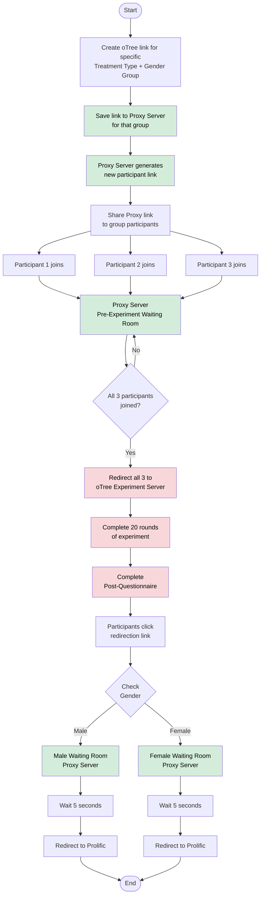

# oTree Proxy Server - User Guide

## Overview

The oTree Proxy Server helps researchers manage online experiments by coordinating participant entry and preventing common issues like duplicate participation or incomplete groups.

**Key Benefits:**
- Prevents duplicate participation
- Automatically organizes participants into groups
- Provides real-time monitoring
- Creates a professional participant experience

---

## How It Works

### Complete Flow



### Three Key Phases

**1. Setup (Researcher)**
- Create oTree experiment link for specific treatment/gender combination
- Save to Proxy Server
- System generates shareable proxy link
- Share proxy link with participants

**2. Pre-Experiment (Participants)**
- Participants click proxy link
- Enter waiting room on Proxy Server
- Wait until all 3 participants join
- Automatic redirect to oTree experiment when group is complete

**3. Post-Experiment (Participants)**
- Complete 20 rounds of experiment
- Complete post-questionnaire
- Click redirection link
- Enter gender-specific waiting room (Male or Female)
- Wait 5 seconds
- Automatic redirect to Prolific

**Important:** Post-experiment waiting rooms are gender-specific only. All males share one room, all females share another, regardless of their original group or treatment.

---

## For Researchers

### Quick Start Guide

**Step 1: Create Experiment Link**

1. Log in to the admin dashboard
2. Click "Create New Link"
3. Fill in the form:
   - **Group Name**: e.g., "Treatment A - Male Group 1"
   - **oTree URL**: Your experiment link
   - **Category**: Gender specification (Mixed, All Male, All Female, or No Gender)
   - **Treatment**: Your treatment condition
4. Click "Create Link"

**Step 2: Share Link**

Copy the generated proxy link and share it with your participants via email, Prolific, or your recruitment platform.

**Step 3: Monitor Progress**

Watch your dashboard for real-time updates:
- Participant count (e.g., "2/3 joined")
- Link status (Active → Full → Used)
- Automatic group formation and redirection

### Dashboard Features

**Link Status:**
- **Active**: Ready for participants
- **Full**: All spots filled, participants redirected
- **Used**: Experiment completed

**Available Actions:**
- **Copy Link**: Get the shareable URL
- **Reset Usage**: Clear participant count to reuse the link for a new session
- **Delete**: Permanently remove the link

### Typical Timeline

```
Create link (1 min) → Share with participants (5 min) → 
Participants join (5-30 min) → Automatic redirect → 
Experiment runs (varies) → Participants return to Prolific
```

### Important Notes

**What the Proxy Server Does:**
- Manages participant entry and grouping
- Prevents duplicate participation
- Coordinates simultaneous start for all group members
- Handles post-experiment redirection to Prolific

**What the Proxy Server Does NOT Do:**
- Store your experiment data (all data stays in oTree)
- Modify your experiment
- Collect personal information about participants

---

## For Participants

### How to Participate

**Step 1: Click the Link**

Click the experiment link provided by the researcher. You'll see experiment information and available spots.

**Step 2: Join and Wait**

1. Click "Join Experiment"
2. You'll enter a waiting room
3. See your position (e.g., "You are participant 2 of 3")
4. Wait for other participants to join
5. The page updates automatically—no need to refresh

**Step 3: Complete the Experiment**

1. When all participants join, you'll be automatically redirected to the experiment
2. Complete all 20 rounds
3. Complete the post-questionnaire
4. Click the redirection link

**Step 4: Final Redirection**

1. You'll enter a brief waiting room (5 seconds)
2. You'll be automatically redirected to Prolific
3. Complete!

### What You'll See

**Information Page:**
- Experiment name
- Participant requirements (usually 3 people)
- Available spots
- "Join Experiment" button

**Waiting Room:**
- Your participant number
- Progress indicator
- Real-time status updates
- Instructions

**Completion:**
- Confirmation message
- Automatic countdown (3 seconds to experiment start)
- Another brief wait (5 seconds) before Prolific redirect

---

## Troubleshooting

### For Researchers

**Problem: Participants report link not working**
- Solution: Check link status is "Active" in dashboard
- Solution: Verify you copied the complete URL
- Solution: Confirm your oTree experiment is running

**Problem: Want to run another session with same link**
- Solution: Click "Reset Usage" button to clear participant count

**Problem: Need to track which groups completed**
- Solution: Use descriptive group names when creating links
- Solution: Monitor dashboard status changes

### For Participants

**Problem: "Link Not Found" error**
- Solution: Check you copied the complete link
- Solution: Contact the researcher for a new link

**Problem: "Experiment Full" message**
- Solution: All spots are taken
- Solution: Contact researcher about additional sessions

**Problem: "Already Participated" message**
- Solution: You've already joined from this device
- Solution: Contact researcher if this is an error

**Problem: Automatic redirect doesn't work**
- Solution: Enable pop-ups for the website
- Solution: Check if a new tab opened in the background
- Solution: Try a different browser

---

## Technical Requirements

**Supported Browsers:**
- Chrome (recommended)
- Firefox
- Safari
- Edge

**Requirements:**
- JavaScript enabled
- Pop-ups allowed
- Stable internet connection

---

## Privacy & Data

**What the Proxy Server Collects:**
- Join timestamps
- Participant count per group
- Browser fingerprint (for duplicate prevention only)

**What the Proxy Server Does NOT Collect:**
- Experiment responses
- Personal information
- Identifiable data
- Cross-experiment tracking data

**Data Storage:**
- All experiment data remains in your oTree system
- Proxy server only tracks participation logistics
- No integration with your research data

---

## Quick Reference

### For Researchers

✅ **Best Practices:**
- Test links before sharing
- Use clear, descriptive group names
- Monitor dashboard during recruitment
- Keep oTree experiment running when sharing links

❌ **Avoid:**
- Sharing incomplete URLs
- Deleting links while participants are joining
- Creating links without testing oTree connection

### For Participants

✅ **Best Practices:**
- Click the complete link provided
- Keep waiting room tab open
- Be patient during group formation
- Contact researcher if issues arise

❌ **Avoid:**
- Refreshing the waiting room page
- Closing the tab while waiting
- Attempting to join multiple times
- Sharing your experiment link

---

## Support

**For Researchers:**
- Check dashboard for real-time diagnostics
- Test links before distributing
- Contact technical support for persistent issues

**For Participants:**
- Contact the researcher who shared the link
- Include experiment name and error messages
- Provide browser type and version

---

*For technical documentation and advanced features, refer to the complete system documentation.*