# 🔗 oTree Proxy Server

<div align="center">

**A professional link management system for research experiments**  
*Specifically designed for oTree studies with secure participant tracking*

[](https://vercel.com/new/clone?repository-url=https://github.com/yourusername/otree-proxy-server)
[](https://railway.app/new/template?template=https://github.com/yourusername/otree-proxy-server)


</div>

---

## ✨ Features

<table>
<tr>
<td width="50%">

### 🔐 **Security & Access Control**
- ✅ One-time use links per participant
- ✅ Browser fingerprinting for duplicate prevention
- ✅ Secure admin authentication
- ✅ Session management with encryption
- ✅ Activity logging and audit trails

### 📊 **Analytics & Monitoring**
- ✅ Real-time participation tracking
- ✅ Usage statistics and progress bars
- ✅ Group completion status
- ✅ Participant count monitoring
- ✅ Export capabilities

</td>
<td width="50%">

### 🎨 **Modern Interface**
- ✅ Beautiful, responsive admin dashboard
- ✅ Dark/Light theme toggle
- ✅ Mobile-friendly design
- ✅ Table-based link management
- ✅ Toast notifications and feedback

### 🚀 **Deployment & Integration**
- ✅ One-click deploy to Vercel/Railway
- ✅ SQLite (dev) + PostgreSQL (prod)
- ✅ Environment-based configuration
- ✅ Seamless oTree integration

</td>
</tr>
</table>

## 🚀 Quick Start

### 💻 Local Development

```bash
# 1. Clone the repository
git clone https://github.com/yourusername/otree-proxy-server.git
cd otree-proxy-server

# 2. Install dependencies
npm install

# 3. Generate session secret
npm run generate-secret

# 4. Create environment file
cp .env.example .env
# Edit .env with your SESSION_SECRET

# 5. Start the server
npm start

# 6. Access admin panel
# Open http://localhost:3000/admin
# Login: admin / admin123
```

### 🌐 Production Deployment

| Platform | Database | Complexity | Cost | Deploy |
|----------|----------|------------|------|--------|
| **Vercel** | PostgreSQL | Medium | Free | [](https://vercel.com/new/clone?repository-url=https://github.com/yourusername/otree-proxy-server) |
| **Railway** | SQLite | Easy | Free | [](https://railway.app/new/template?template=https://github.com/yourusername/otree-proxy-server) |
| **Render** | SQLite | Easy | Free | [Deploy on Render](https://render.com) |

<details>
<summary><b>🔧 Vercel Deployment (with PostgreSQL)</b></summary>

1. **Create free PostgreSQL database** at [Supabase](https://supabase.com)
2. **Run database schema** from `setup-database.sql`
3. **Deploy to Vercel** and set environment variables:
   ```env
   DATABASE_URL=postgresql://...
   SESSION_SECRET=your-generated-secret
   NODE_ENV=production
   ```
4. **Done!** Your app is live with persistent data

📖 **Detailed guide**: [VERCEL-DEPLOY.md](VERCEL-DEPLOY.md)

</details>

<details>
<summary><b>🚂 Railway Deployment (SQLite - Easiest)</b></summary>

1. **Click deploy button** above
2. **Set environment variables**:
   ```env
   SESSION_SECRET=your-generated-secret
   ```
3. **Done!** SQLite database persists automatically

</details>

## 📖 How It Works

```mermaid
graph LR
    A[👨‍🔬 Researcher] --> B[🔗 Create Proxy Link]
    B --> C[📧 Share with Participants]
    C --> D[👥 Participants Click Link]
    D --> E[🔍 System Checks Usage]
    E --> F{First Time?}
    F -->|Yes| G[✅ Redirect to oTree]
    F -->|No| H[❌ Show Already Participated]
    G --> I[📊 Track in Database]
    I --> J[📈 Real-time Analytics]
```



### 🎯 **Workflow**

1. **🔗 Create Links** - Generate unique proxy URLs for each participant group
2. **📧 Share Links** - Send proxy links to your study participants  
3. **🔍 Track Usage** - System prevents duplicate participation automatically
4. **📊 Monitor Progress** - View real-time participation rates and analytics

## 🎯 Use Cases

<div align="center">

| 🧪 **Research Type** | 📊 **Use Case** | ✅ **Benefits** |
|---------------------|----------------|----------------|
| **Behavioral Economics** | oTree experiments with controlled groups | Prevent duplicate participation, track completion rates |
| **Psychology Studies** | Online experiments with session limits | Manage participant flow, ensure data quality |
| **A/B Testing** | Compare different experimental conditions | Easy group management, real-time monitoring |
| **Survey Research** | Control access to questionnaires | One-time participation, usage analytics |
| **Educational Research** | Classroom experiments and assessments | Group-based access, progress tracking |

</div>

## 🛠️ Configuration

### 🔧 Environment Variables

| Variable | Required | Default | Description |
|----------|----------|---------|-------------|
| `SESSION_SECRET` | ✅ | - | Cryptographic key for sessions ([generate one](npm run generate-secret)) |
| `DATABASE_URL` | 🔶 | SQLite | PostgreSQL connection string for production |
| `NODE_ENV` | 🔶 | development | Environment (development/production) |
| `DEFAULT_ADMIN_USERNAME` | ❌ | admin | Default admin username |
| `DEFAULT_ADMIN_PASSWORD` | ❌ | admin123 | Default admin password |
| `PORT` | ❌ | 3000 | Server port |

### 🗄️ Database Support

| Database | Environment | Setup Difficulty | Persistence | Cost |
|----------|-------------|------------------|-------------|------|
| **SQLite** | Development | ⭐ Easy | ✅ Local files | Free |
| **PostgreSQL** | Production | ⭐⭐ Medium | ✅ Cloud hosted | Free tier available |
| **MySQL** | Production | ⭐⭐ Medium | ✅ Cloud hosted | Free tier available |

### 🔐 Generate SESSION_SECRET

```bash
# Method 1: Use built-in generator
npm run generate-secret

# Method 2: Node.js command
node -e "console.log(require('crypto').randomBytes(32).toString('hex'))"

# Method 3: OpenSSL
openssl rand -hex 32
```

## 📊 Admin Dashboard

<div align="center">

### 🎛️ **Dashboard Features**

</div>

| 📈 **Analytics** | 🔗 **Link Management** | 👥 **Participant Control** |
|-----------------|----------------------|---------------------------|
| Real-time usage statistics | Create experiment links | Track individual participants |
| Group completion rates | Activate/deactivate links | Prevent duplicate entries |
| Participant count monitoring | Copy links with one click | Reset usage counters |
| Visual progress indicators | Delete unused experiments | View participation history |

### 🎨 **Interface Highlights**

- **📱 Responsive Design** - Works on desktop, tablet, and mobile
- **🌙 Dark/Light Themes** - Toggle between themes for comfort
- **📋 Table View** - Organized, scannable link management
- **🔔 Toast Notifications** - Instant feedback for all actions
- **⚡ Real-time Updates** - Live data without page refreshes

## 🔧 API Endpoints

### Admin Routes
- `GET /admin` - Admin dashboard
- `POST /admin/login` - Admin authentication
- `POST /admin/create-link` - Create new experiment link
- `GET /admin/links` - Get all experiment links
- `POST /admin/toggle-link` - Activate/deactivate link
- `POST /admin/reset-usage` - Reset participant count
- `POST /admin/delete-link` - Delete experiment link

### Proxy Routes
- `GET /proxy/:proxyId` - Participant landing page
- `POST /proxy/:proxyId/use` - Register participant and redirect

## 🔒 Security Features

- **Session Management** - Secure admin authentication
- **Fingerprint Tracking** - Prevent duplicate participation
- **Input Validation** - Sanitize all user inputs
- **Activity Logging** - Track all admin actions
- **CSRF Protection** - Secure form submissions

## 🎨 Customization

### Themes
- Built-in light/dark theme toggle
- Customizable color schemes
- Responsive design for all devices

### Branding
- Easy to customize logos and colors
- Configurable welcome messages
- Custom styling options

## 📚 Documentation

- [Deployment Guide](DEPLOYMENT.md) - Detailed deployment instructions
- [API Documentation](docs/API.md) - Complete API reference
- [Configuration Guide](docs/CONFIG.md) - Advanced configuration options

## 🤝 Contributing

1. Fork the repository
2. Create a feature branch (`git checkout -b feature/amazing-feature`)
3. Commit your changes (`git commit -m 'Add amazing feature'`)
4. Push to the branch (`git push origin feature/amazing-feature`)
5. Open a Pull Request

## 📄 License

This project is licensed under the MIT License - see the [LICENSE](LICENSE) file for details.

## 🆘 Support

- 📖 [Documentation](docs/)
- 🐛 [Report Issues](https://github.com/yourusername/otree-proxy-server/issues)
- 💬 [Discussions](https://github.com/yourusername/otree-proxy-server/discussions)

## 🙏 Acknowledgments

- Built for the research community
- Inspired by the need for better experiment management
- Thanks to all contributors and users

---

**Made with ❤️ for researchers, by researchers**