# 🔗 oTree Proxy Server

<div align="center">

**A professional link management system for research experiments**  
_Specifically designed for oTree studies with secure participant tracking_

[](https://vercel.com/new/clone?repository-url=https://github.com/yourusername/otree-proxy-server)
[](https://railway.app/new/template?template=https://github.com/yourusername/otree-proxy-server)


</div>

---

## ✨ Features

<table>
<tr>
<td width="50%">

### 🔐 **Security & Access Control**

- ✅ One-time use links per participant
- ✅ Browser fingerprinting for duplicate prevention
- ✅ Secure admin authentication
- ✅ Session management with encryption
- ✅ Activity logging and audit trails

### 📊 **Analytics & Monitoring**

- ✅ Real-time participation tracking
- ✅ Usage statistics and progress bars
- ✅ Group completion status
- ✅ Participant count monitoring
- ✅ Export capabilities

</td>
<td width="50%">

### 🎨 **Modern Interface**

- ✅ Beautiful, responsive admin dashboard
- ✅ Dark/Light theme toggle
- ✅ Mobile-friendly design
- ✅ Table-based link management
- ✅ Toast notifications and feedback

### 🚀 **Deployment & Integration**

- ✅ One-click deploy to Vercel/Railway
- ✅ SQLite (dev) + PostgreSQL (prod)
- ✅ Environment-based configuration
- ✅ Seamless oTree integration

</td>
</tr>
</table>

## 🚀 Quick Start

### 💻 Local Development

```bash
# 1. Clone the repository
git clone https://github.com/yourusername/otree-proxy-server.git
cd otree-proxy-server

# 2. Install dependencies
npm install

# 3. Generate session secret
npm run generate-secret

# 4. Create environment file
cp .env.example .env
# Edit .env with your SESSION_SECRET

# 5. Start the server
npm start

# 6. Access admin panel
# Open http://localhost:3000/admin
# Login: admin / admin123
```

### 🌐 Production Deployment

| Platform    | Database   | Complexity | Cost | Deploy                                                                                                                                               |
| ----------- | ---------- | ---------- | ---- | ---------------------------------------------------------------------------------------------------------------------------------------------------- |
| **Vercel**  | PostgreSQL | Medium     | Free | [](https://vercel.com/new/clone?repository-url=https://github.com/yourusername/otree-proxy-server)   |
| **Railway** | SQLite     | Easy       | Free | [](https://railway.app/new/template?template=https://github.com/yourusername/otree-proxy-server) |
| **Render**  | SQLite     | Easy       | Free | [Deploy on Render](https://render.com)                                                                                                               |

<details>
<summary><b>🔧 Vercel Deployment (with PostgreSQL)</b></summary>

1. **Create free PostgreSQL database** at [Supabase](https://supabase.com)
2. **Run database schema** from `setup-database.sql`
3. **Deploy to Vercel** and set environment variables:
   ```env
   DATABASE_URL=postgresql://...
   SESSION_SECRET=your-generated-secret
   NODE_ENV=production
   ```
4. **Done!** Your app is live with persistent data

📖 **Detailed guide**: [VERCEL-DEPLOY.md](VERCEL-DEPLOY.md)

</details>

<details>
<summary><b>🚂 Railway Deployment (SQLite - Easiest)</b></summary>

1. **Click deploy button** above
2. **Set environment variables**:
   ```env
   SESSION_SECRET=your-generated-secret
   ```
3. **Done!** SQLite database persists automatically

</details>

## 📖 How It Works

```mermaid
graph LR
    A[👨‍🔬 Researcher] --> B[🔗 Create Proxy Link]
    B --> C[📧 Share with Participants]
    C --> D[👥 Participants Click Link]
    D --> E[🔍 System Checks Usage]
    E --> F{First Time?}
    F -->|Yes| G[✅ Redirect to oTree]
    F -->|No| H[❌ Show Already Participated]
    G --> I[📊 Track in Database]
    I --> J[📈 Real-time Analytics]
```



### 🎯 **Workflow**

1. **🔗 Create Links** - Generate unique proxy URLs for each participant group
2. **📧 Share Links** - Send proxy links to your study participants
3. **🔍 Track Usage** - System prevents duplicate participation automatically
4. **📊 Monitor Progress** - View real-time participation rates and analytics

## 🎯 Use Cases

<div align="center">

| 🧪 **Research Type**     | 📊 **Use Case**                           | ✅ **Benefits**                                         |
| ------------------------ | ----------------------------------------- | ------------------------------------------------------- |
| **Behavioral Economics** | oTree experiments with controlled groups  | Prevent duplicate participation, track completion rates |
| **Psychology Studies**   | Online experiments with session limits    | Manage participant flow, ensure data quality            |
| **A/B Testing**          | Compare different experimental conditions | Easy group management, real-time monitoring             |
| **Survey Research**      | Control access to questionnaires          | One-time participation, usage analytics                 |
| **Educational Research** | Classroom experiments and assessments     | Group-based access, progress tracking                   |

</div>

## 🛠️ Configuration

### 🔧 Environment Variables

| Variable                 | Required | Default     | Description                                                              |
| ------------------------ | -------- | ----------- | ------------------------------------------------------------------------ |
| `SESSION_SECRET`         | ✅       | -           | Cryptographic key for sessions ([generate one](npm run generate-secret)) |
| `DATABASE_URL`           | 🔶       | SQLite      | PostgreSQL connection string for production                              |
| `NODE_ENV`               | 🔶       | development | Environment (development/production)                                     |
| `DEFAULT_ADMIN_USERNAME` | ❌       | admin       | Default admin username                                                   |
| `DEFAULT_ADMIN_PASSWORD` | ❌       | admin123    | Default admin password                                                   |
| `PORT`                   | ❌       | 3000        | Server port                                                              |

### 🗄️ Database Support

| Database       | Environment | Setup Difficulty | Persistence     | Cost                |
| -------------- | ----------- | ---------------- | --------------- | ------------------- |
| **SQLite**     | Development | ⭐ Easy          | ✅ Local files  | Free                |
| **PostgreSQL** | Production  | ⭐⭐ Medium      | ✅ Cloud hosted | Free tier available |
| **MySQL**      | Production  | ⭐⭐ Medium      | ✅ Cloud hosted | Free tier available |

### 🔐 Generate SESSION_SECRET

```bash
# Method 1: Use built-in generator
npm run generate-secret

# Method 2: Node.js command
node -e "console.log(require('crypto').randomBytes(32).toString('hex'))"

# Method 3: OpenSSL
openssl rand -hex 32
```

## 📊 Admin Dashboard

<div align="center">

### 🎛️ **Dashboard Features**

</div>

| 📈 **Analytics**             | 🔗 **Link Management**    | 👥 **Participant Control**    |
| ---------------------------- | ------------------------- | ----------------------------- |
| Real-time usage statistics   | Create experiment links   | Track individual participants |
| Group completion rates       | Activate/deactivate links | Prevent duplicate entries     |
| Participant count monitoring | Copy links with one click | Reset usage counters          |
| Visual progress indicators   | Delete unused experiments | View participation history    |

### 🎨 **Interface Highlights**

- **📱 Responsive Design** - Works on desktop, tablet, and mobile
- **🌙 Dark/Light Themes** - Toggle between themes for comfort
- **📋 Table View** - Organized, scannable link management
- **🔔 Toast Notifications** - Instant feedback for all actions
- **⚡ Real-time Updates** - Live data without page refreshes

## 🔧 API Reference

<details>
<summary><b>📡 Admin Endpoints</b></summary>

| Method | Endpoint             | Description              | Auth Required |
| ------ | -------------------- | ------------------------ | ------------- |
| `GET`  | `/admin`             | Admin dashboard          | ❌            |
| `POST` | `/admin/login`       | Admin authentication     | ❌            |
| `POST` | `/admin/logout`      | Admin logout             | ✅            |
| `POST` | `/admin/create-link` | Create experiment link   | ✅            |
| `GET`  | `/admin/links`       | Get all experiment links | ✅            |
| `GET`  | `/admin/stats`       | Get usage statistics     | ✅            |
| `POST` | `/admin/toggle-link` | Activate/deactivate link | ✅            |
| `POST` | `/admin/reset-usage` | Reset participant count  | ✅            |
| `POST` | `/admin/delete-link` | Delete experiment link   | ✅            |

</details>

<details>
<summary><b>🔗 Proxy Endpoints</b></summary>

| Method | Endpoint                | Description                     | Response      |
| ------ | ----------------------- | ------------------------------- | ------------- |
| `GET`  | `/proxy/:proxyId`       | Participant landing page        | HTML page     |
| `POST` | `/proxy/:proxyId/check` | Check participation status      | JSON status   |
| `POST` | `/proxy/:proxyId/use`   | Register & redirect participant | JSON response |

</details>

<details>
<summary><b>📝 Request/Response Examples</b></summary>

**Create Link:**

```javascript
POST /admin/create-link
{
  "groupName": "Group-1",
  "realUrl": "https://otree-server.com/room/experiment1"
}
```

**Check Participation:**

```javascript
POST /proxy/abc123/check
{
  "fingerprint": "user-browser-fingerprint"
}

Response:
{
  "alreadyParticipated": false,
  "remainingSpots": 2
}
```

</details>

## 🔒 Security Features

<div align="center">

### 🛡️ **Multi-Layer Security**

</div>

| 🔐 **Authentication**     | 🕵️ **Tracking**                    | 🛡️ **Protection**               |
| ------------------------- | ---------------------------------- | ------------------------------- |
| Secure session management | Browser fingerprinting             | Input validation & sanitization |
| Encrypted session cookies | Duplicate participation prevention | SQL injection protection        |
| Admin authentication      | IP address logging                 | XSS prevention                  |
| Session timeout handling  | User agent tracking                | CSRF protection                 |

### 🔍 **Privacy & Compliance**

- **🔒 Data Encryption** - All sensitive data encrypted in transit
- **📝 Activity Logging** - Complete audit trail of admin actions
- **🚫 No Personal Data** - Only technical identifiers stored
- **⏰ Session Expiry** - Automatic logout for security
- **🔄 Secure Redirects** - Validated URL redirections only

## 🎨 Customization

<details>
<summary><b>🎨 Theming & Styling</b></summary>

### Built-in Themes

- **🌞 Light Theme** - Clean, professional interface
- **🌙 Dark Theme** - Easy on the eyes for extended use
- **🔄 Auto Toggle** - User preference saved locally

### Custom Styling

```css
/* Modify colors in src/views/adminView.js */
:root {
  --primary-color: #6366f1;
  --secondary-color: #8b5cf6;
  --accent-color: #d946ef;
}
```

</details>

<details>
<summary><b>🏷️ Branding Options</b></summary>

### Customizable Elements

- **📝 Page Titles** - Modify in view files
- **🎨 Color Schemes** - Update CSS gradients
- **📱 Icons** - FontAwesome integration
- **💬 Messages** - Welcome text and notifications

### Configuration

```javascript
// Update in src/views/adminView.js
const config = {
  title: "Your Research Platform",
  subtitle: "Professional Experiment Management",
  theme: "custom",
};
```

</details>

## 📚 Documentation

| 📖 **Guide**           | 📝 **Description**             | 🔗 **Link**                              |
| ---------------------- | ------------------------------ | ---------------------------------------- |
| **Quick Deploy**       | Step-by-step Vercel deployment | [VERCEL-DEPLOY.md](VERCEL-DEPLOY.md)     |
| **Full Deployment**    | Comprehensive deployment guide | [DEPLOYMENT.md](DEPLOYMENT.md)           |
| **Database Setup**     | PostgreSQL schema and setup    | [setup-database.sql](setup-database.sql) |
| **Environment Config** | Environment variables template | [.env.example](.env.example)             |

### 🔧 **Development**

```bash
# Development commands
npm run dev          # Start with nodemon
npm run generate-secret  # Generate SESSION_SECRET
npm run clean        # Clean database files
npm run deploy       # Deployment helper
```

## 🤝 Contributing

We welcome contributions from the research community!

<details>
<summary><b>🚀 How to Contribute</b></summary>

### 🔧 **Development Setup**

```bash
git clone https://github.com/yourusername/otree-proxy-server.git
cd otree-proxy-server
npm install
npm run generate-secret
cp .env.example .env
# Edit .env with your SESSION_SECRET
npm run dev
```

### 📝 **Contribution Process**

1. **🍴 Fork** the repository
2. **🌿 Create** a feature branch (`git checkout -b feature/amazing-feature`)
3. **💻 Make** your changes with tests
4. **✅ Commit** your changes (`git commit -m 'Add amazing feature'`)
5. **📤 Push** to the branch (`git push origin feature/amazing-feature`)
6. **🔄 Open** a Pull Request

### 🎯 **Areas for Contribution**

- 🐛 Bug fixes and improvements
- 📊 New analytics features
- 🎨 UI/UX enhancements
- 📚 Documentation improvements
- 🔧 Database adapters
- 🌐 Internationalization

</details>

## � Prcoject Stats

<div align="center">


</div>

## � License

This project is licensed under the **MIT License** - see the [LICENSE](LICENSE) file for details.

```
MIT License - Free for academic and commercial use
✅ Commercial use    ✅ Modification    ✅ Distribution    ✅ Private use
```

## 🆘 Support & Community

<div align="center">

| 💬 **Get Help**                                                                      | 🐛 **Report Issues**                                                       | 💡 **Feature Requests**                                                                                       |
| ------------------------------------------------------------------------------------ | -------------------------------------------------------------------------- | ------------------------------------------------------------------------------------------------------------- |
| [GitHub Discussions](https://github.com/yourusername/otree-proxy-server/discussions) | [Issue Tracker](https://github.com/yourusername/otree-proxy-server/issues) | [Feature Requests](https://github.com/yourusername/otree-proxy-server/issues/new?template=feature_request.md) |

</div>

### 🔍 **Troubleshooting**

<details>
<summary><b>Common Issues & Solutions</b></summary>

**🚨 "Database not initialized"**

- ✅ Check if `DATABASE_URL` is set correctly
- ✅ Verify database connection string format

**🚨 "Session secret required"**

- ✅ Run `npm run generate-secret`
- ✅ Set `SESSION_SECRET` in environment variables

**🚨 "Admin login not working"**

- ✅ Check database schema is created
- ✅ Verify default admin credentials

</details>

## 🙏 Acknowledgments

<div align="center">

**Built with ❤️ for the research community**

Special thanks to:

- 🧪 **oTree Community** - For inspiring better experiment management
- 🌟 **Contributors** - Everyone who helps improve this project
- 🎓 **Researchers** - Who provide feedback and use cases
- 💻 **Open Source** - Standing on the shoulders of giants

</div>

---

<div align="center">

### 🚀 **Ready to streamline your research experiments?**

[](https://vercel.com/new/clone?repository-url=https://github.com/yourusername/otree-proxy-server)
[](https://railway.app/new/template?template=https://github.com/yourusername/otree-proxy-server)

**⭐ Star this repo if it helps your research!**

</div>
