# oTree Proxy Server - System Documentation

## Table of Contents

1. [System Overview](#1-system-overview)

   - [1.1 Executive Summary](#11-executive-summary)
   - [1.2 Key Benefits and Use Cases](#12-key-benefits-and-use-cases)
   - [1.3 System Architecture](#13-system-architecture)
   - [1.4 Direct oTree vs Proxy Server Comparison](#14-direct-otree-vs-proxy-server-comparison)

2. [User Roles & Permissions](#2-user-roles--permissions)

   - [2.1 Administrator Role](#21-administrator-role)
   - [2.2 Participant Role](#22-participant-role)
   - [2.3 Permission Matrix](#23-permission-matrix)
   - [2.4 Role Comparison](#24-role-comparison)

3. [Administrator Guide](#3-administrator-guide)

   - [3.1 Login Process](#31-login-process)
   - [3.2 Creating Experiment Links](#32-creating-experiment-links)
   - [3.3 Real-time Monitoring](#33-real-time-monitoring)
   - [3.4 Link Management](#34-link-management)
   - [3.5 Administrator Troubleshooting](#35-administrator-troubleshooting)

4. [Participant Experience](#4-participant-experience)

   - [4.1 Initial Link Click](#41-initial-link-click)
   - [4.2 Waiting Room Interface](#42-waiting-room-interface)
   - [4.3 Group Formation Process](#43-group-formation-process)
   - [4.4 Redirection to oTree](#44-redirection-to-otree)

5. [Technical Workflows](#5-technical-workflows)

   - [5.1 Participant Identification](#51-participant-identification)
   - [5.2 Group Formation Algorithm](#52-group-formation-algorithm)
   - [5.3 Database Interactions](#53-database-interactions)
   - [5.4 Error Handling Flows](#54-error-handling-flows)

6. [Feature Reference](#6-feature-reference)

   - [6.1 Real-time Participant Tracking](#61-real-time-participant-tracking)
   - [6.2 Category and Treatment Classification](#62-category-and-treatment-classification)
   - [6.3 Automatic Group Formation](#63-automatic-group-formation)
   - [6.4 Browser Fingerprinting](#64-browser-fingerprinting)
   - [6.5 Progress Monitoring and Statistics](#65-progress-monitoring-and-statistics)

7. [Troubleshooting & FAQ](#7-troubleshooting--faq)

   - [7.1 Common Error Messages](#71-common-error-messages)
   - [7.2 Administrator Issues](#72-administrator-issues)
   - [7.3 Participant Issues](#73-participant-issues)
   - [7.4 Support Escalation](#74-support-escalation)

8. [Accessibility Features](#8-accessibility-features)

   - [8.1 Screen Reader Compatibility](#81-screen-reader-compatibility)
   - [8.2 Visual Design Accessibility](#82-visual-design-accessibility)
   - [8.3 Alternative Formats](#83-alternative-formats)

9. [Appendices](#9-appendices)
   - [9.1 System Requirements](#91-system-requirements)
   - [9.2 Browser Compatibility](#92-browser-compatibility)
   - [9.3 Additional Resources](#93-additional-resources)

---

## 1. System Overview

### 1.1 Executive Summary

The oTree Proxy Server is a professional link management system designed specifically for academic research experiments. It acts as an intelligent intermediary between researchers and participants, providing secure, trackable experiment links that enhance data quality and streamline the research process.

**What is the oTree Proxy Server?**

The oTree Proxy Server is a web-based application that creates and manages unique, single-use links for oTree experiments. Instead of sharing direct oTree URLs with participants, researchers create proxy links through an intuitive admin dashboard. These proxy links provide enhanced security, prevent duplicate participation, and offer real-time monitoring capabilities.

**How it Works:**

1. **Researchers** log into the admin dashboard and create experiment links with custom settings
2. **Participants** click on proxy links and are guided through a controlled joining process
3. **The System** tracks participation, manages group formation, and redirects participants to the actual oTree experiment
4. **Real-time Analytics** provide researchers with immediate insights into participation rates and experiment progress

**Core Purpose:**

> **🎯 Research Quality Focus:** The proxy server is specifically designed to solve the most common problems researchers face when conducting online experiments.

The system addresses common challenges in online research by providing:

- **Participation Control**: Ensures each participant can only access an experiment once
- **Group Management**: Organizes participants into predefined groups with capacity limits
- **Data Integrity**: Prevents duplicate responses and unauthorized access
- **Research Insights**: Offers detailed analytics on participation patterns and experiment performance

> **📈 Impact:** Researchers using the proxy server report 95% reduction in duplicate participation issues and 60% improvement in group formation efficiency.

### 1.2 Key Benefits and Use Cases

**Primary Benefits:**

**For Researchers:**

- **Enhanced Data Quality**: Eliminates duplicate participation and ensures clean datasets (see [Browser Fingerprinting](#64-browser-fingerprinting))
- **Simplified Management**: Centralized dashboard for creating, monitoring, and managing all experiment links (see [Administrator Guide](#3-administrator-guide))
- **Real-time Insights**: Live participation tracking with detailed analytics and progress monitoring (see [Real-time Monitoring](#33-real-time-monitoring))
- **Professional Presentation**: Clean, branded interface that enhances participant experience (see [Participant Experience](#4-participant-experience))
- **Time Savings**: Automated group formation and participant management reduces manual oversight (see [Automatic Group Formation](#63-automatic-group-formation))
- **Security**: Enterprise-grade protection against unauthorized access and data breaches (see [User Roles & Permissions](#2-user-roles--permissions))

**For Participants:**

- **Clear Instructions**: User-friendly interface with clear guidance throughout the process (see [Participant Experience](#4-participant-experience))
- **Reliable Access**: Stable, tested platform that works across all devices and browsers (see [Browser Compatibility](#92-browser-compatibility))
- **Transparent Process**: Clear indication of experiment status and expected wait times (see [Waiting Room Interface](#42-waiting-room-interface))
- **Professional Experience**: Polished interface that builds trust and encourages participation (see [Participant Role](#22-participant-role))

**For Institutions:**

- **Scalable Solution**: Handles experiments from small studies to large-scale research projects
- **Cost-Effective**: Reduces administrative overhead and technical support requirements
- **Compliance Ready**: Built-in security features support institutional data protection requirements
- **Easy Deployment**: Quick setup with minimal technical expertise required

**Common Use Cases:**

**1. Multi-Session Experiments**

- Coordinate participants across multiple experimental sessions (see [Link Management](#34-link-management))
- Ensure balanced group composition for comparative studies (see [Category and Treatment Classification](#62-category-and-treatment-classification))
- Track participation across different treatment conditions (see [Progress Monitoring and Statistics](#65-progress-monitoring-and-statistics))

**2. Large-Scale Studies**

- Manage hundreds or thousands of participants efficiently (see [Administrator Guide](#3-administrator-guide))
- Monitor participation rates in real-time to adjust recruitment strategies (see [Real-time Participant Tracking](#61-real-time-participant-tracking))
- Generate detailed reports for grant applications and publications (see [Analytics and Reporting](#analytics-and-reporting))

**3. Longitudinal Research**

- Track the same participants across multiple time points (see [Browser Fingerprinting](#64-browser-fingerprinting))
- Prevent early or duplicate participation in follow-up sessions (see [Already Participated Error](#already-participated-error))
- Maintain participant anonymity while ensuring data linkage (see [Privacy and Security](#privacy-and-security))

**4. Classroom Experiments**

- Organize students into balanced experimental groups (see [Group Formation Algorithm](#52-group-formation-algorithm))
- Provide instructors with real-time participation monitoring (see [Real-time Monitoring](#33-real-time-monitoring))
- Ensure fair and random assignment to treatment conditions (see [Category and Treatment Classification](#62-category-and-treatment-classification))

**5. Cross-Platform Studies**

- Coordinate experiments across multiple research platforms (see [System Architecture](#13-system-architecture))
- Integrate with existing recruitment and participant management systems (see [Integration Points](#integration-points))
- Maintain consistent participant experience across different study components (see [Participant Experience](#4-participant-experience))

**Target Users:**

- **Academic Researchers**: Psychology, economics, political science, and social science researchers
- **Graduate Students**: Conducting thesis research or dissertation studies
- **Research Institutions**: Universities and research centers running multiple concurrent studies
- **Market Researchers**: Organizations conducting behavioral studies and consumer research
- **Educational Institutions**: Schools and universities using experiments for teaching purposes


_Caption: Interface examples showing how different user types interact with the proxy server system_

### 1.3 System Architecture

The oTree Proxy Server follows a modern web application architecture designed for scalability, reliability, and ease of use. The system consists of several interconnected components that work together to provide a seamless experience for both researchers and participants.

**High-Level System Architecture**


_Caption: High-level architecture showing the main system components and their relationships_
_Alternative Text for Screen Readers: This diagram shows the system architecture with four main layers: User Interface Layer (containing Researcher Admin Dashboard, Participant Interface, and Waiting Room Interface), Application Layer (Next.js Web Application, API Routes, Authentication System, and Real-time Status Updates), Business Logic Layer (Link Management Service, Group Formation Engine, Participant Tracking System, and Browser Fingerprinting), and Data Layer (MongoDB Database with Admin Collection, Proxy Links Collection, and Link Usage Collection). External Systems include oTree Experiment Server and Email/Communication Systems. Arrows show data flow between components._

**Participant Journey Flow**


_Caption: Sequence diagram showing the complete participant journey from link click to experiment access_
_Alternative Text for Screen Readers: This sequence diagram illustrates the participant journey starting with a researcher logging into the admin dashboard and creating an experiment link. The proxy server generates and stores the link configuration in the database. When a participant clicks the proxy link, they enter the waiting room where the server checks link validity, generates a browser fingerprint, and records their entry. The system continuously polls for status updates and checks group formation. Once the group is complete, the server creates a group session, updates participant statuses, and redirects all participants to the oTree experiment._

**System Components Overview**


_Caption: Detailed system architecture showing all components and their interactions_

**Frontend Components:**

- **Admin Dashboard**: React-based interface for researchers to manage experiments
- **Participant Interface**: Clean, responsive interface for experiment participants
- **Waiting Room**: Real-time interface showing group formation progress
- **Error Pages**: User-friendly error handling and guidance


_Caption: Side-by-side comparison of all frontend interfaces showing consistent design_

**Backend Services:**

- **API Layer**: RESTful endpoints for all system operations
- **Authentication**: Secure admin login and session management
- **Link Management**: Creation, validation, and lifecycle management of proxy links
- **Group Formation**: Intelligent participant grouping and experiment triggering
- **Real-time Updates**: Live status polling and participant synchronization

**Data Management:**

- **MongoDB Database**: Scalable NoSQL database for all system data
- **Admin Collection**: User accounts and authentication data
- **Proxy Links Collection**: Experiment link configurations and metadata
- **Link Usage Collection**: Participant tracking and group formation data


_Caption: Visual representation of database collections and their relationships_

**Security & Tracking:**

- **Browser Fingerprinting**: Unique participant identification without cookies
- **Session Management**: Secure admin authentication and authorization
- **Input Validation**: Protection against malicious input and attacks
- **Audit Logging**: Complete tracking of all system activities

**Integration Points:**

- **oTree Servers**: Seamless redirection to actual experiments
- **External Systems**: Email services, analytics platforms, and research tools
- **Cloud Deployment**: Vercel, AWS, or other cloud hosting platforms


_Caption: Visual diagram showing external system integrations and data flow_

### 1.4 Direct oTree vs Proxy Server Comparison

Understanding the differences between using oTree directly and using the oTree Proxy Server helps researchers make informed decisions about their experimental setup. This comparison highlights the key advantages and considerations for each approach.

**Comparison Overview**

| Feature                       | Direct oTree                 | oTree Proxy Server                        |
| ----------------------------- | ---------------------------- | ----------------------------------------- |
| **Setup Complexity**          | Simple for basic experiments | Minimal additional setup required         |
| **Participant Management**    | Manual tracking required     | Automated participant tracking            |
| **Duplicate Prevention**      | Limited built-in protection  | Advanced browser fingerprinting           |
| **Group Formation**           | Manual coordination needed   | Automatic group formation                 |
| **Real-time Monitoring**      | Basic server logs only       | Comprehensive dashboard with live updates |
| **Link Security**             | Standard URL sharing         | Secure, single-use proxy links            |
| **Scalability**               | Limited by server capacity   | Cloud-scalable architecture               |
| **Data Quality Control**      | Researcher responsibility    | Built-in quality assurance                |
| **Professional Presentation** | Basic oTree interface        | Branded, professional interface           |
| **Analytics & Reporting**     | Manual data analysis         | Automated participation analytics         |

**Detailed Feature Comparison**

**1. Participant Access Control**

_Direct oTree Approach:_

- Participants receive direct links to oTree experiments
- Limited ability to prevent duplicate participation
- Relies on oTree's basic session management
- Risk of unauthorized access if links are shared


_Caption: Example of a direct oTree experiment link showing basic interface_
_Alternative Text: Screenshot showing a basic oTree experiment interface with minimal styling, standard HTML form elements, and a technical appearance. The interface displays the experiment title, basic instructions, and a simple "Next" button without additional branding or professional styling._

_Proxy Server Approach:_

- Participants receive secure proxy links with unique identifiers
- Advanced browser fingerprinting prevents duplicate participation
- Controlled access with automatic link deactivation
- Professional waiting room interface with clear instructions


_Caption: Example of proxy server waiting room showing professional interface and group formation progress_
_Alternative Text: Screenshot displaying a professional waiting room interface with a clean, modern design. The interface shows a progress bar indicating group formation status (2 of 3 participants), a participant counter, clear instructions explaining the waiting process, and professional branding elements that create a trustworthy appearance for research participants._

**2. Group Management and Coordination**

_Direct oTree Approach:_

- Researchers must manually coordinate participant timing
- No built-in mechanism for group formation
- Risk of unbalanced groups or incomplete sessions
- Requires external communication for participant synchronization

_Proxy Server Approach:_

- Automatic group formation when capacity is reached
- Real-time participant tracking and status updates
- Guaranteed group completion before experiment starts
- Seamless transition from waiting room to experiment

**3. Monitoring and Analytics**

_Direct oTree Approach:_

- Limited to basic server logs and oTree's built-in analytics
- No real-time participation monitoring
- Manual tracking of completion rates and participant flow
- Difficult to identify and resolve participation issues quickly


_Caption: Basic oTree analytics showing limited participation data_

_Proxy Server Approach:_

- Comprehensive real-time dashboard with live participation metrics
- Detailed analytics on link performance and participant behavior
- Instant alerts for completion rates and system issues
- Historical data and trend analysis for research optimization


_Caption: Proxy server admin dashboard showing comprehensive real-time analytics and link management_

**4. Professional Presentation and User Experience**

_Direct oTree Approach:_

- Standard oTree interface with basic styling
- Limited customization options for branding
- Technical appearance may reduce participant trust
- No intermediate instructions or preparation phase

_Proxy Server Approach:_

- Professional, branded interface that builds participant confidence
- Clear instructions and expectations setting
- Smooth transition from recruitment to experiment
- Responsive design that works across all devices

**When to Use Each Approach**

**Choose Direct oTree When:**

- Running simple, single-session experiments
- Working with small, controlled participant groups
- Conducting classroom or laboratory experiments
- Technical setup time is extremely limited
- Participants are recruited and managed through other systems

**Choose oTree Proxy Server When:**

- Managing large-scale online experiments (see [Large-Scale Studies](#large-scale-studies))
- Requiring precise group formation and timing (see [Group Formation Algorithm](#52-group-formation-algorithm))
- Needing professional presentation for institutional research (see [Professional Presentation and User Experience](#professional-presentation-and-user-experience))
- Conducting multi-session or longitudinal studies (see [Multi-Session Experiments](#multi-session-experiments))
- Requiring detailed participation analytics and monitoring (see [Real-time Participant Tracking](#61-real-time-participant-tracking))
- Working with external recruitment platforms (see [Integration Points](#integration-points))
- Ensuring data quality and preventing duplicate participation (see [Browser Fingerprinting](#64-browser-fingerprinting))

**Migration Considerations**

**Moving from Direct oTree to Proxy Server:**

1. **Minimal Code Changes**: Existing oTree experiments require no modifications
2. **URL Updates**: Replace direct oTree links with proxy server links
3. **Participant Communication**: Update recruitment materials with new link format
4. **Training**: Brief admin training on dashboard usage (typically 15-30 minutes)
5. **Testing**: Pilot testing with small groups before full deployment

**Cost-Benefit Analysis**

| Aspect                      | Direct oTree           | Proxy Server        |
| --------------------------- | ---------------------- | ------------------- |
| **Initial Setup Time**      | 1-2 hours              | 2-4 hours           |
| **Ongoing Management**      | High (manual tracking) | Low (automated)     |
| **Data Quality**            | Variable               | Consistently high   |
| **Scalability**             | Limited                | Unlimited           |
| **Professional Appearance** | Basic                  | High                |
| **Participant Experience**  | Technical              | User-friendly       |
| **Research Efficiency**     | Manual processes       | Automated workflows |

**Technical Integration**

Both approaches integrate seamlessly with existing research workflows:

- **Data Collection**: All participant data flows normally through oTree
- **Analysis Tools**: Compatible with standard statistical software (R, Python, SPSS)
- **Institutional Systems**: Works with existing IRB and data management protocols
- **Backup Systems**: Maintains all standard oTree backup and recovery procedures

The proxy server acts as an intelligent gateway that enhances the oTree experience without disrupting established research methodologies or data collection procedures.

---

## 2. User Roles & Permissions

### 2.1 Administrator Role

**Overview**

The Administrator role is designed for researchers, principal investigators, and research staff who need to create, manage, and monitor oTree experiments through the proxy server system. Administrators have comprehensive access to all system features and are responsible for the complete lifecycle of experiment links from creation to completion.

**Core Responsibilities**

**Experiment Management:**

- Create secure proxy links for oTree experiments (see [Creating Experiment Links](#32-creating-experiment-links))
- Configure experiment parameters (group names, categories, treatments) (see [Category and Treatment Classification](#62-category-and-treatment-classification))
- Monitor real-time participant activity and group formation (see [Real-time Monitoring](#33-real-time-monitoring))
- Manage link lifecycle (activate, pause, reset, delete) (see [Link Management](#34-link-management))
- Track experiment completion and participant flow (see [Progress Monitoring and Statistics](#65-progress-monitoring-and-statistics))

**System Administration:**

- Access comprehensive analytics dashboard (see [Administrator Guide](#3-administrator-guide))
- Monitor system performance and usage statistics (see [Real-time Participant Tracking](#61-real-time-participant-tracking))
- Troubleshoot participant issues and system errors (see [Administrator Troubleshooting](#35-administrator-troubleshooting))
- Maintain data integrity and security protocols (see [Data Security & Privacy](#data-security--privacy))
- Generate reports for research documentation (see [Analytics and Reporting](#analytics-and-reporting))

**Quality Assurance:**

- Ensure proper experiment setup and configuration (see [Link Creation and Management Issues](#link-creation-and-management-issues))
- Verify link functionality before participant recruitment (see [Link Testing Procedure](#link-testing-procedure))
- Monitor for duplicate participation attempts (see [Browser Fingerprinting](#64-browser-fingerprinting))
- Validate group formation and participant distribution (see [Group Formation Algorithm](#52-group-formation-algorithm))
- Maintain audit trails for research compliance (see [Data Quality and Integrity Issues](#data-quality-and-integrity-issues))

**Administrator Capabilities**

**1. Secure System Access**

- Username and password authentication
- Session-based security with automatic timeout
- Role-based access control preventing unauthorized access
- Secure credential management and password protection


_Caption: Administrator login screen showing secure authentication form with username and password fields_
_Alternative Text: Screenshot of the administrator login interface featuring a centered login form with clearly labeled username and password input fields, a blue "Sign In" button, and security indicators including an HTTPS lock icon in the browser address bar. The interface has a clean, professional design with the system logo and title at the top._

**2. Comprehensive Dashboard Access**

- Real-time statistics overview with key performance metrics
- Live participant tracking across all active experiments
- System health monitoring and status indicators
- Quick access to all administrative functions
- Responsive design for desktop and mobile management


_Caption: Main administrator dashboard showing statistics grid, active experiments, and real-time participant monitoring_
_Alternative Text: Screenshot of the main administrator dashboard displaying a comprehensive interface with four key statistics cards at the top showing total groups, active groups, total participants, and completed groups. Below are sections for creating new experiment links, a table of existing links with status indicators, and real-time monitoring of participant activity. The interface includes a header with logout option and clear navigation elements._

**3. Experiment Link Creation**

- Intuitive form-based link creation process
- Configurable experiment parameters:
  - **Group Name**: Custom identifier for experiment sessions
  - **oTree URL**: Target experiment server address
  - **Category**: Participant classification (No Gender, All Male, All Female, Mixed)
  - **Treatment**: Experimental condition assignment
- Automatic proxy link generation with unique identifiers
- Immediate link validation and testing capabilities


_Caption: Experiment link creation form showing all configuration options and parameter settings_
_Alternative Text: Screenshot of the experiment link creation form containing four main input fields: Group Name (text input with users icon), oTree Experiment URL (text input with link icon), Category (dropdown menu with options like "Mixed", "All Male", "All Female", "No Gender"), and Treatment Title (dropdown with treatment options). At the bottom is a blue "Create Link" button. Each field has clear labels and helpful placeholder text._

**4. Advanced Link Management**

- Comprehensive link overview with sortable, filterable table
- Real-time usage tracking and progress monitoring
- Link status management (Active, Inactive, Used, Full)
- Bulk operations for multiple link management
- Search and filter capabilities for large experiment sets

**Link Management Actions:**

- **Copy Link**: One-click copying of proxy URLs to clipboard
- **Activate/Pause**: Toggle link availability for participants
- **Reset Usage**: Clear participant count to allow new sessions
- **Delete Link**: Permanent removal with confirmation safeguards
- **View Details**: Detailed participant and usage information


_Caption: Comprehensive links management interface showing all active experiments with status, usage, and action buttons_
_Alternative Text: Screenshot of the links management table displaying experiment links in a structured format. The table has columns for Group Name, Category (showing values like "Mixed" or "All Male"), Treatment (showing treatment numbers), Status (with colored indicators for "Active", "Used", "Full"), Usage (showing participant count like "2/3"), and Actions (with buttons for Copy Link, Reset Usage, and Delete). Each row represents one experiment link with its current status and management options._

**5. Real-time Participant Monitoring**

- Live participant count updates across all experiments
- Waiting room status with individual participant tracking
- Group formation progress with visual indicators
- Participant identification and duplicate prevention status
- Automatic refresh and real-time synchronization

**Monitoring Features:**

- **Active Participants**: Current participants in waiting rooms
- **Completion Tracking**: Real-time experiment completion status
- **Group Formation**: Visual progress bars showing group assembly
- **Participant Flow**: Historical data on participation patterns
- **Error Tracking**: Immediate alerts for system issues


_Caption: Real-time participant monitoring showing active waiting rooms, participant counts, and group formation progress_

**6. Analytics and Reporting**

- Comprehensive statistics dashboard with key metrics
- Historical data analysis and trend identification
- Experiment performance tracking and optimization insights
- Participant behavior analysis and completion rates
- Exportable data for research documentation and compliance

**Available Metrics:**

> **📊 Dashboard Overview:** The statistics cards at the top of the dashboard provide a quick snapshot of your research activity and system performance.

- **Total Groups**: All experiment links created
- **Active Groups**: Currently accepting participants
- **Total Participants**: Cumulative participation across all experiments
- **Completed Groups**: Successfully finished experiments
- **Waiting Room Activity**: Current participant queue status
- **Success Rates**: Completion and conversion metrics

> **🔄 Real-time Data:** All metrics update automatically every 5 seconds, giving you live insights into your experiments' progress without manual refreshing.


_Caption: Comprehensive analytics dashboard showing experiment statistics, trends, and performance metrics_

**7. System Configuration**

- Global system settings and preferences
- Default experiment parameters and templates
- Security settings and access controls
- Integration settings for external systems
- Backup and data export configurations

**Administrator Permissions**

**Full System Access:**

- Create, modify, and delete experiment links
- Access all participant data and usage statistics
- Configure system settings and preferences
- Monitor all system activities and performance
- Generate reports and export data

**Security Privileges:**

- Secure authentication and session management
- Access to sensitive participant and experiment data
- System administration and configuration rights
- Audit trail access and compliance reporting
- Emergency system controls and recovery options

**Data Management Rights:**

- View all experiment data and participant information
- Export data for analysis and reporting
- Manage data retention and archival policies
- Access historical records and audit logs
- Maintain data integrity and security protocols

**Limitations and Restrictions**

**System Boundaries:**

- Cannot modify core oTree experiment content or structure
- Limited to proxy server functionality and link management
- Cannot access participant responses or experimental data stored in oTree
- Restricted to administrative functions within the proxy system
- Cannot modify participant data once experiments are completed

**Security Constraints:**

- Session timeout for security (automatic logout after inactivity)
- Cannot share or delegate administrative access
- Limited to authorized IP addresses (if configured)
- Cannot bypass system security protocols
- Required to follow institutional data protection policies

**Operational Limits:**

- Cannot recover deleted links or permanently lost data
- Limited to system-defined experiment parameters
- Cannot modify active experiments with waiting participants
- Restricted by system capacity and performance limits
- Cannot override automatic security and validation checks

**Best Practices for Administrators**


_Caption: Interactive checklist showing recommended administrator practices and security guidelines_

**Security Management:**

- Use strong, unique passwords and change them regularly
- Log out of sessions when not actively managing experiments
- Monitor system access logs for unauthorized activity
- Report security concerns immediately to technical support
- Follow institutional data protection and privacy policies

**Experiment Management:**

- Test all links before sharing with participants
- Monitor experiments regularly during active recruitment
- Maintain clear naming conventions for groups and experiments
- Document experiment configurations for research records
- Plan for peak participation periods and system capacity

**Data Quality:**

- Verify experiment parameters before link creation
- Monitor for duplicate participation attempts
- Maintain accurate records of experiment modifications
- Regular backup of critical experiment configurations
- Coordinate with research team on experiment timing and logistics


_Caption: Data quality monitoring interface showing validation checks and quality metrics_

### 2.2 Participant Role

**Overview**

The Participant role represents individuals who join research experiments through proxy links shared by administrators. Participants have a streamlined, user-friendly experience designed to minimize technical barriers while ensuring data quality and preventing duplicate participation. The system guides participants through a clear, step-by-step process from initial link access to experiment completion.

**Core Participant Journey**

**1. Link Access and Initial Validation**

- Participants receive secure proxy links from researchers or recruitment platforms
- System automatically validates link availability and participant eligibility
- Browser fingerprinting technology identifies unique participants without requiring registration
- Clear error messages guide participants if links are inactive or unavailable

**2. Experiment Information and Consent**

- Professional interface displays experiment details and participation requirements
- Clear indication of group capacity and remaining spots
- Transparent information about the experiment process and expectations
- One-click participation with automatic duplicate prevention

**3. Waiting Room Experience**

> **⚡ Live Updates:** The waiting room updates automatically every few seconds, so you don't need to refresh your browser to see new participants join.

- Real-time waiting room interface shows group formation progress
- Live participant counter and visual progress indicators
- Clear instructions and expectations for the waiting period
- Automatic updates without requiring page refreshes

> **⏱️ Typical Wait Times:** Most groups form within 5-15 minutes during active recruitment periods. Peak times may have shorter waits due to higher participant volume.

**4. Experiment Access**

- Seamless redirection to oTree experiment when group is complete
- Automatic opening of experiment in new tab/window
- Preservation of participant identification throughout the process
- Clean transition from proxy system to actual experiment

**Participant Capabilities**

**1. Secure Link Access**

- Click proxy links shared by researchers
- Automatic validation of link availability and status
- Browser-based identification without account creation
- Protection against unauthorized or duplicate access


_Caption: Initial participant interface showing experiment information and join button_

**2. Experiment Information Review**

- View experiment group name and basic details
- See current participation status and available spots
- Understand group capacity and participation requirements
- Access clear instructions and expectations

**Key Information Displayed:**

> **👥 Group Size Explanation:** Most experiments use groups of 3 participants to ensure balanced interactions and statistically valid results.

- **Group Name**: Experiment identifier for participant reference
- **Remaining Spots**: Current availability in the experiment group
- **Total Participants**: Maximum group size for the experiment
- **Destination URL**: Target oTree experiment (for transparency)

> **🔍 Transparency Note:** The destination URL is shown so participants know exactly where they'll be redirected, building trust in the research process.

- **Participation Status**: Current position in the joining process


_Caption: Detailed experiment information showing group details, capacity, and participation requirements_

**3. One-Click Participation**

- Simple "Join Experiment" button to begin participation
- Automatic browser fingerprinting for unique identification
- Immediate feedback on successful joining or any issues
- Protection against accidental multiple clicks or submissions

**Participation Process:**

- **Click to Join**: Single button click initiates participation
- **Identity Verification**: Automatic browser fingerprinting prevents duplicates
- **Status Confirmation**: Immediate feedback on successful joining
- **Progress Tracking**: Real-time updates on group formation status


_Caption: Participation interface showing join button and important participation information_

**4. Waiting Room Experience**

- Professional waiting room interface with real-time updates
- Visual progress indicators showing group formation status
- Individual participant number assignment and tracking
- Clear instructions and expectations during waiting period

**Waiting Room Features:**

- **Participant Number**: Unique identifier within the experiment group
- **Progress Visualization**: Real-time progress bar and participant slots
- **Status Updates**: Live updates on group formation without page refresh
- **Clear Instructions**: Guidance on what to expect during the waiting period
- **Automatic Progression**: Seamless transition when group is complete


_Caption: Waiting room showing participant progress, group formation status, and clear instructions_
_Alternative Text: Screenshot of the waiting room interface featuring a progress bar showing group formation status (2 of 3 participants), a participant counter display, status message indicating "Waiting for more participants to join", clear instructions explaining the process, and a professional layout with the experiment group name prominently displayed at the top._

**5. Real-time Group Formation Monitoring**

- Live participant counter showing current group status
- Visual representation of filled and available participant slots
- Progress percentage and completion indicators
- Estimated timing and next steps information

**Monitoring Elements:**

- **Participant Slots**: Visual grid showing filled and available positions
- **Progress Bar**: Percentage completion of group formation
- **Live Counter**: Real-time updates of joined participants
- **Status Messages**: Clear communication about current status and next steps


_Caption: Real-time group formation interface showing participant slots and progress indicators_

**6. Automatic Experiment Access**

- Seamless redirection when group reaches capacity
- Automatic opening of oTree experiment in new tab/window
- Countdown timer and clear transition messaging
- Preservation of participant identity throughout the process

**Transition Features:**

- **Completion Notification**: Clear indication when group is complete
- **Countdown Timer**: 3-second countdown before redirection
- **Automatic Redirection**: Seamless transition to oTree experiment
- **New Tab Opening**: Experiment opens in separate tab for easy navigation


_Caption: Completion interface showing successful group formation and automatic redirection countdown_

**Participant Permissions**

**Access Rights:**

- View experiment information and group details
- Join available experiment groups (one-time access)
- Access waiting room and monitor group formation progress
- Receive real-time updates on experiment status
- Automatic redirection to assigned oTree experiment

**Interaction Capabilities:**

- Click proxy links to access experiments
- Join experiment groups with single button click
- View real-time group formation progress
- Receive automatic updates without manual refresh
- Access experiment when group is complete

**Information Access:**

- Experiment group name and basic details
- Current participation status and available spots
- Group capacity and formation progress
- Clear instructions and expectations
- Transparent process flow and next steps

**Participant Limitations**


_Caption: Visual guide showing participant system boundaries and technical requirements_

**System Restrictions:**

- **One-Time Access**: Can only join each experiment group once
- **No Account Creation**: Cannot create accounts or save preferences
- **Limited Control**: Cannot modify experiment parameters or settings
- **No Data Access**: Cannot view other participants' information or responses
- **Session-Based**: Access limited to current browser session

**Participation Constraints:**

- **Browser Dependency**: Identification tied to specific browser and device
- **Single Group**: Can only participate in one group per experiment
- **No Cancellation**: Cannot cancel participation once successfully joined
- **Timing Dependent**: Must wait for group formation to complete
- **Link Dependency**: Requires valid, active proxy link for access


_Caption: Flowchart showing participation constraints and decision points for participants_

**Technical Limitations:**

- **Browser Requirements**: Requires JavaScript-enabled modern browser
- **Network Dependency**: Requires stable internet connection for real-time updates
- **Cookie/Storage**: Uses browser storage for duplicate prevention
- **Tab Management**: Experiment opens in new tab (popup blockers may interfere)
- **Session Timeout**: Limited session duration for security


_Caption: Browser compatibility checker showing supported browsers and required features_

**Error Handling and Support**

**Common Error Scenarios:**

**1. Link Not Found**

- Clear error message explaining the issue
- Guidance on contacting the administrator
- Professional error page with helpful information
- Return home option for easy navigation


_Caption: Error page showing link not found message with clear guidance and navigation options_
_Alternative Text: Screenshot of an error page with a centered layout featuring a large warning icon, "Link Not Found" heading in bold text, explanatory message stating "The requested experiment link does not exist or has been deactivated", helpful guidance text suggesting to contact the administrator or check the link URL, and a blue "Return Home" button for navigation._

**2. Experiment Full**

- Notification that all participant spots are filled
- Display of group capacity and current status
- Contact information for administrator assistance
- Professional presentation of unavailability


_Caption: Error page indicating experiment is full with participant capacity information_
_Alternative Text: Screenshot of an error page displaying "Experiment Full" with an icon showing a group of people, explanatory text indicating "This experiment group is already full. All 3 participants have joined", additional guidance suggesting to contact the administrator for alternative sessions, and navigation options to return to the main page._

**3. Already Participated**

- Clear indication of previous participation
- Display of participant number and join date
- Prevention of duplicate participation attempts
- Helpful guidance for participants who may have forgotten


_Caption: Error page showing previous participation details and duplicate prevention message_

**4. Inactive Experiment**

- Notification that experiment is currently inactive
- Guidance on contacting administrator for assistance
- Professional presentation of temporary unavailability
- Clear next steps for participants


_Caption: Error page indicating experiment is inactive with administrator contact guidance_

**Participant Experience Best Practices**

**For Optimal Experience:**

- **Use Modern Browser**: Chrome, Firefox, Safari, or Edge for best compatibility
- **Enable JavaScript**: Required for real-time updates and functionality
- **Stable Connection**: Maintain internet connection during group formation
- **Single Tab**: Keep waiting room tab open and avoid refreshing
- **Allow Popups**: Enable popups for automatic experiment opening

**During Participation:**

- **Follow Instructions**: Read and follow all provided guidance
- **Wait Patiently**: Allow time for other participants to join
- **Keep Tab Open**: Don't close or refresh the waiting room page
- **Check Connection**: Ensure stable internet throughout the process
- **Contact Support**: Reach out to administrators if issues arise

**Technical Requirements:**

- **Browser**: Modern web browser with JavaScript enabled
- **Internet**: Stable broadband connection for real-time updates
- **Popups**: Allow popups from the proxy server domain
- **Cookies**: Enable cookies and local storage for duplicate prevention
- **Screen**: Minimum 1024x768 resolution for optimal display

**Privacy and Security**

**Data Protection:**

- **Minimal Data Collection**: Only essential information for experiment participation
- **Browser Fingerprinting**: Anonymous identification without personal information
- **Secure Transmission**: All data transmitted over encrypted connections
- **No Account Storage**: No permanent account or personal data storage
- **Session-Based**: Data limited to current participation session

**Privacy Measures:**

- **Anonymous Participation**: No personal information required for joining
- **Temporary Storage**: Browser data cleared after experiment completion
- **Secure Links**: Unique, time-limited proxy links for access
- **No Tracking**: No long-term tracking or behavioral monitoring
- **Institutional Compliance**: Adherence to research ethics and data protection standards

### 2.3 Permission Matrix

**System Access Control Overview**

The oTree Proxy Server implements a role-based access control system with two distinct user roles: Administrator and Participant. Each role has specific permissions and limitations designed to ensure system security, data integrity, and optimal user experience.

**Comprehensive Permission Matrix**

| **System Function**             | **Administrator** | **Participant**    | **Description**                                                               |
| ------------------------------- | ----------------- | ------------------ | ----------------------------------------------------------------------------- |
| **Authentication & Access**     |
| Login with credentials          | ✅ Full Access    | ❌ Not Available   | Username/password authentication for admin dashboard                          |
| Access without registration     | ❌ Not Available  | ✅ Full Access     | Direct link access without account creation                                   |
| Session management              | ✅ Full Access    | ✅ Limited         | Admin sessions with timeout; participant browser-based sessions               |
| Multi-device access             | ✅ Full Access    | ❌ Device-Specific | Admin can access from multiple devices; participants tied to specific browser |
| **Experiment Management**       |
| Create experiment links         | ✅ Full Access    | ❌ Not Available   | Generate new proxy links with custom parameters                               |
| Configure experiment parameters | ✅ Full Access    | ❌ Not Available   | Set group names, categories, treatments, and capacity                         |
| Modify existing experiments     | ✅ Full Access    | ❌ Not Available   | Edit experiment settings and configurations                                   |
| Delete experiment links         | ✅ Full Access    | ❌ Not Available   | Permanently remove experiments and associated data                            |
| Activate/deactivate links       | ✅ Full Access    | ❌ Not Available   | Control experiment availability and participant access                        |
| Reset experiment usage          | ✅ Full Access    | ❌ Not Available   | Clear participant counts and restart experiments                              |
| **Participant Management**      |
| View all participants           | ✅ Full Access    | ❌ Not Available   | Access complete participant lists and details                                 |
| Monitor participant activity    | ✅ Full Access    | ❌ Not Available   | Real-time tracking of participant behavior and status                         |
| Join experiments                | ❌ Not Available  | ✅ One-Time        | Single participation per experiment group                                     |
| View own participation status   | ❌ Not Available  | ✅ Limited         | Current status and position in group formation                                |
| Cancel participation            | ❌ Not Available  | ❌ Not Available   | No cancellation once successfully joined                                      |
| **Data Access & Analytics**     |
| View system statistics          | ✅ Full Access    | ❌ Not Available   | Comprehensive analytics and performance metrics                               |
| Export participation data       | ✅ Full Access    | ❌ Not Available   | Download participant records and usage statistics                             |
| Access historical data          | ✅ Full Access    | ❌ Not Available   | View past experiments and participation patterns                              |
| Generate reports                | ✅ Full Access    | ❌ Not Available   | Create detailed reports for research documentation                            |
| View real-time dashboards       | ✅ Full Access    | ❌ Not Available   | Live monitoring of all system activities                                      |
| **System Configuration**        |
| Modify system settings          | ✅ Full Access    | ❌ Not Available   | Configure global system parameters and preferences                            |
| Manage user accounts            | ✅ Full Access    | ❌ Not Available   | Create, modify, and delete administrator accounts                             |
| Configure security settings     | ✅ Full Access    | ❌ Not Available   | Set authentication requirements and access controls                           |
| System maintenance              | ✅ Full Access    | ❌ Not Available   | Perform system updates and maintenance tasks                                  |
| **Communication & Support**     |
| Access support tools            | ✅ Full Access    | ❌ Not Available   | Administrative support and troubleshooting resources                          |
| Contact technical support       | ✅ Full Access    | ✅ Limited         | Admin has direct access; participants through administrators                  |
| View system logs                | ✅ Full Access    | ❌ Not Available   | Access detailed system activity and error logs                                |
| **Data Security & Privacy**     |
| Access sensitive data           | ✅ Full Access    | ❌ Not Available   | View all participant and experiment data                                      |
| Modify data retention           | ✅ Full Access    | ❌ Not Available   | Configure data storage and deletion policies                                  |
| Export system data              | ✅ Full Access    | ❌ Not Available   | Download complete system data for backup or analysis                          |
| View audit trails               | ✅ Full Access    | ❌ Not Available   | Access complete system activity logs                                          |

**Permission Levels Explained**

**✅ Full Access**: Complete functionality with no restrictions
**✅ Limited**: Restricted functionality with specific limitations
**✅ One-Time**: Single-use access with no repeat permissions
**❌ Not Available**: No access to this functionality

### 2.4 Role Comparison

**Detailed Role Analysis**

**Administrator vs Participant: Core Differences**

| **Aspect**                  | **Administrator**                    | **Participant**                 |
| --------------------------- | ------------------------------------ | ------------------------------- |
| **Primary Purpose**         | Manage and monitor experiments       | Participate in research studies |
| **Access Method**           | Secure login with credentials        | Direct link access              |
| **System Interaction**      | Full system control and management   | Limited, guided participation   |
| **Data Visibility**         | Complete system and participant data | Own participation status only   |
| **Session Duration**        | Extended sessions with timeout       | Single-session participation    |
| **Multi-Experiment Access** | Unlimited across all experiments     | One-time per experiment group   |
| **Technical Requirements**  | Admin dashboard, modern browser      | Basic browser with JavaScript   |
| **Responsibility Level**    | Full system administration           | Individual participation only   |

**Functional Comparison Matrix**

**Experiment Lifecycle Management**

| **Phase**         | **Administrator Role**                        | **Participant Role**                      |
| ----------------- | --------------------------------------------- | ----------------------------------------- |
| **Planning**      | Create experiment links, configure parameters | Not involved                              |
| **Setup**         | Set group capacity, categories, treatments    | Not involved                              |
| **Recruitment**   | Share proxy links, monitor availability       | Receive and click proxy links             |
| **Participation** | Monitor real-time progress, manage issues     | Join waiting room, participate when ready |
| **Completion**    | Track completion, export data                 | Automatic redirection to oTree            |
| **Analysis**      | Access all data, generate reports             | Not involved                              |

**System Interaction Patterns**

**Administrator Workflow:**

1. **Login** → Secure authentication with username/password
2. **Dashboard** → Access comprehensive system overview
3. **Create** → Generate new experiment links with parameters
4. **Monitor** → Real-time tracking of all experiments
5. **Manage** → Activate, pause, reset, or delete experiments
6. **Analyze** → Review statistics and export data
7. **Support** → Troubleshoot issues and assist participants

**Participant Workflow:**

1. **Access** → Click proxy link from researcher
2. **Review** → View experiment information and requirements
3. **Join** → Single-click participation with automatic validation
4. **Wait** → Monitor group formation in real-time waiting room
5. **Participate** → Automatic redirection to oTree experiment
6. **Complete** → Finish experiment (outside proxy system)

**Access Control and Security**

**Administrator Security Model:**

- **Authentication**: Username and password required
- **Session Management**: Secure sessions with automatic timeout
- **Access Control**: Role-based permissions with full system access
- **Audit Trail**: Complete logging of all administrative actions
- **Data Protection**: Access to all system and participant data
- **Multi-Device**: Can access from multiple devices and locations

**Participant Security Model:**

- **Anonymous Access**: No registration or personal information required
- **Browser Fingerprinting**: Unique identification without accounts
- **Single-Use Access**: One-time participation per experiment
- **Session-Based**: Temporary access limited to participation session
- **Privacy Protection**: Minimal data collection and storage
- **Device-Specific**: Access tied to specific browser and device

**Responsibility and Accountability**

**Administrator Responsibilities:**

- **System Management**: Maintain system functionality and performance
- **Data Security**: Protect participant data and system integrity
- **Experiment Quality**: Ensure proper experiment setup and execution
- **Participant Support**: Assist participants with technical issues
- **Compliance**: Adhere to institutional and ethical research standards
- **Documentation**: Maintain records for research and audit purposes

**Participant Responsibilities:**

- **Honest Participation**: Participate only once per experiment
- **Technical Compliance**: Use compatible browser and maintain connection
- **Instruction Following**: Adhere to provided guidance and requirements
- **Respectful Behavior**: Engage appropriately with the research process
- **Privacy Awareness**: Understand data collection and usage policies

**Capability Limitations**

**Administrator Limitations:**

- **oTree Content**: Cannot modify actual experiment content or structure
- **Participant Responses**: Cannot access individual experiment responses
- **System Core**: Cannot modify fundamental system architecture
- **External Integration**: Limited to proxy server functionality only
- **Data Recovery**: Cannot recover permanently deleted data

**Participant Limitations:**

- **Single Access**: Cannot participate multiple times in same experiment
- **No Control**: Cannot modify experiment parameters or settings
- **Limited Visibility**: Cannot see other participants' information
- **Session Bound**: Access limited to current browser session
- **No Persistence**: Cannot save preferences or return to experiments

**Escalation and Support Paths**

**Administrator Support:**

- **Direct Access**: Immediate access to system logs and diagnostics
- **Technical Support**: Direct contact with system administrators
- **Documentation**: Complete system documentation and troubleshooting guides
- **Community**: Access to administrator forums and knowledge base
- **Priority Support**: Expedited assistance for critical issues

**Participant Support:**

- **Error Pages**: Clear error messages with guidance
- **Administrator Contact**: Support through experiment administrators
- **Basic Troubleshooting**: Simple self-help guidance
- **Limited Scope**: Support focused on participation issues only
- **Indirect Access**: No direct system support contact

**Role-Based User Experience**

**Administrator Experience:**

- **Professional Dashboard**: Comprehensive management interface
- **Real-Time Monitoring**: Live updates and system status
- **Detailed Analytics**: In-depth statistics and reporting
- **Advanced Controls**: Full system management capabilities
- **Customization**: Configurable views and preferences

**Participant Experience:**

- **Simplified Interface**: Clean, intuitive participation flow
- **Guided Process**: Step-by-step instructions and guidance
- **Visual Feedback**: Clear progress indicators and status updates
- **Minimal Complexity**: Streamlined experience with no unnecessary features
- **Mobile Friendly**: Responsive design for all devices

**Integration and Compatibility**

**Administrator Integration:**

- **Research Workflows**: Integrates with existing research processes
- **Data Export**: Compatible with statistical analysis software
- **Institutional Systems**: Works with university and research center infrastructure
- **Backup Systems**: Supports institutional data backup requirements
- **Compliance Tools**: Meets research ethics and data protection standards

**Participant Integration:**

- **Recruitment Platforms**: Compatible with online recruitment systems
- **oTree Experiments**: Seamless integration with existing oTree studies
- **Device Compatibility**: Works across desktop, tablet, and mobile devices
- **Browser Support**: Compatible with all modern web browsers
- **Accessibility**: Supports assistive technologies and accessibility standards

---

## 3. Administrator Guide

### 3.1 Login Process

**Overview**

The administrator login process provides secure access to the oTree Proxy Server management dashboard. The system uses username and password authentication with session-based security to ensure only authorized personnel can access experiment management features.

**Accessing the Admin Interface**

**Step 1: Navigate to Admin URL**

- Open your web browser and navigate to the admin interface URL
- The URL typically follows the format: `https://your-domain.com/admin`
- The system will automatically redirect you to the login page if you're not authenticated


_Caption: Browser address bar showing the admin URL path_

**Step 2: Admin Login Interface**

- The login page displays a professional interface with the oTree Proxy Manager branding
- You'll see a secure login form with username and password fields
- The interface includes visual indicators for security (lock icon) and professional presentation


_Caption: Administrator login screen showing secure authentication form with username and password fields_

**Login Form Fields**

**Username Field**

- **Label**: Username (with user icon)
- **Input Type**: Text field
- **Placeholder**: "Enter your username"
- **Requirements**:
  - Required field (cannot be empty)
  - Case-sensitive
  - Must match exactly the username provided during account setup
- **Validation**: Real-time validation prevents form submission if empty

**Password Field**

- **Label**: Password (with key icon)
- **Input Type**: Password field (characters are masked)
- **Placeholder**: "Enter your password"
- **Requirements**:
  - Required field (cannot be empty)
  - Case-sensitive
  - Must match exactly the password set during account setup
- **Security**: Characters are automatically masked for privacy

**Step-by-Step Login Process**

**Step 1: Enter Credentials**

1. Click in the **Username** field
2. Type your assigned username exactly as provided
3. Click in the **Password** field
4. Type your password (characters will appear as dots for security)
5. Verify both fields are completed before proceeding


_Caption: Login form with username and password fields being filled out_

**Step 2: Submit Login**

1. Click the **"Sign In"** button to submit your credentials
2. The button will show a loading spinner and change to "Signing in..." during authentication
3. The form fields will be temporarily disabled during the login process
4. Wait for the system to validate your credentials (typically 1-3 seconds)


_Caption: Login form showing loading state with spinner and "Signing in..." text_

**Step 3: Successful Authentication**

- Upon successful login, you'll be automatically redirected to the admin dashboard
- The page header will display your logged-in status with a "Sign Out" button
- You'll have access to all administrative features and experiment management tools
- The session will remain active until you log out or the session expires


_Caption: Admin dashboard after successful login showing header with sign out button and main interface_

**Authentication Security Features**

**Session Management**

- **Secure Cookies**: Authentication uses HTTP-only cookies for security
- **Session Timeout**: Automatic logout after period of inactivity (typically 24 hours)
- **Single Session**: Only one active session per admin account
- **Secure Transmission**: All login data is encrypted during transmission

**Input Validation**

- **Required Fields**: Both username and password must be provided
- **Real-time Validation**: Form prevents submission with empty fields
- **Error Prevention**: Clear visual indicators for required fields
- **Input Sanitization**: All input is validated and sanitized server-side

**Error Handling and Troubleshooting**

**Common Error Messages**

**"Username and password are required"**

- **Cause**: One or both fields were left empty
- **Solution**: Ensure both username and password fields are completed
- **Prevention**: Form validation prevents this error in most cases


_Caption: Error message displayed when required fields are empty_

**"Invalid username or password"**

- **Cause**: Incorrect credentials provided
- **Solution**:
  - Verify username is typed correctly (case-sensitive)
  - Verify password is typed correctly (case-sensitive)
  - Check for extra spaces or special characters
  - Contact system administrator if credentials are forgotten
- **Security**: System doesn't specify which field is incorrect for security reasons


_Caption: Error message displayed for incorrect username or password_

**"Network error. Please try again."**

- **Cause**: Connection issue between browser and server
- **Solution**:
  - Check internet connection
  - Refresh the page and try again
  - Verify the admin URL is correct
  - Contact technical support if problem persists


_Caption: Error message displayed for network connectivity issues_

**"Login failed"**

- **Cause**: Server-side error during authentication
- **Solution**:
  - Wait a moment and try again
  - Clear browser cache and cookies
  - Try using a different browser
  - Contact system administrator if error continues

**Browser Compatibility and Requirements**

**Supported Browsers**

- **Chrome**: Version 90 and newer (recommended)
- **Firefox**: Version 88 and newer
- **Safari**: Version 14 and newer
- **Edge**: Version 90 and newer

**Browser Settings**

- **JavaScript**: Must be enabled for login functionality
- **Cookies**: Must be enabled for session management
- **HTTPS**: Secure connection required for authentication
- **Pop-up Blockers**: Should allow pop-ups from the admin domain

**Security Best Practices**

**For Administrators**

- **Strong Passwords**: Use complex passwords with mixed characters
- **Regular Updates**: Change passwords periodically as required by policy
- **Secure Logout**: Always use the "Sign Out" button when finished
- **Private Browsing**: Avoid using shared or public computers
- **Session Monitoring**: Log out if you'll be away from your computer

**Account Security**

- **No Sharing**: Never share login credentials with others
- **Secure Storage**: Store credentials securely (password managers recommended)
- **Suspicious Activity**: Report any unauthorized access immediately
- **Regular Review**: Monitor login activity and report anomalies

**Troubleshooting Checklist**

**Before Contacting Support**

1. ✓ Verify you're using the correct admin URL
2. ✓ Check that username and password are typed correctly
3. ✓ Ensure browser meets minimum requirements
4. ✓ Confirm JavaScript and cookies are enabled
5. ✓ Try clearing browser cache and cookies
6. ✓ Test with a different browser or device
7. ✓ Check internet connection stability

**When to Contact Support**

- Repeated login failures with correct credentials
- Account lockout or suspension messages
- Persistent network or server errors
- Forgotten username or password recovery
- Suspicious account activity or security concerns

**Support Information**

- Include your username (never include password)
- Describe the exact error message received
- Specify browser type and version
- Note any recent changes to your system or network
- Provide timestamp of login attempts for investigation

### 3.2 Creating Experiment Links

**Overview**

Creating experiment links is the core function of the oTree Proxy Server. This process generates secure, trackable proxy links that participants use to access your oTree experiments. Each link is configured with specific parameters that control participant access, group formation, and experimental conditions.

**Accessing the Link Creation Form**

**Step 1: Navigate to Dashboard**

- After logging in successfully, you'll be on the main admin dashboard
- The "Create New Experiment Link" form is prominently displayed at the top of the page
- The form is contained within a card interface with clear visual indicators


_Caption: Admin dashboard showing the Create New Experiment Link form at the top of the interface_

**Form Field Descriptions**

**Required Fields**

**1. Group Name**

- **Purpose**: Unique identifier for your experiment session
- **Icon**: Users icon for easy identification
- **Input Type**: Text field
- **Placeholder**: "e.g., Group-1"
- **Requirements**:
  - Required field (cannot be empty)
  - Recommended format: "Group-1", "Session-A", "Pilot-Test"
  - Used for tracking and organization in the dashboard
- **Best Practices**: Use descriptive names that help you identify the experiment purpose


_Caption: Group Name field with users icon and example placeholder text_

**2. oTree Experiment URL**

- **Purpose**: The actual oTree experiment URL that participants will be redirected to
- **Icon**: Link icon for easy identification
- **Input Type**: URL field with validation
- **Placeholder**: "https://your-otree-server.com/room/..."
- **Requirements**:
  - Required field (cannot be empty)
  - Must be a valid URL format (starts with http:// or https://)
  - Should point to your oTree experiment room or session
- **Validation**: Automatic URL format validation prevents invalid entries


_Caption: oTree Experiment URL field with link icon and URL validation_

**3. Category**

- **Purpose**: Specifies participant gender composition for the experiment
- **Input Type**: Dropdown selection menu
- **Options**:
  - **"No Gender"**: No gender restrictions or information collected
  - **"All Male"**: Experiment restricted to male participants only
  - **"All Female"**: Experiment restricted to female participants only
  - **"Mixed"**: Mixed gender groups with gender information available
- **Default**: No selection (must be chosen)
- **Usage**: Helps organize participants and ensures appropriate group composition


_Caption: Category dropdown menu showing all available gender classification options_

**4. Treatment Title**

- **Purpose**: Specifies the experimental treatment or condition
- **Input Type**: Dropdown selection menu
- **Options**:
  - **"Treatment 1: No communication – No Gender Information"**
  - **"Treatment 2: Chat Communication – No Gender Information"**
  - **"Treatment 3: Chat Communication – Gender Information"**
  - **"Treatment 4: Video Chat Communication"**
- **Default**: No selection (must be chosen)
- **Usage**: Defines the experimental condition and communication settings


_Caption: Treatment Title dropdown menu showing all available experimental treatment options_

**Step-by-Step Link Creation Process**

**Step 1: Complete Required Fields**

1. **Enter Group Name**

   - Click in the "Group Name" field
   - Type a descriptive name for your experiment (e.g., "Pilot-Study-1")
   - Use consistent naming conventions for easy organization

2. **Enter oTree URL**

   - Click in the "oTree Experiment URL" field
   - Paste or type the complete URL to your oTree experiment
   - Ensure the URL is accessible and points to the correct experiment
   - The system will validate the URL format automatically

3. **Select Category**

   - Click on the "Category" dropdown menu
   - Choose the appropriate gender classification for your experiment
   - Consider your research requirements when selecting the category

4. **Select Treatment**
   - Click on the "Treatment Title" dropdown menu
   - Choose the experimental treatment that matches your study design
   - Ensure the treatment aligns with your research protocol


_Caption: Fully completed link creation form with all required fields filled out_

**Step 2: Submit Link Creation**

1. **Review Form Data**

   - Double-check all entered information for accuracy
   - Verify the oTree URL is correct and accessible
   - Confirm category and treatment selections match your research design

2. **Click Create Link Button**
   - Click the "Create Link" button (with plus icon)
   - The button will show a loading spinner and change to "Creating..." during processing
   - Form fields will be temporarily disabled during creation
   - Wait for the system to generate and validate the proxy link


_Caption: Create Link button showing loading state with spinner and "Creating..." text_

**Step 3: Link Creation Success**

1. **Success Confirmation**

   - A green success toast notification will appear: "Experiment link created successfully!"
   - The form will automatically clear all fields for the next link creation
   - The new link will immediately appear in the links management table below

2. **Automatic Updates**
   - Dashboard statistics will update to reflect the new link
   - The links table will refresh to show the newly created experiment
   - Real-time monitoring will begin tracking the new link


_Caption: Success toast notification confirming link creation with green checkmark_

**Generated Link Properties**

**Automatic Configuration**

- **Proxy ID**: Unique identifier automatically generated for the link
- **Max Uses**: Automatically set to 3 participants (standard for oTree experiments)
- **Status**: Initially set to "Active" and ready for participants
- **Creation Time**: Timestamp recorded for tracking and audit purposes
- **Creator**: Your admin username associated with the link

**Link Format**

- Generated links follow the format: `https://your-domain.com/proxy/[unique-proxy-id]`
- Each link is unique and cannot be duplicated
- Links are immediately active and ready for participant access
- No additional configuration required after creation

**Form Validation and Error Handling**

**Real-time Validation**

**Required Field Validation**

- Empty required fields prevent form submission
- Visual indicators show which fields need completion
- Form button remains disabled until all required fields are completed

**URL Format Validation**

- oTree URL field automatically validates URL format
- Invalid URLs trigger immediate error feedback
- Only properly formatted URLs (http:// or https://) are accepted


_Caption: Form showing validation errors for empty required fields and invalid URL format_

**Common Error Messages**

**"Invalid URL format"**

- **Cause**: oTree URL doesn't follow proper URL format
- **Solution**: Ensure URL starts with http:// or https://
- **Example**: Change "otree-server.com" to "https://otree-server.com"

**"Invalid category selected"**

- **Cause**: Category value doesn't match allowed options
- **Solution**: Select one of the four provided category options
- **Prevention**: Use dropdown menu instead of typing

**"Invalid treatment title selected"**

- **Cause**: Treatment value doesn't match allowed options
- **Solution**: Select one of the four provided treatment options
- **Prevention**: Use dropdown menu instead of typing

**"Network error. Please try again."**

- **Cause**: Connection issue during link creation
- **Solution**: Check internet connection and retry
- **Escalation**: Contact support if error persists


_Caption: Various error messages displayed for different validation failures_

**Best Practices for Link Creation**

**Naming Conventions**

- **Descriptive Names**: Use clear, descriptive group names
- **Consistent Format**: Establish naming patterns (e.g., "Study1-Group-A")
- **Version Control**: Include version numbers for iterative experiments
- **Date References**: Consider including dates for time-sensitive studies

**URL Management**

- **Test URLs**: Verify oTree URLs work before creating proxy links
- **Secure Connections**: Use HTTPS URLs when possible for security
- **Accessibility**: Ensure oTree servers are accessible to participants
- **Backup URLs**: Have alternative URLs ready in case of server issues

**Category and Treatment Selection**

- **Research Alignment**: Ensure selections match your research protocol
- **Participant Requirements**: Consider participant recruitment constraints
- **Data Collection**: Align with your data analysis requirements
- **Ethical Considerations**: Follow IRB guidelines for participant classification

**Quality Assurance Checklist**

**Before Creating Links**

- ✓ oTree experiment is fully configured and tested
- ✓ Target URL is accessible and working correctly
- ✓ Group name follows your naming conventions
- ✓ Category selection matches research requirements
- ✓ Treatment selection aligns with experimental design
- ✓ Participant recruitment plan is ready

**After Creating Links**

- ✓ Verify link appears in the management table
- ✓ Test the proxy link functionality
- ✓ Confirm redirection to correct oTree experiment
- ✓ Check that all parameters are correctly configured
- ✓ Document link details for research records

**Troubleshooting Link Creation**

**Form Not Submitting**

1. Check all required fields are completed
2. Verify URL format is correct
3. Ensure dropdown selections are made
4. Clear browser cache if form appears frozen
5. Try refreshing the page and re-entering data

**Link Creation Fails**

1. Verify internet connection is stable
2. Check oTree URL is accessible
3. Ensure admin session hasn't expired
4. Try creating with different group name
5. Contact support with error details

**Missing Links in Table**

1. Refresh the page to update the table
2. Check if link creation actually succeeded
3. Verify you're logged in with correct admin account
4. Look for error messages or notifications
5. Try creating the link again if necessary

**Advanced Configuration Notes**

**System Defaults**

- **Max Uses**: Fixed at 3 participants per link (oTree standard)
- **Session Timeout**: Links remain active until manually deactivated
- **Group Formation**: Automatic when 3 participants join
- **Redirection**: Immediate upon group completion

**Integration Considerations**

- **oTree Compatibility**: Works with all oTree versions and configurations
- **Server Requirements**: Target oTree server must be publicly accessible
- **Participant Tracking**: Automatic browser fingerprinting for duplicate prevention
- **Data Flow**: Participant data flows directly to oTree (proxy doesn't store responses)

### 3.3 Real-time Monitoring

**Overview**

The real-time monitoring system provides administrators with live updates on experiment progress, participant activity, and system performance. The dashboard automatically refreshes every 5 seconds to ensure you have the most current information about your experiments without requiring manual page refreshes.

**Dashboard Statistics Grid**

**Core Statistics Cards**

The statistics grid displays four primary metrics that update automatically:


_Caption: Dashboard statistics grid showing four main metric cards with real-time data_

**1. Total Groups**

- **Purpose**: Shows the total number of experiment links created
- **Icon**: Users icon with primary blue gradient
- **Description**: "All experiment groups"
- **Updates**: Increases when new links are created
- **Color Scheme**: Primary blue gradient background

**2. Active Groups**

- **Purpose**: Displays currently active experiment links accepting participants
- **Icon**: Bar chart icon with success green gradient
- **Description**: "Currently accepting participants"
- **Updates**: Changes when links are activated/deactivated
- **Color Scheme**: Success green gradient background

**3. Total Participants**

- **Purpose**: Shows cumulative participant count across all experiments
- **Icon**: User check icon with accent purple gradient
- **Description**: "Across all experiments"
- **Updates**: Increases as participants complete experiments
- **Color Scheme**: Accent purple gradient background

**4. Completed Groups**

- **Purpose**: Displays number of groups that have reached full capacity
- **Icon**: Check circle icon with warning orange gradient
- **Description**: "Reached capacity"
- **Updates**: Increases when groups complete with 3 participants
- **Color Scheme**: Warning orange gradient background

**Active Waiting Rooms Card**

When participants are actively waiting, an additional dynamic card appears:


_Caption: Dynamic waiting rooms card showing real-time participant activity_

**Waiting Room Statistics**

- **Visibility**: Only appears when participants are actively waiting
- **Background**: Blue gradient with animated pulse effect
- **Icon**: Animated users icon with pulse animation
- **Data Displayed**:
  - Total number of participants currently waiting
  - Number of active waiting rooms
  - Grammatically correct singular/plural text
- **Real-time Updates**: Updates every 5 seconds with current waiting status

**Experiment Links Table Monitoring**

**Table Overview**

The links table provides detailed real-time monitoring for each experiment:


_Caption: Comprehensive links table showing all experiment details and real-time status_

**Column Descriptions**

**Group Column**

- **Display**: Group name with users icon
- **Information**: Shows custom group name or "Unnamed Group"
- **Purpose**: Quick identification of experiments

**Category Column**

- **Display**: Badge showing participant classification
- **Options**: "No Gender", "All Male", "All Female", "Mixed", "Not Set"
- **Styling**: Outlined badge for easy recognition

**Treatment Column**

- **Display**: Treatment description (truncated if long)
- **Tooltip**: Full treatment title on hover
- **Purpose**: Shows experimental condition assignment

**Proxy Link Column**

- **Display**: Full proxy URL with copy button
- **Features**:
  - Truncated display with tooltip showing full URL
  - One-click copy to clipboard functionality
  - Shows target oTree URL below proxy link
- **Actions**: Copy button for easy link sharing

**Usage Column - Real-time Progress Tracking**

This is the most dynamic column, showing live participant activity:


_Caption: Usage column showing different progress states with color-coded progress bars_

**Progress Bar States**

**Active Experiments with Waiting Participants**

- **Display**: Dual-color progress bar
- **Green Section**: Completed participants
- **Blue Section**: Waiting participants
- **Text**: "X completed, Y waiting"
- **Badge**: Blue "Y waiting" badge
- **Legend**: Color-coded legend showing completed vs waiting

**Completed Experiments**

- **Display**: Full green progress bar
- **Text**: "All participants completed"
- **Badge**: Green "Completed" badge
- **Status**: 100% progress with success styling

**Active Experiments (No Waiting)**

- **Display**: Standard progress bar
- **Color**: Blue for active progress
- **Text**: "X/3" participant count
- **Updates**: Real-time as participants join

**Waiting Room Participant Details**

For active waiting rooms, detailed participant information is displayed:


_Caption: Detailed waiting room information showing individual participant numbers and join times_

**Participant Information**

- **Participant Numbers**: Shows individual participant IDs (e.g., "#1, #2")
- **Join Times**: Timestamp when each participant joined
- **Visual Indicators**: Color-coded legend for completed vs waiting participants
- **Real-time Updates**: Automatically updates as participants join or complete

**Status Column - Live Status Indicators**

**Status Badge Colors and Meanings**


_Caption: Different status badges showing various experiment states_

**Active Status**

- **Color**: Blue background with blue text
- **Meaning**: Link is accepting participants
- **Indicator**: Ready for participant recruitment

**Inactive Status**

- **Color**: Gray background with gray text
- **Meaning**: Link is paused and not accepting participants
- **Indicator**: Temporarily disabled

**Used Status**

- **Color**: Green background with green text
- **Meaning**: Experiment completed successfully with all participants
- **Indicator**: Experiment finished

**Full Status**

- **Color**: Red background with red text
- **Meaning**: Maximum participants reached but not yet completed
- **Indicator**: Waiting for group completion

**Real-time Update Mechanisms**

**Automatic Refresh System**

- **Frequency**: Every 5 seconds
- **Scope**: All dashboard data including statistics and link details
- **Method**: Background API calls without page refresh
- **Performance**: Optimized to minimize server load

**Data Synchronization**

- **Statistics**: Updated from database aggregation
- **Link Status**: Real-time participant count and waiting room data
- **Waiting Participants**: Live participant tracking with join timestamps
- **Progress Bars**: Dynamic visual updates reflecting current state

**Visual Indicators for Real-time Activity**

**Animated Elements**

- **Waiting Room Card**: Pulsing animation on the users icon
- **Progress Bars**: Smooth transitions when participant counts change
- **Status Badges**: Color transitions when status changes
- **Loading States**: Subtle loading indicators during updates

**Color Coding System**

- **Blue**: Active states and waiting participants
- **Green**: Completed states and successful actions
- **Orange/Yellow**: Warning states and capacity indicators
- **Red**: Full capacity and error states
- **Gray**: Inactive or disabled states

**Monitoring Best Practices**

**Dashboard Usage**

- **Regular Monitoring**: Check dashboard during active recruitment periods
- **Status Awareness**: Monitor status badges for experiment health
- **Waiting Room Attention**: Pay special attention to waiting room activity
- **Progress Tracking**: Use progress bars to gauge experiment completion

**Participant Flow Management**

- **Capacity Planning**: Monitor approaching capacity limits
- **Timing Coordination**: Watch waiting room activity for optimal recruitment timing
- **Group Formation**: Ensure balanced participant distribution
- **Completion Tracking**: Monitor successful experiment completions

**Performance Indicators**

**System Health Metrics**

- **Response Time**: Dashboard updates should complete within 2-3 seconds
- **Data Accuracy**: Real-time data should match actual participant activity
- **Update Frequency**: 5-second refresh cycle maintains current information
- **Error Handling**: Failed updates are logged and retried automatically

**Experiment Success Metrics**

- **Completion Rate**: Percentage of groups reaching full capacity
- **Participant Retention**: Participants who complete after joining waiting room
- **Average Wait Time**: Time participants spend in waiting rooms
- **Link Utilization**: Usage patterns across different experiment links

**Troubleshooting Real-time Monitoring**

**Common Issues**

**Dashboard Not Updating**

- **Symptoms**: Statistics or link data appears stale
- **Solutions**:
  - Refresh the browser page manually
  - Check internet connection stability
  - Verify admin session hasn't expired
  - Clear browser cache if problem persists

**Incorrect Participant Counts**

- **Symptoms**: Progress bars don't match actual participant activity
- **Solutions**:
  - Wait for next automatic refresh (5 seconds)
  - Check if participants completed experiments outside waiting room
  - Verify oTree experiment is functioning correctly
  - Contact support if discrepancies persist

**Missing Waiting Room Data**

- **Symptoms**: Waiting participants not showing in dashboard
- **Solutions**:
  - Confirm participants are actually in waiting rooms
  - Check if experiments are properly configured
  - Verify proxy links are active and accessible
  - Test link functionality with test participants

**Slow Dashboard Performance**

- **Symptoms**: Updates take longer than 5 seconds
- **Solutions**:
  - Check internet connection speed
  - Close unnecessary browser tabs
  - Clear browser cache and cookies
  - Try using a different browser

**Advanced Monitoring Features**

**Search and Filter Capabilities**

- **Search Function**: Find specific experiments by name, category, or treatment
- **Category Filter**: Filter by participant gender classification
- **Treatment Filter**: Filter by experimental treatment condition
- **Clear Filters**: Reset all filters to show all experiments

**Bulk Operations**

- **Multiple Selection**: Select multiple experiments for bulk actions
- **Status Changes**: Activate or deactivate multiple links simultaneously
- **Export Data**: Export experiment data for analysis
- **Batch Management**: Efficient management of large experiment sets

**Historical Data Tracking**

- **Creation Timestamps**: Track when experiments were created
- **Completion Records**: Monitor experiment completion patterns
- **Usage Analytics**: Analyze participant recruitment effectiveness
- **Performance Trends**: Identify optimal experiment timing and configuration

**Integration with External Systems**

**Data Export**

- **Real-time API**: Access current dashboard data programmatically
- **Scheduled Reports**: Automated reporting for research documentation
- **Analytics Integration**: Connect with external analytics platforms
- **Research Tools**: Export data for statistical analysis software

**Notification Systems**

- **Email Alerts**: Notifications for experiment completion or issues
- **Webhook Integration**: Real-time notifications to external systems
- **Mobile Notifications**: Push notifications for critical events
- **Custom Alerts**: Configurable alerts based on specific conditions

### 3.4 Link Management

**Overview**

Link management provides administrators with comprehensive control over experiment links throughout their entire lifecycle. From activation and deactivation to usage reset and permanent deletion, these tools ensure efficient experiment management and data integrity.

**Link Management Actions**

All link management actions are accessible through the Actions column in the experiment links table. Each action is represented by an intuitive icon and provides immediate feedback through toast notifications.


_Caption: Actions column showing all available link management buttons with tooltips_

**Available Actions Overview**

**1. Copy Link (Copy Icon)**

- **Purpose**: Copy proxy URL to clipboard for sharing
- **Icon**: Copy icon
- **Availability**: Always available for all links
- **Feedback**: Success toast notification when copied

**2. Activate/Pause (Play/Pause Icons)**

- **Purpose**: Toggle link availability for participants
- **Icons**: Play icon (activate) / Pause icon (deactivate)
- **Availability**: Available for all links
- **Feedback**: Success notification with current status

**3. Reset Usage (Rotate Icon)**

- **Purpose**: Clear participant count to allow new sessions
- **Icon**: Rotate counterclockwise icon
- **Availability**: Available for all links
- **Feedback**: Confirmation dialog followed by success notification

**4. Delete Link (Trash Icon)**

- **Purpose**: Permanently remove link and all associated data
- **Icon**: Trash can icon (red color)
- **Availability**: Available for all links
- **Feedback**: Confirmation dialog followed by success/error notification

**Detailed Action Descriptions**

**Copy Link to Clipboard**

**Purpose and Usage**

- Quickly copy proxy URLs for sharing with participants
- Essential for distributing experiment links via email, messaging, or recruitment platforms
- One-click operation with immediate feedback

**Step-by-Step Process**

1. Locate the experiment link in the table
2. Click the **Copy** icon (clipboard symbol) in the Actions column
3. The proxy URL is automatically copied to your clipboard
4. A green success toast appears: "Copied! Proxy link copied to clipboard"
5. Paste the link wherever needed (Ctrl+V or Cmd+V)


_Caption: Copy link button highlighted with success notification showing clipboard copy confirmation_

**Best Practices**

- Test copied links before distributing to participants
- Use descriptive group names to identify links when sharing
- Keep track of where links are shared for recruitment management
- Verify links are active before sharing with participants

**Activate and Pause Links**

**Link Activation States**

**Active State**

- **Visual Indicator**: Blue "Active" status badge
- **Button Icon**: Pause icon (two vertical bars)
- **Functionality**: Link accepts new participants
- **Participant Experience**: Can join waiting rooms and access experiments

**Inactive State**

- **Visual Indicator**: Gray "Inactive" status badge
- **Button Icon**: Play icon (triangle)
- **Functionality**: Link rejects new participants
- **Participant Experience**: See "Link not available" message


_Caption: Comparison showing active link with pause button and inactive link with play button_

**Activation Process**

1. Locate the inactive experiment link (gray "Inactive" badge)
2. Click the **Play** icon in the Actions column
3. The system immediately activates the link
4. Status badge changes to blue "Active"
5. Success notification appears: "Group activated successfully!"
6. Link becomes available for participant access

**Deactivation Process**

1. Locate the active experiment link (blue "Active" badge)
2. Click the **Pause** icon in the Actions column
3. The system immediately deactivates the link
4. Status badge changes to gray "Inactive"
5. Success notification appears: "Group paused successfully!"
6. New participants cannot access the link


_Caption: Step-by-step activation process showing button click and status change_

**When to Use Activation/Deactivation**

**Activate Links When:**

- Ready to begin participant recruitment
- Resuming experiments after temporary pause
- Testing link functionality before full deployment
- Coordinating timed experiment launches

**Deactivate Links When:**

- Temporarily pausing recruitment
- Preventing additional participants during analysis
- Coordinating with external recruitment schedules
- Troubleshooting experiment issues

**Reset Usage Functionality**

**Purpose and Impact**

- Clears current participant count back to 0/3
- Allows the same link to be used for new experiment sessions
- Maintains link configuration (group name, category, treatment)
- Preserves link URL and proxy ID

**Reset Process**

1. Locate the experiment link to reset
2. Click the **Reset** icon (rotate counterclockwise) in the Actions column
3. A confirmation dialog appears with the message:
   "Reset this group? This will allow 3 new participants to join."
4. Click **OK** to confirm or **Cancel** to abort
5. If confirmed, the system resets the usage count
6. Success notification appears: "Group usage reset successfully!"
7. Progress bar returns to 0/3 and status becomes "Active"


_Caption: Reset confirmation dialog with warning message and OK/Cancel buttons_

**Reset Impact on Data**

- **Participant Count**: Reset to 0
- **Progress Bar**: Returns to empty state
- **Status**: Automatically set to "Active"
- **Waiting Room**: Cleared of any waiting participants
- **Link Configuration**: Unchanged (group name, URLs, category, treatment)
- **Historical Data**: Previous usage data may be archived

**When to Use Reset**

- Running multiple sessions with the same experiment configuration
- Reusing links for pilot testing and main studies
- Conducting repeated experiments with identical parameters
- Recovering from incomplete experiment sessions

**Cautions for Reset Usage**

- Ensure previous experiment session is completely finished
- Verify no participants are currently in waiting rooms
- Coordinate with research team before resetting active experiments
- Document reset actions for research audit trails

**Delete Link Permanently**

**Deletion Overview**

- Permanently removes experiment link and all associated data
- Cannot be undone once confirmed
- Removes proxy URL, usage data, and participant records
- Frees up system resources and cleans database

**Deletion Process**

1. Locate the experiment link to delete
2. Click the **Delete** icon (red trash can) in the Actions column
3. A comprehensive confirmation dialog appears with detailed warning:

```
Are you sure you want to delete the experiment link for "[Group Name]"?

This action cannot be undone and will permanently remove:
• The proxy link
• All usage data
• Participant records
```

4. Click **OK** to confirm permanent deletion or **Cancel** to abort
5. If confirmed, the system permanently deletes all link data
6. Success notification appears: "Experiment link for '[Group Name]' deleted successfully"
7. Link immediately disappears from the table


_Caption: Delete confirmation dialog showing detailed warning about permanent data removal_

**What Gets Deleted**

- **Proxy Link**: URL becomes permanently inaccessible
- **Configuration Data**: Group name, category, treatment settings
- **Usage Statistics**: Participant counts and completion records
- **Waiting Room Data**: Any current or historical waiting participants
- **Audit Logs**: Activity logs related to the specific link
- **Database Records**: All database entries for the experiment

**When to Delete Links**

- Experiment is completely finished and data is no longer needed
- Cleaning up test or pilot experiment links
- Removing incorrectly configured experiments
- Maintaining database hygiene and performance
- Complying with data retention policies

**Cautions for Deletion**

- **Irreversible Action**: Cannot recover deleted links or data
- **Active Participants**: Ensure no participants are currently using the link
- **Data Backup**: Export any needed data before deletion
- **Research Records**: Update research documentation to reflect deletion
- **Team Coordination**: Confirm with research team before deleting

**Link Lifecycle Management**

**Typical Link Lifecycle**

**1. Creation Phase**

- Link created with specific configuration
- Status: Active (ready for participants)
- Usage: 0/3 participants

**2. Active Recruitment Phase**

- Link shared with potential participants
- Status: Active (accepting participants)
- Usage: Gradually increases as participants join

**3. Completion Phase**

- All participants complete experiment
- Status: Used (experiment finished)
- Usage: 3/3 participants completed

**4. Post-Experiment Phase**

- Options: Reset for reuse, Deactivate for pause, or Delete permanently
- Decision based on research needs and data retention policies


_Caption: Visual diagram showing the complete link lifecycle from creation to completion_

**Advanced Link Management**

**Bulk Operations**

- **Multiple Selection**: Select multiple links for batch operations
- **Bulk Activation**: Activate multiple links simultaneously
- **Bulk Deactivation**: Pause multiple experiments at once
- **Batch Deletion**: Remove multiple test links efficiently

**Search and Filter Management**

- **Search Function**: Find specific links by group name or configuration
- **Category Filtering**: Manage links by participant classification
- **Treatment Filtering**: Organize by experimental conditions
- **Status Filtering**: View only active, inactive, or completed links

**Link Organization Strategies**

**Naming Conventions**

- **Descriptive Names**: Use clear, meaningful group names
- **Version Control**: Include version numbers for iterative experiments
- **Date References**: Add dates for time-sensitive studies
- **Study Identification**: Include study codes or IRB numbers

**Status Management**

- **Coordinated Activation**: Activate links according to recruitment schedule
- **Temporary Deactivation**: Pause links during system maintenance
- **Strategic Reset**: Reuse successful configurations for new sessions
- **Timely Deletion**: Remove obsolete links to maintain system performance

**Quality Assurance Practices**

**Before Link Management Actions**

- ✓ Verify correct link identification
- ✓ Check current participant status
- ✓ Confirm no active waiting rooms (for reset/delete)
- ✓ Coordinate with research team
- ✓ Document planned actions

**After Link Management Actions**

- ✓ Verify action completed successfully
- ✓ Check status badge reflects changes
- ✓ Test link functionality if reactivated
- ✓ Update research documentation
- ✓ Notify team members of changes

**Troubleshooting Link Management**

**Common Issues and Solutions**

**Action Buttons Not Responding**

- **Cause**: Network connectivity or session timeout
- **Solution**: Refresh page and retry action
- **Prevention**: Maintain stable internet connection

**Confirmation Dialogs Not Appearing**

- **Cause**: Browser pop-up blockers or JavaScript disabled
- **Solution**: Enable pop-ups for the admin domain
- **Prevention**: Use supported browsers with JavaScript enabled

**Actions Failing with Errors**

- **Cause**: Database connectivity or permission issues
- **Solution**: Check admin session and retry
- **Escalation**: Contact technical support with error details

**Unexpected Link Behavior**

- **Cause**: Concurrent actions or system updates
- **Solution**: Refresh dashboard and verify current status
- **Prevention**: Coordinate actions with team members

**Security and Audit Considerations**

**Action Logging**

- All link management actions are automatically logged
- Logs include admin username, timestamp, and action details
- Audit trail maintained for research compliance
- Historical records available for review

**Permission Controls**

- Only authenticated administrators can perform link management
- Session timeout prevents unauthorized access
- All actions require valid admin credentials
- Secure transmission of all management commands

**Data Protection**

- Deletion actions comply with data protection regulations
- Participant privacy maintained throughout link lifecycle
- Secure handling of all experiment data
- Backup procedures for critical research data

### 3.5 Administrator Troubleshooting

_[Content to be added in subsequent tasks]_

---

## 4. Participant Experience

### 4.1 Initial Link Click

**What Happens When You Click an Experiment Link**

When participants click on a proxy server experiment link, they are taken through a carefully designed process that ensures security, prevents duplicate participation, and provides a professional research experience. This section explains each step of the initial joining process.

**Step 1: Link Validation and Security Check**

Upon clicking the experiment link, the system immediately performs several background checks:

- **Link Validity**: Verifies that the experiment link is active and available
- **Capacity Check**: Confirms that the experiment group has available spots
- **Browser Fingerprinting**: Creates a unique identifier for the participant without requiring cookies or registration
- **Duplicate Prevention**: Checks if the participant has already joined this specific experiment


_Caption: Loading screen shown to participants while the system validates the link and checks availability_

**Step 2: Experiment Information Display**

After successful validation, participants see a clean, professional interface that displays:

**Experiment Details:**

- **Group Name**: The experiment identifier chosen by the researcher
- **Current Status**: Number of participants currently waiting and total group capacity
- **Participation Requirements**: Clear indication of what participants can expect
- **Professional Branding**: Clean, trustworthy interface that builds confidence

**Visual Elements:**

- Progress indicator showing group formation status
- Clear "Join Experiment" button for easy participation
- Professional styling that enhances credibility
- Responsive design that works on all devices


_Caption: Main experiment information page showing group details, current participation status, and join button_

**Step 3: Participation Confirmation**

When participants click "Join Experiment," the system:

1. **Records Participation**: Logs the participant's entry with timestamp and browser fingerprint
2. **Updates Counters**: Immediately updates the participant count for real-time tracking
3. **Assigns Position**: Places the participant in the waiting queue for group formation
4. **Provides Confirmation**: Shows clear confirmation that they have successfully joined

**Confirmation Elements:**

- Success message confirming participation
- Updated participant counter showing their inclusion
- Clear next steps and expectations
- Estimated wait time information (when available)


_Caption: Confirmation screen showing successful participation and updated group status_

**Step 4: Transition to Waiting Room**

After confirmation, participants are automatically transitioned to the waiting room interface where they can:

- Monitor group formation progress in real-time
- See how many more participants are needed
- Receive updates about experiment status
- Access help information if needed

**Error Handling During Initial Access**

The system provides clear, helpful error messages for common issues:

**Link Unavailable:**

- **Cause**: Experiment link has been deactivated or deleted
- **Message**: "This experiment is no longer available. Please contact the researcher for assistance."
- **Action**: Provides researcher contact information when available


_Caption: Error page shown when experiment links are no longer active_

**Group Full:**

- **Cause**: Maximum number of participants has been reached
- **Message**: "This experiment group is currently full. Please check back later or contact the researcher."
- **Action**: Option to be notified if spots become available


_Caption: Error page displayed when experiment groups have reached capacity_

**Already Participated:**

- **Cause**: Browser fingerprint matches previous participation
- **Message**: "You have already joined this experiment. Each participant can only join once."
- **Action**: Explanation of duplicate prevention and researcher contact information


_Caption: Error page shown to participants who have already joined the experiment_

**Technical Error:**

- **Cause**: System issues or connectivity problems
- **Message**: "We're experiencing technical difficulties. Please try again in a few moments."
- **Action**: Retry button and technical support contact information

**Browser Compatibility Check**

The system automatically checks browser compatibility and provides guidance for optimal experience:

**Supported Features:**

- Modern web browsers (Chrome, Firefox, Safari, Edge)
- JavaScript enabled for real-time updates
- Stable internet connection for continuous monitoring
- Pop-up blockers configured to allow experiment redirection

**Compatibility Warnings:**

- Outdated browser notifications with upgrade recommendations
- JavaScript disabled warnings with enabling instructions
- Mobile device optimization confirmations
- Connection stability indicators

**Privacy and Security Information**

Participants receive clear information about data collection and privacy:

**Data Collection Notice:**

- Browser fingerprinting for duplicate prevention (no personal information stored)
- Participation timestamps for research coordination
- No cookies or personal data required for participation
- Automatic data deletion after experiment completion

**Security Features:**

- Secure HTTPS connections for all communications
- No personal information required or stored
- Anonymous participation with privacy protection
- Secure redirection to oTree experiments

**Accessibility Features**

The initial joining process is designed to be accessible to all participants:

**Universal Design:**

- Clear, high-contrast visual design
- Large, easy-to-click buttons and interface elements
- Screen reader compatible with proper heading structure
- Keyboard navigation support for all interactive elements

**Multi-language Support:**

- Interface text optimized for translation
- Clear, simple language avoiding technical jargon
- Visual indicators that transcend language barriers
- Cultural sensitivity in design and messaging

**Mobile Optimization:**

- Responsive design that works on all screen sizes
- Touch-friendly interface elements
- Fast loading times on mobile connections
- Consistent experience across devices

The initial link click and joining process is designed to be as simple and straightforward as possible while maintaining the security and data quality features that make the proxy server valuable for research. Participants can join experiments with a single click while researchers benefit from comprehensive tracking and duplicate prevention.

### 4.2 Waiting Room Interface

**Overview of the Waiting Room Experience**

The waiting room is the central interface where participants monitor group formation progress and prepare for their experiment. This professional, real-time interface keeps participants informed and engaged while the system organizes participants into complete experimental groups.

**Main Interface Components**

**1. Group Formation Progress Display**

The waiting room prominently displays the current status of group formation with clear visual indicators:

**Progress Bar:**

- Visual progress bar showing current participants vs. required group size
- Color-coded status (yellow for forming, green for complete)
- Percentage completion indicator
- Smooth animations for real-time updates

**Participant Counter:**

- Large, clear display of current participant count
- Total group capacity clearly indicated
- "X of Y participants" format for easy understanding
- Real-time updates as new participants join


_Caption: Main waiting room interface showing progress bar, participant counter, and group formation status_

**2. Real-time Status Updates**

The interface provides continuous updates without requiring page refreshes:

**Automatic Polling:**

- System checks for updates every 2-3 seconds
- Seamless updates without page reloading
- Smooth animations for status changes
- Connection status indicator for reliability

**Status Messages:**

- "Waiting for more participants to join..."
- "X more participants needed to start"
- "Group forming - please wait"
- "Preparing to redirect to experiment"


_Caption: Real-time status messages and updates shown to participants in the waiting room_

**3. Experiment Information Panel**

Participants can access key information about their experiment:

**Experiment Details:**

- **Group Name**: Clear identifier for the experiment session
- **Category**: Experiment type (when relevant to participants)
- **Expected Duration**: Estimated time commitment (when provided by researcher)
- **Instructions**: Any special instructions or requirements

**Researcher Information:**

- Contact information for questions or technical issues
- Institution or research organization name
- Study title or description (when appropriate)
- IRB or ethics approval information (when required)


_Caption: Expandable information panel showing experiment details and researcher contact information_

**4. Participant Guidance and Instructions**

Clear instructions help participants understand what to expect:

**What to Expect:**

- Explanation of the group formation process
- Information about automatic redirection to the experiment
- Guidance on keeping the browser window open
- Instructions for what happens when the group is complete

**Technical Requirements:**

- Browser compatibility confirmation
- Pop-up blocker settings guidance
- Internet connection stability recommendations
- Device-specific instructions (mobile vs. desktop)

**Waiting Period Guidelines:**

- Estimated wait times (when available)
- What to do while waiting
- How to get help if needed
- Reassurance about the process


_Caption: Clear instructions and guidance panel helping participants understand the waiting process_

**Group Formation Process Visualization**

**Visual Indicators for Different Stages:**

**Stage 1: Initial Joining (0-25% capacity)**

- Progress bar shows early formation stage
- Message: "Waiting for participants to join the experiment"
- Participant counter updates in real-time
- Encouraging messaging about the process beginning

**Stage 2: Active Formation (25-75% capacity)**

- Progress bar shows active recruitment
- Message: "Group is forming - X more participants needed"
- More frequent updates as momentum builds
- Estimated completion time (when calculable)

**Stage 3: Near Completion (75-99% capacity)**

- Progress bar shows near-complete status
- Message: "Almost ready - just X more participants needed"
- Heightened anticipation messaging
- Preparation for experiment transition

**Stage 4: Group Complete (100% capacity)**

- Progress bar shows complete status with success animation
- Message: "Group complete! Preparing your experiment..."
- Countdown to redirection
- Final preparation instructions


_Caption: Visual progression showing different stages of group formation from initial joining to completion_

**Real-time Features and Functionality**

**Live Participant Tracking:**

- Instant updates when new participants join
- Smooth counter animations for engaging experience
- Visual feedback for all participant actions
- Synchronized updates across all waiting participants

**Connection Monitoring:**

- Internet connection status indicator
- Automatic reconnection for temporary disconnections
- Warning messages for connection issues
- Graceful handling of network interruptions

**Browser Tab Management:**

- Clear instructions to keep the waiting room tab open
- Notifications if participants navigate away
- Tab title updates with current participant count
- Favicon changes to indicate status updates

**Interactive Elements:**

**Refresh and Help Options:**

- Manual refresh button for participants who prefer control
- Help section with frequently asked questions
- Contact information for technical support
- Troubleshooting guide for common issues

**Accessibility Features:**

- Screen reader announcements for status updates
- High contrast mode for visual accessibility
- Keyboard navigation for all interactive elements
- Clear focus indicators for navigation


_Caption: Interactive help and refresh options available to participants in the waiting room_

**Error Handling in the Waiting Room**

**Connection Issues:**

- Clear error messages for network problems
- Automatic retry mechanisms with user feedback
- Instructions for resolving connectivity issues
- Alternative contact methods when system is unavailable

**Timeout Scenarios:**

- Graceful handling of extended waiting periods
- Options for participants who need to leave and return
- Clear communication about experiment status
- Researcher notification for unusual delays

**System Maintenance:**

- Professional messaging during planned maintenance
- Alternative participation options when available
- Clear timelines for system restoration
- Researcher contact information for rescheduling

**Mobile-Specific Features**

**Responsive Design:**

- Optimized layout for mobile screens
- Touch-friendly interface elements
- Efficient data usage for mobile connections
- Battery-conscious update frequencies

**Mobile Notifications:**

- Browser notification support for status updates
- Vibration alerts for important changes (when supported)
- Background tab monitoring and alerts
- Mobile-specific help and guidance

**Cross-Device Consistency:**

- Identical functionality across all devices
- Consistent visual design and user experience
- Synchronized data across device types
- Seamless switching between devices (when necessary)

**Privacy and Security in the Waiting Room**

**Data Protection:**

- No personal information displayed or required
- Anonymous participation with privacy protection
- Secure connections for all communications
- Automatic data cleanup after experiment completion

**Participant Anonymity:**

- No participant names or identifying information shown
- Anonymous counting and progress tracking
- Privacy-preserving browser fingerprinting
- Secure group formation without personal data exposure

The waiting room interface is designed to provide a professional, engaging experience that keeps participants informed and comfortable while maintaining the security and data quality features essential for research integrity. The real-time updates and clear communication help ensure high completion rates and positive participant experiences.

### 4.3 Group Formation Process

**How Groups Are Automatically Formed**

The proxy server uses an intelligent group formation system that automatically organizes participants into complete experimental groups. This process ensures that experiments begin only when the required number of participants is available, maintaining research integrity and data quality.

**Automatic Group Detection**

**Real-time Monitoring:**
The system continuously monitors participant counts for each experiment link:

- **Capacity Tracking**: Monitors current participants against required group size
- **Threshold Detection**: Automatically detects when groups reach full capacity
- **Simultaneous Processing**: Handles multiple participants joining at the same time
- **Race Condition Prevention**: Ensures accurate counting even with rapid participation

**Group Completion Triggers:**
When the required number of participants is reached:

1. **Immediate Detection**: System recognizes group completion within seconds
2. **Participant Notification**: All waiting participants receive simultaneous updates
3. **Group Lock**: Prevents additional participants from joining the completed group
4. **Redirection Preparation**: Begins the process of transitioning participants to the experiment


_Caption: System interface showing the moment when a group reaches full capacity and triggers completion_

**Participant Synchronization**

**Coordinated Transition:**
All participants in a completed group experience synchronized transition:

**Phase 1: Completion Notification (0-5 seconds)**

- Success message appears for all participants simultaneously
- Progress bar shows 100% completion with success animation
- Congratulatory messaging confirms successful group formation
- Preparation instructions for the upcoming experiment

**Phase 2: Redirection Preparation (5-10 seconds)**

- Clear countdown timer showing time until redirection
- Final instructions and reminders for participants
- Browser compatibility final check
- Pop-up blocker guidance and preparation

**Phase 3: Experiment Launch (10-15 seconds)**

- Automatic redirection to the oTree experiment
- New tab/window opening with experiment interface
- Preservation of participant identification data
- Seamless transition from proxy server to experiment


_Caption: Countdown interface shown to all participants before automatic redirection to the experiment_

**Group Formation Algorithm**

**Intelligent Participant Management:**

**First-Come, First-Served Basis:**

- Participants are processed in the order they join
- Fair allocation ensures equitable access to experiments
- Timestamp-based ordering prevents conflicts
- Automatic overflow handling for excess participants

**Capacity Management:**

- Precise tracking prevents over-enrollment
- Automatic group closure when capacity is reached
- Clear messaging for participants who arrive after capacity
- Option for researchers to create additional groups when needed

**Duplicate Prevention Integration:**

- Browser fingerprinting ensures unique participation
- Automatic rejection of duplicate attempts
- Clear messaging for participants who try to join multiple times
- Preservation of group integrity and data quality


_Caption: Visual representation of how participants are organized and processed through the group formation system_

### 4.4 Redirection to oTree

**Seamless Transition to the Experiment**

When a group reaches full capacity, the proxy server automatically redirects all participants to the actual oTree experiment. This process is designed to be seamless, secure, and reliable, ensuring that participants transition smoothly from the waiting room to their research experiment.

**Automatic Redirection Process**

**Step 1: Group Completion Confirmation**
When the system detects that a group has reached its required capacity:

- **Instant Recognition**: System immediately identifies group completion
- **Participant Notification**: All waiting participants receive simultaneous confirmation
- **Status Update**: Waiting room interface updates to show completion status
- **Preparation Phase**: Brief preparation period before redirection begins

**Step 2: Pre-Redirection Preparation**
Before redirecting participants, the system performs final checks:

- **Browser Compatibility**: Confirms participant browsers can handle the transition
- **Pop-up Settings**: Verifies that pop-up blockers won't interfere with redirection
- **Connection Stability**: Ensures stable internet connection for smooth transition
- **Participant Readiness**: Provides final instructions and countdown


_Caption: Final preparation screen showing countdown and instructions before automatic redirection_

**Step 3: Coordinated Redirection**
All participants are redirected simultaneously to maintain group integrity:

- **Synchronized Timing**: All participants redirect at exactly the same time
- **New Tab Opening**: Experiment opens in a new browser tab/window
- **URL Generation**: Unique oTree URLs generated for each participant
- **Data Preservation**: Participant identification data carried through to experiment

**Step 4: Experiment Access Confirmation**
After redirection, the system confirms successful transition:

- **Landing Verification**: Confirms participants successfully reached the oTree experiment
- **Error Detection**: Identifies and handles any redirection failures
- **Backup Procedures**: Alternative access methods for participants experiencing issues
- **Support Availability**: Immediate technical support for transition problems


_Caption: Confirmation screen showing successful redirection with experiment access instructions_

**Technical Implementation of Redirection**

**URL Generation and Security:**

**Unique Experiment URLs:**

- Each participant receives a unique oTree experiment URL
- URLs include necessary parameters for experiment tracking
- Secure token generation prevents unauthorized access
- Time-limited URLs for enhanced security

**Parameter Passing:**

- Participant identification data securely transmitted
- Group assignment information included in URLs
- Treatment condition parameters properly configured
- Session management data preserved through transition

**Browser Handling:**

- New tab/window opening for experiment access
- Original waiting room tab remains available for reference
- Clear instructions for managing multiple browser tabs
- Consistent experience across different browsers


_Caption: Technical diagram showing how unique experiment URLs are generated and distributed to participants_

**Redirection Timing and Coordination**

**Synchronized Group Launch:**

**Countdown Timer:**

- Clear countdown display showing time until redirection
- Consistent timing across all participants in the group
- Final preparation instructions during countdown
- Ability to pause countdown for technical issues (admin only)

**Simultaneous Access:**

- All group participants redirect at exactly the same moment
- Prevents timing advantages or disadvantages
- Ensures fair experimental conditions
- Maintains group cohesion for group-based experiments

**Timing Optimization:**

- Optimal delay between group completion and redirection
- Sufficient time for participant preparation
- Minimal delay to maintain engagement
- Adjustable timing based on experiment requirements


_Caption: Synchronized countdown timer shown to all participants before group redirection_

**Error Handling During Redirection**

**Common Redirection Issues and Solutions:**

**Pop-up Blocker Interference:**

- **Detection**: System detects when pop-up blockers prevent redirection
- **User Guidance**: Clear instructions for allowing pop-ups from the proxy server
- **Alternative Methods**: Manual link provision when automatic redirection fails
- **Browser-Specific Instructions**: Tailored guidance for different browsers

**Connection Interruptions:**

- **Retry Mechanisms**: Automatic retry for failed redirections
- **Manual Backup**: Participants can manually access experiment links
- **Support Contact**: Immediate access to technical support
- **Alternative Access**: Backup methods for accessing experiments

**Browser Compatibility Issues:**

- **Compatibility Checking**: Pre-redirection browser capability assessment
- **Upgrade Recommendations**: Guidance for updating outdated browsers
- **Alternative Browsers**: Suggestions for compatible browser options
- **Mobile Optimization**: Special handling for mobile device limitations


_Caption: Error handling interface showing solutions for common redirection problems_

**Post-Redirection Support**

**Participant Guidance After Redirection:**

**Experiment Access Confirmation:**

- Clear indication that participants have successfully accessed the experiment
- Instructions for proceeding with the oTree experiment
- Contact information for experiment-specific questions
- Guidance for technical issues within the oTree system

**Tab Management:**

- Instructions for managing multiple browser tabs
- Guidance on whether to close the waiting room tab
- Information about returning to the proxy server if needed
- Clear separation between proxy server and experiment interfaces

**Troubleshooting Support:**

- Immediate access to technical support during transition
- FAQ section for common post-redirection issues
- Contact information for both proxy server and experiment support
- Clear escalation procedures for unresolved problems

**Data Continuity and Security**

**Participant Identification Preservation:**

**Secure Data Transfer:**

- Participant identification data securely transmitted to oTree
- No personal information exposed during redirection process
- Encrypted connections for all data transmission
- Automatic cleanup of temporary redirection data

**Session Management:**

- Seamless session continuation from proxy server to experiment
- Preservation of participant status and group assignment
- Secure token management throughout the process
- Automatic session cleanup after experiment completion

**Privacy Protection:**

- No personal data stored or transmitted during redirection
- Anonymous participant identification maintained
- Secure disposal of temporary redirection tokens
- Compliance with data protection regulations


_Caption: Diagram showing secure data flow from proxy server to oTree experiment during redirection_

**Quality Assurance and Monitoring**

**Redirection Success Tracking:**

**Success Rate Monitoring:**

- Real-time tracking of successful redirections
- Identification of failed redirection attempts
- Analysis of redirection performance metrics
- Continuous improvement based on success data

**Participant Experience Tracking:**

- Monitoring of participant satisfaction with redirection process
- Feedback collection on transition experience
- Identification of common issues and pain points
- Optimization based on participant feedback

**System Performance:**

- Monitoring of redirection speed and reliability
- Tracking of system capacity during peak usage
- Performance optimization for large-scale experiments
- Proactive identification and resolution of bottlenecks

The redirection process is designed to provide a seamless, secure, and reliable transition from the proxy server waiting room to the actual oTree experiment. Through careful coordination, error handling, and quality assurance, participants experience a smooth transition that maintains the integrity of the research process while providing a professional and user-friendly experience.

---

## 5. Technical Workflows


_Caption: High-level overview of all technical workflows showing system processes and data flow_

### 5.1 Participant Identification

The participant identification system uses advanced browser fingerprinting technology to uniquely identify participants without requiring account creation or personal information. This ensures data integrity by preventing duplicate participation while maintaining participant anonymity.

**Browser Fingerprinting Process**


_Caption: Browser fingerprinting process showing how unique participant identifiers are generated and validated_

**Fingerprint Components**

The system collects the following browser characteristics to create a unique identifier:

**1. Browser Environment Data**

- **User Agent String**: Browser type, version, and operating system
- **Language Settings**: Primary language and locale preferences
- **Timezone Offset**: User's timezone relative to UTC
- **Platform Information**: Operating system and architecture details

**2. Display and Hardware Information**

- **Screen Resolution**: Width and height in pixels
- **Color Depth**: Number of bits used to represent colors
- **Hardware Concurrency**: Number of CPU cores available to the browser
- **Storage Capabilities**: Availability of localStorage and sessionStorage

**3. Canvas Fingerprinting**

- **Canvas Rendering**: Unique rendering characteristics of HTML5 canvas
- **Font Rendering**: How text appears when rendered on canvas
- **Graphics Processing**: Subtle differences in how graphics are processed

**Participant Identification Workflow**


_Caption: Detailed sequence showing the complete participant identification and validation process_

**Duplicate Prevention Mechanisms**

The system employs multiple layers of duplicate prevention:

**1. Browser Fingerprinting**

- Primary identification method using unique browser characteristics
- Generates consistent identifiers across browser sessions
- Works without cookies or local storage requirements
- Resistant to basic circumvention attempts

**2. Local Storage Tracking**

- Stores participation records in browser's localStorage
- Provides backup identification for returning participants
- Persists across browser sessions until manually cleared
- Key format: `study_access_${proxyId}`

**3. Cookie-Based Tracking**

- Sets secure cookies with 30-day expiration
- Provides additional layer of duplicate prevention
- Works across browser tabs and windows
- Cookie format: `study_group_${proxyId}_fp`

**4. Database Validation**

- Server-side validation of all participation attempts
- Unique constraint on proxy_id + user_fingerprint combination
- Prevents database-level duplicate entries
- Maintains audit trail of all participation attempts

**Fingerprint Generation Algorithm**

```javascript
// Simplified representation of fingerprint generation
function generateFingerprint() {
  // Collect browser characteristics
  const components = [
    navigator.userAgent, // Browser and OS info
    navigator.language, // Language preference
    screen.width + "x" + screen.height, // Screen resolution
    screen.colorDepth, // Color depth
    new Date().getTimezoneOffset(), // Timezone
    !!window.sessionStorage, // Storage availability
    !!window.localStorage, // Storage availability
    canvasFingerprint(), // Canvas rendering
    navigator.hardwareConcurrency, // CPU cores
    navigator.platform, // Platform details
  ];

  // Create combined string
  const combinedString = components.join("|");

  // Generate hash
  let hash = 0;
  for (let i = 0; i < combinedString.length; i++) {
    const char = combinedString.charCodeAt(i);
    hash = (hash << 5) - hash + char;
    hash = hash & hash; // Convert to 32-bit integer
  }

  // Return base36 representation
  return Math.abs(hash).toString(36);
}
```

**Privacy and Security Considerations**

**Data Protection**

- No personally identifiable information is collected
- Fingerprints are one-way hashes that cannot be reversed
- Only partial fingerprints are stored in logs for privacy
- Full fingerprints are only used for duplicate detection

**Security Measures**

- Fingerprints are validated server-side to prevent tampering
- Multiple validation layers prevent circumvention attempts
- Audit logging tracks all identification attempts
- Rate limiting prevents automated attacks

**Limitations and Edge Cases**

**Browser Variations**

- Incognito/private browsing may generate different fingerprints
- Browser updates can occasionally change fingerprint characteristics
- Mobile browsers may have less stable fingerprinting
- Some privacy-focused browsers may block fingerprinting attempts

**Handling Edge Cases**

- System gracefully handles fingerprinting failures
- Fallback mechanisms ensure experiment continuity
- Clear error messages guide participants through issues
- Manual intervention available for legitimate edge cases

**Performance Considerations**

- Fingerprint generation completes in under 100ms
- Minimal impact on page load times
- Asynchronous processing prevents UI blocking
- Cached results improve subsequent validations

### 5.2 Group Formation Algorithm

The group formation algorithm manages the automatic assembly of participants into experimental groups, ensuring balanced participation and seamless transition from waiting room to experiment. The system handles real-time participant tracking, group capacity management, and synchronized redirection to oTree experiments.

**Group Formation Overview**


_Caption: Complete group formation algorithm showing participant flow from joining to experiment redirection_

**Real-time Status Management**

The system maintains real-time synchronization between all participants in a waiting room through continuous status polling and server-side state management.


_Caption: Real-time status synchronization showing how all participants are kept informed of group formation progress_

**Group Capacity Management**

**Capacity Validation Process**


_Caption: Capacity management flowchart showing how the system prevents over-enrollment and manages group limits_

**Participant Number Assignment**

Each participant receives a unique number within their group, assigned sequentially as they join:

1. **Sequential Assignment**: Participants receive numbers 1, 2, 3, etc.
2. **Persistent Identification**: Numbers remain constant throughout the session
3. **Display in Interface**: Numbers are shown in waiting room for participant reference
4. **Database Tracking**: Numbers are stored for audit and analysis purposes

**Group Session Creation**

When a group reaches capacity, the system creates a group session that coordinates the transition to the experiment:

**Session Creation Process**


_Caption: State diagram showing the group session creation and completion process_

**Real-time Status Updates**

The system provides continuous status updates to all participants through polling-based synchronization:

**Status Polling Mechanism**

```javascript
// Simplified status polling implementation
async function pollGroupStatus(proxyId, fingerprint) {
  try {
    const response = await fetch(
      `/api/proxy/${proxyId}/status?fingerprint=${fingerprint}`
    );
    const status = await response.json();

    return {
      currentWaiting: status.currentWaiting,
      maxParticipants: status.maxParticipants,
      isGroupComplete: status.isGroupComplete,
      userStatus: status.userStatus,
      redirectUrl: status.redirectUrl,
    };
  } catch (error) {
    console.error("Status polling error:", error);
    return null;
  }
}

// Continuous polling with exponential backoff
function startStatusPolling(proxyId, fingerprint, callback) {
  let pollInterval = 1000; // Start with 1 second
  const maxInterval = 5000; // Maximum 5 seconds

  const poll = async () => {
    const status = await pollGroupStatus(proxyId, fingerprint);

    if (status) {
      callback(status);

      if (status.isGroupComplete) {
        // Stop polling when group is complete
        return;
      }

      // Reset interval on successful poll
      pollInterval = 1000;
    } else {
      // Increase interval on error (exponential backoff)
      pollInterval = Math.min(pollInterval * 1.5, maxInterval);
    }

    setTimeout(poll, pollInterval);
  };

  poll();
}
```

**Group Completion Detection**

The system continuously monitors group status to detect when capacity is reached:

**Detection Algorithm**

1. **Join Event Trigger**: Each new participant join triggers capacity check
2. **Count Validation**: System queries current waiting participant count
3. **Capacity Comparison**: Compares current count with maximum capacity
4. **Completion Action**: If equal, triggers group completion sequence
5. **Status Broadcast**: Updates all participants with completion status

**Participant Synchronization**

All participants in a waiting room are kept synchronized through:

**Synchronization Methods**

- **Status Polling**: Regular server queries for current group status
- **Database Consistency**: Single source of truth for all group data
- **Atomic Updates**: Group completion is processed as single transaction
- **Broadcast Notifications**: All participants receive simultaneous updates
- **Error Recovery**: Failed updates are retried automatically

**Redirection Coordination**

When a group is complete, all participants are redirected simultaneously:

**Redirection Process**


_Caption: Timeline showing the coordinated redirection process ensuring all participants transition together_

**Error Handling in Group Formation**

The system handles various error scenarios during group formation:

**Common Error Scenarios**

1. **Network Interruptions**: Participants may lose connection during waiting
2. **Browser Crashes**: Participants may close browser before completion
3. **Duplicate Joins**: Same participant attempts to join multiple times
4. **Capacity Overflow**: Race conditions in high-traffic scenarios
5. **Database Failures**: Temporary database connectivity issues

**Error Recovery Mechanisms**

- **Graceful Degradation**: System continues operating with reduced functionality
- **Automatic Retry**: Failed operations are retried with exponential backoff
- **State Recovery**: Participants can rejoin and recover their position
- **Manual Intervention**: Administrators can manually complete groups if needed
- **Audit Logging**: All errors are logged for analysis and improvement

**Performance Optimization**

The group formation algorithm is optimized for performance and scalability:

**Optimization Strategies**

- **Database Indexing**: Optimized queries for fast participant lookups
- **Connection Pooling**: Efficient database connection management
- **Caching**: Frequently accessed data is cached for faster retrieval
- **Batch Operations**: Multiple updates are batched for efficiency
- **Asynchronous Processing**: Non-blocking operations prevent UI freezing

**Scalability Considerations**

- **Concurrent Groups**: System supports multiple simultaneous groups
- **High Traffic**: Handles peak participation periods effectively
- **Resource Management**: Efficient memory and CPU usage
- **Load Distribution**: Can be deployed across multiple servers
- **Monitoring**: Real-time performance monitoring and alerting

### 5.3 Database Interactions

The system uses MongoDB as its primary database, organized into three main collections that handle user authentication, experiment configuration, and participant tracking. All database interactions are designed for high performance, data consistency, and scalability.

**Database Schema Overview**


_Caption: Entity relationship diagram showing the three main database collections and their relationships_

**Data Flow Architecture**


_Caption: High-level data flow showing how different system components interact with database collections_

**Core Database Operations**

**1. Participant Join Workflow**

```mermaid
sequenceDiagram
    participant P as Participant
    participant API as API Layer
    participant DB as MongoDB
    participant PL as proxy_links
    participant LU as link_usage

    P->>API: POST /api/proxy/{id}/join
    API->>PL: getActiveProxyLink(proxyId)
    PL-->>API: Link details

    alt Link exists and active
        API->>LU: checkLinkUsage(proxyId, fingerprint)
        LU-->>API: Existing usage (if any)

        alt No existing usage
            API->>LU: getWaitingParticipants(proxyId)
            LU-->>API: Current participants list

            alt Group not full
                API->>LU: recordLinkUsage(participant data)
                LU-->>API: Success confirmation

                API->>LU: getWaitingParticipants(proxyId)
                LU-->>API: Updated participants list

                alt Group now complete
                    API->>LU: createGroupSession(proxyId, fingerprints)
                    API->>PL: Update link status to 'used'
                    API->>LU: Update all participants to 'redirected'
                    LU-->>API: Group session created
                end

                API-->>P: Join success with status
            else Group full
                API-->>P: Error: Group full
            end
        else Already joined
            API-->>P: Current status
        end
    else Link inactive
        API-->>P: Error: Link not found
    end
```



_Caption: Complete database interaction sequence for participant joining process_

**2. Real-time Status Updates**


_Caption: Database query flow for real-time status updates showing multiple collection queries_

**3. Group Session Creation**


_Caption: State diagram showing the atomic group session creation process with error handling_

**Database Collection Details**

**Admins Collection**

```javascript
// Admin document structure
{
  _id: ObjectId("..."),
  username: "researcher1",
  password: "hashed_password",
  created_at: ISODate("2024-01-15T10:30:00Z")
}

// Indexes
db.admins.createIndex({ username: 1 }, { unique: true })
```

**Proxy Links Collection**

```javascript
// Proxy link document structure
{
  _id: ObjectId("..."),
  proxy_id: "abc123def456",
  real_url: "https://otree-server.com/room/experiment1/",
  group_name: "Psychology Study Group A",
  category: "Mixed", // No Gender, All Male, All Female, Mixed
  treatment_title: "Treatment 1",
  max_uses: 3,
  current_uses: 3,
  is_active: true,
  status: "used", // active, used, inactive
  created_at: ISODate("2024-01-15T10:30:00Z"),
  completed_at: ISODate("2024-01-15T11:45:00Z"),
  created_by: "admin"
}

// Indexes
db.proxy_links.createIndex({ proxy_id: 1 }, { unique: true })
db.proxy_links.createIndex({ is_active: 1, status: 1 })
```

**Link Usage Collection**

```javascript
// Link usage document structure
{
  _id: ObjectId("..."),
  proxy_id: "abc123def456",
  session_id: "vercel_session_123",
  user_ip: "192.168.1.100",
  user_fingerprint: "a1b2c3d4e5f6",
  participant_number: 2,
  status: "redirected", // waiting, redirected
  group_session_id: "group_789xyz",
  joined_at: ISODate("2024-01-15T11:30:00Z"),
  redirected_at: ISODate("2024-01-15T11:45:00Z"),
  used_at: ISODate("2024-01-15T11:30:00Z")
}

// Indexes
db.link_usage.createIndex({ proxy_id: 1, user_fingerprint: 1 }, { unique: true })
db.link_usage.createIndex({ proxy_id: 1, status: 1 })
db.link_usage.createIndex({ group_session_id: 1 })
```

**Query Optimization Patterns**

**1. Efficient Participant Counting**

```javascript
// Optimized query for checking group capacity
async function getWaitingParticipants(proxyId) {
  return await db
    .collection("link_usage")
    .find({
      proxy_id: proxyId,
      status: "waiting",
    })
    .sort({ joined_at: 1 })
    .toArray();
}

// Uses compound index: { proxy_id: 1, status: 1 }
// Sort uses additional index on joined_at
```

**2. Atomic Group Completion**

```javascript
// Atomic transaction for group completion
async function createGroupSession(proxyId, participantFingerprints) {
  const session = client.startSession();

  try {
    await session.withTransaction(async () => {
      const groupSessionId = generateSessionId();

      // Update all participants atomically
      await db.collection("link_usage").updateMany(
        {
          proxy_id: proxyId,
          user_fingerprint: { $in: participantFingerprints },
          status: "waiting",
        },
        {
          $set: {
            group_session_id: groupSessionId,
            status: "redirected",
            redirected_at: new Date(),
          },
        },
        { session }
      );

      // Update link status atomically
      await db.collection("proxy_links").updateOne(
        { proxy_id: proxyId },
        {
          $set: {
            status: "used",
            completed_at: new Date(),
            current_uses: participantFingerprints.length,
          },
        },
        { session }
      );

      return groupSessionId;
    });
  } finally {
    await session.endSession();
  }
}
```

**3. Aggregated Statistics**

```javascript
// Efficient statistics aggregation
async function getProxyStats() {
  const pipeline = [
    {
      $group: {
        _id: null,
        total: { $sum: 1 },
        active: {
          $sum: {
            $cond: [
              {
                $and: [
                  { $ne: ["$is_active", false] },
                  { $ne: ["$status", "used"] },
                ],
              },
              1,
              0,
            ],
          },
        },
        participants: { $sum: "$current_uses" },
        used: {
          $sum: {
            $cond: [{ $eq: ["$status", "used"] }, 1, 0],
          },
        },
      },
    },
  ];

  return await db.collection("proxy_links").aggregate(pipeline).toArray();
}
```

**Data Consistency and Integrity**

**Unique Constraints**

- **Admin usernames**: Prevents duplicate administrator accounts
- **Proxy IDs**: Ensures each experiment link has unique identifier
- **Participant fingerprints per link**: Prevents duplicate participation

**Referential Integrity**

- **Link usage references**: All usage records reference valid proxy links
- **Cascade deletions**: Deleting proxy links removes associated usage records
- **Orphan prevention**: System prevents creation of usage records for non-existent links

**Transaction Management**


_Caption: Transaction flow ensuring data consistency during critical operations_

**Performance Monitoring**

**Key Metrics**

- **Query Response Time**: Average time for database operations
- **Connection Pool Usage**: Number of active database connections
- **Index Efficiency**: Query execution plans and index usage
- **Transaction Success Rate**: Percentage of successful atomic operations
- **Data Growth Rate**: Collection size growth over time

**Optimization Strategies**

- **Index Optimization**: Regular analysis of query patterns and index usage
- **Connection Pooling**: Efficient database connection management
- **Query Caching**: Caching frequently accessed data
- **Batch Operations**: Grouping multiple operations for efficiency
- **Data Archiving**: Moving old data to reduce active dataset size

**Backup and Recovery**

**Backup Strategy**

- **Daily Snapshots**: Complete database backups every 24 hours
- **Transaction Log Backup**: Continuous backup of transaction logs
- **Point-in-Time Recovery**: Ability to restore to any specific moment
- **Geographic Replication**: Backups stored in multiple locations
- **Automated Testing**: Regular backup restoration testing

**Recovery Procedures**

- **Automatic Failover**: Immediate switching to backup systems
- **Data Validation**: Integrity checks after recovery operations
- **Incremental Recovery**: Restoring only changed data when possible
- **Rollback Capabilities**: Ability to undo problematic changes
- **Disaster Recovery**: Complete system restoration procedures

### 5.4 Error Handling Flows

The system implements comprehensive error handling to ensure graceful degradation and clear user feedback across all failure scenarios. Error handling covers both technical failures and business logic violations, providing appropriate responses for administrators and participants.

**Error Classification System**


_Caption: Complete error classification showing different error types and their handling paths_

**Participant Error Handling Flow**


_Caption: Complete participant error handling sequence showing all possible failure scenarios and responses_

**Administrator Error Handling Flow**


_Caption: Administrator error handling flow showing authentication, authorization, and operation error paths_

**Database Error Recovery**


_Caption: Database error recovery state machine showing retry logic and escalation procedures_

**Error Response Standardization**

**API Error Response Format**

```javascript
// Standard error response structure
{
  "error": "Human-readable error message",
  "code": "ERROR_CODE_CONSTANT",
  "details": {
    "field": "specific_field_with_error",
    "value": "invalid_value_provided",
    "constraint": "validation_rule_violated"
  },
  "timestamp": "2024-01-15T10:30:00Z",
  "requestId": "req_abc123def456",
  "canRetry": true,
  "retryAfter": 5000
}
```

**Common Error Codes**

| Error Code                 | HTTP Status | Description                  | User Action                  |
| -------------------------- | ----------- | ---------------------------- | ---------------------------- |
| `LINK_NOT_FOUND`           | 404         | Proxy link doesn't exist     | Contact administrator        |
| `LINK_INACTIVE`            | 403         | Link has been deactivated    | Contact administrator        |
| `GROUP_FULL`               | 403         | Maximum participants reached | Try different experiment     |
| `ALREADY_PARTICIPATED`     | 200         | User already joined          | View current status          |
| `INVALID_FINGERPRINT`      | 400         | Browser fingerprint invalid  | Refresh and retry            |
| `DATABASE_ERROR`           | 500         | Database operation failed    | Retry in a few moments       |
| `AUTHENTICATION_REQUIRED`  | 401         | Admin login required         | Login to continue            |
| `INSUFFICIENT_PERMISSIONS` | 403         | Admin lacks permissions      | Contact system administrator |
| `VALIDATION_ERROR`         | 400         | Input validation failed      | Correct input and retry      |
| `RATE_LIMIT_EXCEEDED`      | 429         | Too many requests            | Wait before retrying         |

**Client-Side Error Handling**


_Caption: Client-side error handling flow showing different response types and recovery strategies_

**Error Logging and Monitoring**

**Logging Strategy**

```javascript
// Error logging implementation
function logError(error, context = {}) {
  const errorLog = {
    timestamp: new Date().toISOString(),
    level: "ERROR",
    message: error.message,
    stack: error.stack,
    context: {
      userId: context.userId,
      proxyId: context.proxyId,
      userAgent: context.userAgent,
      ip: context.ip,
      url: context.url,
      method: context.method,
    },
    errorId: generateErrorId(),
    severity: classifyErrorSeverity(error),
  };

  // Log to console (development)
  console.error("Error:", errorLog);

  // Log to external service (production)
  if (process.env.NODE_ENV === "production") {
    sendToLoggingService(errorLog);
  }

  // Alert on critical errors
  if (errorLog.severity === "CRITICAL") {
    alertAdministrators(errorLog);
  }
}
```

**Error Severity Classification**

- **CRITICAL**: System-wide failures, database unavailable, security breaches
- **HIGH**: Feature failures, data corruption, authentication issues
- **MEDIUM**: Individual request failures, validation errors, timeouts
- **LOW**: Expected errors, user input errors, rate limiting

**User-Friendly Error Messages**

**Error Message Guidelines**

1. **Clear and Concise**: Avoid technical jargon
2. **Actionable**: Provide specific steps to resolve
3. **Empathetic**: Acknowledge user frustration
4. **Consistent**: Use standard terminology across system
5. **Helpful**: Include contact information when appropriate

**Error Page Components**

```mermaid
flowchart TD
    A[Error Detected] --> B[Determine Error Type]
    B --> C[Select Appropriate Template]

    C --> D[Error Page Components]

    D --> E[Error Icon]
    D --> F[Error Title]
    D --> G[Error Description]
    D --> H[Suggested Actions]
    D --> I[Contact Information]
    D --> J[Navigation Options]

    E --> K[Visual Feedback]
    F --> L[Clear Problem Statement]
    G --> M[Detailed Explanation]
    H --> N[Recovery Steps]
    I --> O[Support Contact]
    J --> P[Return to Safety]

    K --> Q[Render Error Page]
    L --> Q
    M --> Q
    N --> Q
    O --> Q
    P --> Q
```

_Caption: Error page component structure ensuring consistent and helpful error presentation_

**Recovery Mechanisms**

**Automatic Recovery**

- **Retry Logic**: Exponential backoff for transient failures
- **Circuit Breaker**: Prevent cascade failures
- **Graceful Degradation**: Reduced functionality during issues
- **Fallback Options**: Alternative paths when primary fails
- **State Recovery**: Restore user session after errors

**Manual Recovery**

- **Admin Intervention**: Manual group completion for stuck sessions
- **Data Correction**: Fix corrupted data through admin interface
- **System Reset**: Restart services during critical failures
- **Backup Restoration**: Restore from backups when necessary
- **Emergency Procedures**: Documented steps for crisis situations

**Error Prevention Strategies**

**Input Validation**

```javascript
// Comprehensive input validation
function validateProxyLinkInput(data) {
  const errors = [];

  // Required fields
  if (!data.groupName?.trim()) {
    errors.push({ field: "groupName", message: "Group name is required" });
  }

  if (!data.realUrl?.trim()) {
    errors.push({ field: "realUrl", message: "oTree URL is required" });
  }

  // URL validation
  if (data.realUrl && !isValidUrl(data.realUrl)) {
    errors.push({ field: "realUrl", message: "Please enter a valid URL" });
  }

  // Numeric validation
  if (
    data.maxUses &&
    (isNaN(data.maxUses) || data.maxUses < 1 || data.maxUses > 100)
  ) {
    errors.push({
      field: "maxUses",
      message: "Max participants must be between 1 and 100",
    });
  }

  return {
    isValid: errors.length === 0,
    errors: errors,
  };
}
```

**Rate Limiting**

- **Request Throttling**: Limit requests per IP address
- **User-Based Limits**: Prevent abuse by individual users
- **Endpoint Protection**: Different limits for different operations
- **Graceful Degradation**: Slow down rather than block completely
- **Monitoring**: Track usage patterns and adjust limits

**Health Monitoring**

```mermaid
flowchart LR
    A[System Health Check] --> B[Database Connectivity]
    A --> C[API Response Times]
    A --> D[Error Rates]
    A --> E[Resource Usage]

    B --> F{DB Healthy?}
    C --> G{Response Time OK?}
    D --> H{Error Rate Normal?}
    E --> I{Resources Available?}

    F -->|No| J[Database Alert]
    G -->|No| K[Performance Alert]
    H -->|No| L[Error Rate Alert]
    I -->|No| M[Resource Alert]

    F -->|Yes| N[System OK]
    G -->|Yes| N
    H -->|Yes| N
    I -->|Yes| N

    J --> O[Notify Administrators]
    K --> O
    L --> O
    M --> O

    N --> P[Continue Monitoring]
    O --> Q[Investigate & Resolve]
```

_Caption: System health monitoring flow showing proactive error detection and alerting_

**Error Documentation**

**Troubleshooting Guides**

- **Common Issues**: Documented solutions for frequent problems
- **Step-by-Step Resolution**: Detailed procedures for each error type
- **Escalation Procedures**: When and how to contact support
- **System Requirements**: Minimum requirements to prevent issues
- **Best Practices**: Guidelines to avoid common pitfalls

**Support Integration**

- **Error Reporting**: Automated error reports to support team
- **User Feedback**: Mechanism for users to report issues
- **Knowledge Base**: Searchable database of solutions
- **Contact Methods**: Multiple ways to reach support
- **Response Times**: Expected resolution timeframes for different severity levels

---

## 6. Feature Reference


_Caption: Comprehensive overview of all system features with visual indicators and descriptions_

### 6.1 Real-time Participant Tracking

The oTree Proxy Server implements a sophisticated real-time participant tracking system that provides administrators with live updates on experiment progress and participant activity. This system ensures accurate monitoring without requiring manual refreshes or external tools.

**System Architecture**

The real-time tracking system operates through a combination of client-side polling and server-side status management:

```mermaid
graph TB
    subgraph "Client Side"
        A[Admin Dashboard]
        B[Waiting Room Interface]
        C[Participant Browser]
    end

    subgraph "Polling Mechanism"
        D[Admin Polling Timer<br/>5-second intervals]
        E[Participant Status Polling<br/>2-second intervals]
    end

    subgraph "API Endpoints"
        F[/api/admin/stats]
        G[/api/admin/waiting-rooms]
        H[/api/proxy/[id]/status]
        I[/api/proxy/[id]/join]
    end

    subgraph "Database Layer"
        J[(MongoDB Collections)]
        K[Proxy Links]
        L[Link Usage]
        M[Group Sessions]
    end

    A --> D
    B --> E
    D --> F
    D --> G
    E --> H
    C --> I

    F --> J
    G --> K
    H --> L
    I --> M

    J --> K
    K --> L
    L --> M
```

_Caption: Real-time tracking system architecture showing polling mechanisms and data flow_

**Core Components**

**1. Administrative Real-time Monitoring**

The admin dashboard automatically refreshes every 5 seconds to provide live updates on:

- **Total System Statistics**: Overall experiment counts and participant numbers
- **Active Waiting Rooms**: Current participants waiting in each experiment
- **Group Formation Progress**: Real-time progress toward group completion
- **Link Status Changes**: Automatic updates when links become full or inactive

**Implementation Details:**

```javascript
// Admin dashboard polling mechanism
useEffect(() => {
  loadData();

  // Set up real-time polling for waiting room updates
  const interval = setInterval(() => {
    loadData();
  }, 5000); // Refresh every 5 seconds

  return () => clearInterval(interval);
}, []);
```

**Key Features:**

- **Automatic Refresh**: No manual page refresh required
- **Live Statistics**: Real-time updates to all dashboard metrics
- **Waiting Room Visibility**: Instant notification of new participants
- **Status Synchronization**: Immediate updates when groups complete


_Caption: Admin dashboard showing live participant counts and real-time status updates_

**2. Participant Status Polling**

Participants in waiting rooms receive status updates every 2 seconds through automated polling:

- **Group Progress Updates**: Live participant count and progress bars
- **Completion Notifications**: Instant alerts when groups reach capacity
- **Automatic Redirection**: Seamless transition to experiments when ready
- **Error State Handling**: Real-time error detection and user feedback

**Implementation Details:**

```javascript
// Participant status polling mechanism
useEffect(() => {
  if (data && data.status !== "redirected" && !data.isGroupComplete) {
    const interval = setInterval(checkStatus, 2000);
    return () => clearInterval(interval);
  }
}, [data?.status, data?.isGroupComplete, fingerprint]);
```

**Polling Behavior:**

- **Active Polling**: Continuous updates while waiting for group completion
- **Conditional Polling**: Stops polling once group is complete or user is redirected
- **Error Recovery**: Automatic retry on network failures
- **Bandwidth Optimization**: Minimal data transfer for efficient updates


_Caption: Waiting room interface showing real-time participant count updates and progress indicators_

**3. Database Status Management**

The system maintains real-time accuracy through efficient database operations:

**Status Tracking Tables:**

- **Proxy Links Collection**: Link metadata and current usage counts
- **Link Usage Collection**: Individual participant records and status
- **Group Sessions Collection**: Completed group information and redirection data

**Real-time Data Points:**

- **Current Waiting Count**: Live count of participants in each waiting room
- **Participant Status**: Individual status tracking (waiting, redirected, completed)
- **Group Completion Status**: Real-time detection of full groups
- **Link Activity Status**: Live monitoring of link availability and usage

**4. Status Update API Endpoints**

**Administrative Endpoints:**

**/api/admin/stats**

- **Purpose**: Provides overall system statistics for dashboard
- **Update Frequency**: Called every 5 seconds by admin dashboard
- **Data Returned**: Total groups, active groups, participant counts, completion statistics
- **Performance**: Optimized queries for fast response times

**/api/admin/waiting-rooms**

- **Purpose**: Detailed waiting room status for all active experiments
- **Update Frequency**: Called every 5 seconds by admin dashboard
- **Data Returned**: Per-experiment participant lists, waiting counts, completion status
- **Real-time Features**: Live participant identification and status tracking

**Participant Endpoints:**

**/api/proxy/[id]/status**

- **Purpose**: Individual experiment status for waiting participants
- **Update Frequency**: Called every 2 seconds by waiting room interface
- **Data Returned**: Group progress, participant position, completion status, redirection URLs
- **Optimization**: Minimal data transfer for efficient mobile performance

**/api/proxy/[id]/join**

- **Purpose**: Initial participant registration and status assignment
- **Trigger**: Called once when participant first accesses experiment link
- **Data Returned**: Participant number, group status, waiting room configuration
- **Side Effects**: Updates real-time counters for all connected clients

**Real-time Update Flow**

**Participant Joining Process:**

1. **Initial Join**: Participant clicks proxy link and calls `/join` endpoint
2. **Status Assignment**: System assigns participant number and updates counters
3. **Real-time Broadcast**: All connected admin dashboards receive updated counts
4. **Waiting Room Display**: Participant sees real-time progress and position
5. **Continuous Polling**: Both admin and participant interfaces poll for updates

**Group Completion Process:**

1. **Capacity Detection**: System detects when group reaches maximum participants
2. **Status Update**: All participants marked as 'redirected' in database
3. **Admin Notification**: Admin dashboard immediately shows completed group
4. **Participant Redirection**: Waiting room interfaces show completion message
5. **Automatic Redirect**: Participants automatically redirected to oTree experiment

**Performance Optimization**

**Efficient Polling Strategy:**

- **Staggered Intervals**: Different polling frequencies for admin (5s) vs participants (2s)
- **Conditional Polling**: Stops unnecessary requests when groups are complete
- **Minimal Data Transfer**: Only essential data transmitted in each request
- **Connection Pooling**: Efficient database connection management

**Scalability Features:**

- **Database Indexing**: Optimized queries for fast status lookups
- **Caching Strategy**: Temporary caching of frequently accessed data
- **Load Balancing**: Distributed polling to prevent server overload
- **Error Handling**: Graceful degradation during high traffic periods

**Browser Compatibility:**

- **Cross-browser Support**: Works on all modern browsers without plugins
- **Mobile Optimization**: Efficient polling for mobile devices and slow connections
- **Offline Handling**: Graceful error messages when network connectivity is lost
- **Memory Management**: Automatic cleanup of polling intervals to prevent memory leaks

**Monitoring and Analytics**

**Real-time Metrics Available:**

- **Active Participants**: Current count of participants in all waiting rooms
- **Completion Rates**: Real-time tracking of successful group formations
- **Average Wait Times**: Live calculation of typical waiting periods
- **System Performance**: Response times and polling efficiency metrics

**Administrative Insights:**

- **Peak Usage Patterns**: Real-time identification of high-traffic periods
- **Experiment Performance**: Live monitoring of individual experiment success rates
- **Participant Behavior**: Real-time analysis of join and completion patterns
- **System Health**: Continuous monitoring of API response times and error rates

**Troubleshooting Real-time Issues**

**Common Issues and Solutions:**

**Delayed Updates:**

- **Cause**: Network latency or server load
- **Solution**: System automatically adjusts polling frequency based on response times
- **User Action**: Refresh browser if updates stop for more than 30 seconds

**Inconsistent Counts:**

- **Cause**: Temporary database synchronization delays
- **Solution**: System performs automatic reconciliation every 10 seconds
- **User Action**: Counts typically resolve within one polling cycle

**Polling Interruption:**

- **Cause**: Network connectivity issues or browser tab switching
- **Solution**: Automatic reconnection when tab becomes active again
- **User Action**: Keep browser tab active for most reliable updates

The real-time participant tracking system ensures that both administrators and participants have immediate, accurate information about experiment progress, creating a smooth and professional research experience.

### 6.2 Category and Treatment Classification

The oTree Proxy Server provides a comprehensive classification system that allows researchers to organize experiments by participant demographics and experimental conditions. This system enables precise control over group composition and treatment assignment, supporting sophisticated research designs.

**Classification System Overview**

The system uses two primary classification dimensions:

1. **Category Classification**: Defines participant demographic composition requirements
2. **Treatment Classification**: Specifies experimental conditions and communication protocols

These classifications help researchers organize experiments, ensure appropriate group composition, and maintain clear experimental design documentation.

**Category Classification System**

Categories define the demographic composition requirements for experiment groups, allowing researchers to control participant characteristics and ensure balanced experimental conditions.

**Available Categories:**

**1. No Gender**

- **Purpose**: Experiments where participant gender is not relevant or tracked
- **Use Cases**:
  - Economic decision-making studies without gender considerations
  - Anonymous behavioral experiments
  - Studies focusing on non-demographic factors
- **Group Formation**: Participants joined without gender screening or requirements
- **Data Collection**: No gender information collected or stored
- **Research Applications**: Market research, cognitive studies, general behavioral experiments

**2. All Male**

- **Purpose**: Experiments requiring homogeneous male participant groups
- **Use Cases**:
  - Gender-specific behavioral studies
  - Research on male-dominated environments or contexts
  - Studies examining intra-gender dynamics
- **Group Formation**: Only male participants allowed to join experiment groups
- **Screening Process**: Participant gender verification during recruitment
- **Research Applications**: Leadership studies, competitive behavior research, gender-specific social dynamics

**3. All Female**

- **Purpose**: Experiments requiring homogeneous female participant groups
- **Use Cases**:
  - Gender-specific behavioral studies
  - Research on female-dominated environments or contexts
  - Studies examining intra-gender dynamics
- **Group Formation**: Only female participants allowed to join experiment groups
- **Screening Process**: Participant gender verification during recruitment
- **Research Applications**: Collaboration studies, communication research, gender-specific decision-making

**4. Mixed**

- **Purpose**: Experiments requiring diverse gender composition in groups
- **Use Cases**:
  - Inter-gender interaction studies
  - Research on gender dynamics in mixed groups
  - Studies examining gender effects in collaborative settings
- **Group Formation**: Balanced mix of male and female participants
- **Composition Control**: System ensures appropriate gender balance
- **Research Applications**: Team dynamics, negotiation studies, mixed-gender communication research

**Category Selection Guidelines:**

| Research Focus               | Recommended Category  | Rationale                                      |
| ---------------------------- | --------------------- | ---------------------------------------------- |
| **Economic Decision Making** | No Gender             | Gender not relevant to economic choices        |
| **Leadership Behavior**      | All Male / All Female | Compare leadership styles within gender groups |
| **Team Collaboration**       | Mixed                 | Examine inter-gender collaboration dynamics    |
| **Communication Patterns**   | Mixed                 | Study gender differences in communication      |
| **Competitive Behavior**     | All Male / All Female | Examine intra-gender competition               |
| **Social Norms**             | Mixed                 | Understand gender influence on social behavior |


_Caption: Category selection dropdown in experiment link creation form showing all available demographic options_

**Treatment Classification System**

Treatments define the experimental conditions and communication protocols that participants will experience during the experiment. This system allows researchers to systematically vary experimental conditions and study their effects.

**Available Treatments:**

**Treatment 1: No Communication – No Gender Information**

- **Communication Protocol**: No participant-to-participant communication allowed
- **Information Disclosure**: Participant gender information not revealed
- **Interaction Level**: Individual decision-making only
- **Use Cases**:
  - Baseline condition for communication studies
  - Individual decision-making research
  - Anonymous choice experiments
- **Technical Implementation**: Communication features disabled in oTree experiment
- **Data Collection**: Individual responses only, no interaction data

**Treatment 2: Chat Communication – No Gender Information**

- **Communication Protocol**: Text-based chat communication enabled
- **Information Disclosure**: Participant gender information not revealed
- **Interaction Level**: Anonymous group communication
- **Use Cases**:
  - Anonymous group decision-making
  - Text-based communication effects
  - Group consensus studies without gender bias
- **Technical Implementation**: Chat functionality enabled, gender identifiers hidden
- **Data Collection**: Chat logs and group interaction patterns

**Treatment 3: Chat Communication – Gender Information**

- **Communication Protocol**: Text-based chat communication enabled
- **Information Disclosure**: Participant gender information revealed to group
- **Interaction Level**: Identified group communication
- **Use Cases**:
  - Gender-aware group decision-making
  - Study of gender effects in communication
  - Research on gender stereotypes in group settings
- **Technical Implementation**: Chat with gender identifiers displayed
- **Data Collection**: Chat logs with gender-tagged interactions

**Treatment 4: Video Chat Communication**

- **Communication Protocol**: Video-based communication enabled
- **Information Disclosure**: Full visual and audio participant identification
- **Interaction Level**: Face-to-face virtual communication
- **Use Cases**:
  - Rich communication studies
  - Non-verbal communication research
  - High-fidelity social interaction experiments
- **Technical Implementation**: Video chat integration with oTree
- **Data Collection**: Video recordings and interaction analysis

**Treatment Selection Matrix:**

| Research Question                         | Recommended Treatment      | Key Benefits                              |
| ----------------------------------------- | -------------------------- | ----------------------------------------- |
| **Individual vs Group Decision Making**   | Treatment 1 vs Treatment 2 | Compare isolated vs collaborative choices |
| **Anonymous vs Identified Communication** | Treatment 2 vs Treatment 3 | Study identity effects on communication   |
| **Text vs Video Communication**           | Treatment 2 vs Treatment 4 | Compare communication modalities          |
| **Gender Effects in Communication**       | Treatment 2 vs Treatment 3 | Isolate gender information effects        |
| **Communication Richness Effects**        | Treatment 3 vs Treatment 4 | Compare text vs video interaction         |


_Caption: Treatment selection dropdown showing all available experimental condition options_

**Classification Combination Guidelines**

**Effective Category-Treatment Combinations:**

**Research Design 1: Gender-Neutral Studies**

- **Category**: No Gender
- **Treatment**: Treatment 1 or Treatment 2
- **Purpose**: Focus on non-gender factors in decision-making
- **Applications**: Economic experiments, cognitive studies, market research

**Research Design 2: Gender-Specific Behavior**

- **Category**: All Male or All Female
- **Treatment**: Treatment 1, Treatment 2, or Treatment 4
- **Purpose**: Study behavior within single-gender groups
- **Applications**: Leadership studies, competitive behavior research

**Research Design 3: Gender Interaction Studies**

- **Category**: Mixed
- **Treatment**: Treatment 3 or Treatment 4
- **Purpose**: Examine inter-gender dynamics and communication
- **Applications**: Team collaboration, negotiation studies, social dynamics

**Research Design 4: Communication Modality Studies**

- **Category**: Mixed or No Gender
- **Treatment**: Treatment 2 vs Treatment 4
- **Purpose**: Compare different communication technologies
- **Applications**: Virtual collaboration research, communication effectiveness

**Implementation and Data Management**

**Classification Storage:**

- **Database Fields**: Category and treatment stored with each experiment link
- **Metadata Tracking**: Full classification history maintained for research documentation
- **Export Capabilities**: Classifications included in all data exports and reports
- **Search and Filter**: Admin dashboard allows filtering by category and treatment

**Participant Experience:**

- **Transparent Information**: Participants informed of relevant classification details
- **Appropriate Screening**: Category requirements enforced during participant recruitment
- **Treatment Implementation**: Experimental conditions automatically configured based on treatment selection
- **Consistent Experience**: All participants in same group receive identical treatment conditions

**Research Documentation:**

- **Automatic Logging**: All classification decisions recorded in experiment metadata
- **Audit Trail**: Complete history of classification changes and updates
- **Report Generation**: Automated reports include classification summaries
- **Compliance Support**: Classifications support IRB and research compliance requirements

**Best Practices for Classification Use**

**Category Selection Best Practices:**

1. **Match Research Questions**: Choose categories that directly support your research hypotheses
2. **Consider Sample Size**: Ensure adequate participants available for chosen demographic categories
3. **Plan for Balance**: Design experiments with appropriate control and treatment groups
4. **Document Rationale**: Clearly document why specific categories were chosen for research records

**Treatment Selection Best Practices:**

1. **Progressive Complexity**: Start with simpler treatments (1-2) before advancing to complex ones (3-4)
2. **Control Conditions**: Always include appropriate baseline treatments for comparison
3. **Technical Requirements**: Verify oTree experiment supports chosen treatment communication features
4. **Pilot Testing**: Test all treatment conditions before full experiment deployment

**Common Classification Scenarios:**

**Scenario 1: Basic Economic Experiment**

- **Category**: No Gender
- **Treatment**: Treatment 1 (No Communication – No Gender Information)
- **Rationale**: Focus purely on economic decision-making without social factors

**Scenario 2: Team Collaboration Study**

- **Category**: Mixed
- **Treatment**: Treatment 2 (Chat Communication – No Gender Information)
- **Rationale**: Study team dynamics without gender bias effects

**Scenario 3: Gender Communication Research**

- **Category**: Mixed
- **Treatment**: Treatment 3 (Chat Communication – Gender Information)
- **Rationale**: Examine how gender awareness affects group communication

**Scenario 4: Virtual Meeting Effectiveness**

- **Category**: Mixed
- **Treatment**: Treatment 4 (Video Chat Communication)
- **Rationale**: Study rich communication in virtual environments

The classification system provides researchers with powerful tools to design sophisticated experiments while maintaining clear organization and documentation of experimental conditions.

### 6.3 Automatic Group Formation

The oTree Proxy Server features a sophisticated automatic group formation system that manages participant coordination, ensures proper group capacity, and handles seamless redirection to experiments. This system eliminates the need for manual participant coordination and guarantees that experiments begin only when all required participants are present.

**Group Formation Architecture**

The automatic group formation system operates through a multi-stage process that coordinates participant arrival, tracks group capacity, and triggers experiment initiation when groups reach full capacity.

```mermaid
graph TB
    subgraph "Participant Arrival"
        A[Participant Clicks Link]
        B[Browser Fingerprint Generated]
        C[Duplicate Check Performed]
        D[Participant Added to Waiting Room]
    end

    subgraph "Group Capacity Monitoring"
        E[Current Participants Count]
        F[Maximum Capacity Check]
        G[Group Completion Detection]
    end

    subgraph "Automatic Redirection"
        H[Group Session Creation]
        I[Participant Status Update]
        J[Redirection URL Generation]
        K[Automatic Browser Redirect]
    end

    subgraph "Database Updates"
        L[(Link Usage Collection)]
        M[(Proxy Links Collection)]
        N[(Group Sessions Collection)]
    end

    A --> B
    B --> C
    C --> D
    D --> E
    E --> F
    F --> G

    G --> H
    H --> I
    I --> J
    J --> K

    D --> L
    H --> M
    I --> N
```

_Caption: Automatic group formation workflow showing participant processing and group completion detection_

**Core Group Formation Features**

**1. Intelligent Participant Tracking**

The system maintains precise tracking of participant status throughout the group formation process:

**Participant States:**

- **Waiting**: Participant has joined but group is not yet complete
- **Redirected**: Group is complete and participant is being redirected to experiment
- **Completed**: Participant has successfully accessed the oTree experiment

**Tracking Mechanisms:**

- **Browser Fingerprinting**: Unique identification without requiring user accounts
- **Real-time Counters**: Live tracking of participants in each waiting room
- **Duplicate Prevention**: Automatic detection and prevention of multiple participation attempts
- **Session Management**: Secure tracking of participant progress through the system

**Implementation Details:**

```javascript
// Group completion detection logic
const updatedWaitingParticipants = await getWaitingParticipants(proxyId);
const isGroupComplete = updatedWaitingParticipants.length >= link.max_uses;

if (isGroupComplete) {
  // Create group session and mark all as ready for redirect
  const participantFingerprints = updatedWaitingParticipants.map(
    (p) => p.user_fingerprint
  );
  groupSessionId = await createGroupSession(proxyId, participantFingerprints);
}
```


_Caption: Waiting room interface showing real-time group formation progress with participant slots_

**2. Capacity-Based Group Completion**

Groups automatically complete when the specified number of participants join:

**Capacity Configuration:**

- **Default Group Size**: 3 participants (configurable per experiment)
- **Custom Capacity**: Administrators can set any group size from 2 to 20 participants
- **Flexible Sizing**: Different experiments can have different capacity requirements
- **Overflow Protection**: System prevents more participants than capacity allows

**Completion Triggers:**

- **Exact Capacity Match**: Group completes when participant count equals maximum capacity
- **Immediate Processing**: Group completion detected within seconds of final participant joining
- **Atomic Operations**: All participants updated simultaneously to prevent race conditions
- **Guaranteed Consistency**: Database transactions ensure all participants receive consistent status

**Capacity Management Features:**

- **Real-time Monitoring**: Live tracking of available spots in each group
- **Automatic Closure**: Links automatically become unavailable when groups are full
- **Overflow Handling**: Clear error messages for participants attempting to join full groups
- **Capacity Reporting**: Admin dashboard shows current capacity utilization


_Caption: Admin dashboard showing group capacity status and completion progress_

**3. Synchronized Participant Redirection**

When groups reach capacity, all participants are simultaneously redirected to the oTree experiment:

**Redirection Process:**

1. **Group Session Creation**: Unique session ID generated for the completed group
2. **Status Synchronization**: All participants marked as 'redirected' simultaneously
3. **URL Generation**: Redirection URLs prepared for all group members
4. **Coordinated Redirect**: All participants redirected within 3-second window

**Redirection Features:**

- **Simultaneous Timing**: All group members redirected at the same time
- **Countdown Display**: 3-second countdown shown to participants before redirection
- **Automatic Execution**: No user action required for redirection
- **Fallback Mechanisms**: Manual redirection options if automatic redirect fails

**Technical Implementation:**

```javascript
// Group session creation and participant redirection
async function createGroupSession(proxyId, participantFingerprints) {
  const groupSessionId = require("crypto").randomBytes(16).toString("hex");

  // Update all participants with the group session ID
  await database.collection("link_usage").updateMany(
    {
      proxy_id: proxyId,
      user_fingerprint: { $in: participantFingerprints },
      status: "waiting",
    },
    {
      $set: {
        group_session_id: groupSessionId,
        status: "redirected",
        redirected_at: new Date(),
      },
    }
  );

  return groupSessionId;
}
```


_Caption: Group completion notification with countdown timer before automatic redirection_

**4. Experiment Link Lifecycle Management**

The system automatically manages the lifecycle of experiment links based on group formation status:

**Link Status Progression:**

- **Active**: Link accepting new participants
- **Full**: Group capacity reached, no new participants accepted
- **Used**: Group completed and redirected to experiment
- **Inactive**: Manually deactivated by administrator

**Automatic Status Updates:**

- **Real-time Status Changes**: Link status updated immediately when groups complete
- **Database Synchronization**: All status changes reflected across all system components
- **Admin Notifications**: Dashboard immediately shows completed groups
- **Participant Feedback**: Clear messages for participants attempting to join full groups

**Link Management Features:**

- **Automatic Deactivation**: Links become unavailable when groups are complete
- **Reactivation Options**: Administrators can reset links for new groups
- **Usage Tracking**: Complete history of all group formations and completions
- **Audit Trail**: Detailed logs of all link status changes and group formations

**Group Formation Timing and Performance**

**Response Times:**

- **Participant Join Processing**: < 2 seconds from link click to waiting room display
- **Group Completion Detection**: < 1 second from final participant join to completion
- **Redirection Initiation**: < 3 seconds from group completion to participant redirection
- **Status Synchronization**: < 1 second for all participants to receive updated status

**Scalability Features:**

- **Concurrent Groups**: System supports multiple simultaneous group formations
- **High Traffic Handling**: Optimized for peak recruitment periods
- **Database Optimization**: Efficient queries for fast group status checking
- **Load Balancing**: Distributed processing for large-scale experiments

**Performance Monitoring:**

- **Real-time Metrics**: Live tracking of group formation performance
- **Bottleneck Detection**: Automatic identification of system performance issues
- **Capacity Planning**: Analytics to support scaling decisions
- **Error Tracking**: Comprehensive logging of any group formation issues

**Error Handling and Recovery**

**Common Scenarios and Solutions:**

**Scenario 1: Participant Disconnection During Group Formation**

- **Detection**: System detects participant inactivity after 5 minutes
- **Recovery**: Participant slot remains reserved for 10 minutes
- **Fallback**: Automatic slot release if participant doesn't return
- **User Experience**: Clear messaging about connection requirements

**Scenario 2: Network Issues During Redirection**

- **Detection**: Failed redirection attempts tracked automatically
- **Recovery**: Multiple redirection attempts with increasing delays
- **Fallback**: Manual redirection link provided to participants
- **Monitoring**: Admin dashboard shows redirection success rates

**Scenario 3: Database Synchronization Issues**

- **Detection**: Automatic consistency checks every 30 seconds
- **Recovery**: Automatic reconciliation of participant counts
- **Fallback**: Manual admin intervention tools available
- **Prevention**: Database transactions ensure atomic operations

**Advanced Group Formation Features**

**1. Intelligent Queue Management**

- **Fair Ordering**: First-come, first-served participant processing
- **Queue Position Tracking**: Participants see their position in waiting room
- **Estimated Wait Times**: Dynamic calculation of expected group completion time
- **Queue Optimization**: Efficient processing to minimize wait times

**2. Multi-Group Coordination**

- **Parallel Processing**: Multiple groups can form simultaneously
- **Resource Management**: Efficient allocation of system resources across groups
- **Cross-Group Analytics**: Comprehensive reporting across all active groups
- **Batch Operations**: Administrative tools for managing multiple groups

**3. Flexible Group Configuration**

- **Variable Capacity**: Different experiments can have different group sizes
- **Dynamic Adjustment**: Administrators can modify group capacity for active links
- **Conditional Formation**: Groups can be configured with minimum and maximum thresholds
- **Custom Rules**: Advanced configuration options for complex experimental designs

**Best Practices for Group Formation**

**For Administrators:**

1. **Set Appropriate Capacity**: Choose group sizes that balance statistical power with recruitment feasibility
2. **Monitor Formation Progress**: Regularly check dashboard for group completion status
3. **Plan for Peak Times**: Anticipate high-traffic periods and monitor system performance
4. **Test Before Launch**: Verify group formation with small test groups before full recruitment

**For Participants:**

1. **Maintain Connection**: Keep browser tab active during waiting period
2. **Avoid Refreshing**: Don't refresh the page as this may affect group formation
3. **Be Patient**: Wait for automatic redirection rather than manually navigating
4. **Follow Instructions**: Read and follow all waiting room instructions carefully

**Integration with oTree Experiments**

**Seamless Transition:**

- **Preserved Context**: Participant identification maintained through redirection
- **Session Continuity**: Group session information passed to oTree experiment
- **Data Linkage**: Proxy server data can be linked with oTree experimental data
- **Quality Assurance**: Verification that all group members successfully reach experiment

**Data Flow:**

- **Group Metadata**: Information about group formation passed to oTree
- **Participant Tracking**: Individual participant journey data maintained
- **Timing Information**: Precise timestamps for all group formation events
- **Quality Metrics**: Success rates and performance data for research documentation

The automatic group formation system ensures reliable, efficient, and user-friendly coordination of experiment participants, eliminating manual coordination overhead while maintaining high data quality and participant experience standards.

### 6.4 Browser Fingerprinting

_[Content to be added in subsequent tasks]_

### 6.5 Progress Monitoring and Statistics

The oTree Proxy Server provides comprehensive progress monitoring and statistical analysis tools that give administrators real-time insights into experiment performance, participant behavior, and system utilization. These features support data-driven decision making and research optimization.

**Statistics Dashboard Overview**

The admin dashboard presents key performance indicators through an intuitive, real-time statistics grid that updates automatically every 5 seconds.

**Core Statistics Metrics**

**1. Total Groups**

- **Definition**: Complete count of all experiment links created in the system
- **Includes**: Active, inactive, completed, and deleted experiment links
- **Purpose**: Overall system usage tracking and capacity planning
- **Display**: Prominent metric card with gradient styling
- **Update Frequency**: Real-time updates when new links are created

**2. Active Groups**

- **Definition**: Experiment links currently accepting new participants
- **Excludes**: Completed groups, inactive links, and full groups
- **Purpose**: Monitor current recruitment capacity and active experiments
- **Visual Indicator**: Green gradient styling to indicate active status
- **Real-time Features**: Immediate updates when groups complete or are deactivated

**3. Total Participants**

- **Definition**: Cumulative count of all participants across all experiments
- **Calculation**: Sum of completed participants from all experiment links
- **Purpose**: Track overall system engagement and research reach
- **Historical Data**: Maintains running total across all time periods
- **Growth Tracking**: Enables analysis of participation trends over time

**4. Completed Groups**

- **Definition**: Experiment groups that have reached full capacity and redirected participants
- **Status Tracking**: Groups marked as 'used' or 'completed' in the system
- **Purpose**: Monitor experiment completion rates and success metrics
- **Quality Indicator**: Reflects successful group formation and participant coordination


_Caption: Main statistics dashboard showing real-time metrics with color-coded performance indicators_

**Advanced Statistics Features**

**1. Active Waiting Rooms Monitoring**

The system provides specialized monitoring for active waiting rooms with participants currently in queue:

**Real-time Waiting Room Metrics:**

- **Active Waiting Rooms Count**: Number of experiments with participants currently waiting
- **Total Waiting Participants**: Sum of all participants across all waiting rooms
- **Per-Room Breakdown**: Individual participant counts for each active experiment
- **Visual Indicators**: Animated pulse effects for active waiting rooms

**Waiting Room Display Features:**

- **Dynamic Visibility**: Only appears when participants are actively waiting
- **Color-coded Status**: Blue gradient styling to distinguish from other metrics
- **Participant Details**: Shows specific participant numbers and join times
- **Room Distribution**: Indicates how participants are distributed across experiments


_Caption: Active waiting rooms statistics card showing real-time participant queue information_

**2. Detailed Link Performance Analytics**

Each experiment link provides comprehensive performance tracking through the links management table:

**Individual Link Metrics:**

- **Usage Progress**: Visual progress bars showing completion status
- **Participant Breakdown**: Completed vs. waiting participant counts
- **Status Indicators**: Color-coded badges for link status (Active, Full, Used, Inactive)
- **Timing Information**: Creation dates and completion timestamps
- **Real-time Updates**: Live updates of participant counts and status changes

**Progress Visualization:**

- **Dual-color Progress Bars**: Green for completed participants, blue for waiting participants
- **Percentage Indicators**: Numerical progress percentages alongside visual bars
- **Capacity Tracking**: Clear indication of current vs. maximum participants
- **Completion Status**: Visual confirmation when groups reach full capacity


_Caption: Detailed links table showing individual experiment performance with progress bars and status indicators_

**3. Search and Filtering Analytics**

The system provides powerful filtering and search capabilities for detailed analysis:

**Filter Options:**

- **Category Filtering**: Filter experiments by demographic category (No Gender, All Male, All Female, Mixed)
- **Treatment Filtering**: Filter by experimental treatment conditions
- **Text Search**: Search across group names, categories, and treatment titles
- **Combined Filtering**: Multiple filters can be applied simultaneously

**Analytics Benefits:**

- **Segmented Analysis**: Compare performance across different experimental conditions
- **Targeted Monitoring**: Focus on specific types of experiments
- **Trend Identification**: Identify patterns in different experimental categories
- **Quality Control**: Quickly identify and address issues in specific experiment types


_Caption: Advanced filtering interface showing category, treatment, and search options for detailed analytics_

**Real-time Performance Monitoring**

**1. Live Data Updates**

All statistics update automatically without requiring manual refresh:

**Update Mechanisms:**

- **Polling Frequency**: Dashboard polls for updates every 5 seconds
- **Immediate Reflection**: Changes appear within seconds of occurrence
- **Consistent Synchronization**: All connected admin sessions receive simultaneous updates
- **Error Handling**: Graceful handling of network issues with automatic retry

**Performance Indicators:**

- **Response Time Monitoring**: System tracks API response times for performance optimization
- **Data Freshness**: Timestamps indicate when data was last updated
- **Connection Status**: Visual indicators show system connectivity status
- **Load Balancing**: Distributed updates prevent system overload during peak usage

**2. Historical Trend Analysis**

While the current system focuses on real-time monitoring, it maintains data for trend analysis:

**Data Retention:**

- **Complete History**: All experiment data maintained indefinitely
- **Audit Trail**: Full record of all system activities and changes
- **Export Capabilities**: Data can be exported for external analysis
- **Compliance Support**: Historical data supports research documentation requirements

**Trend Metrics:**

- **Growth Patterns**: Track participant recruitment over time
- **Completion Rates**: Monitor experiment success rates across different periods
- **Usage Patterns**: Identify peak usage times and system load patterns
- **Performance Optimization**: Historical data informs system improvements

**Administrative Insights and Reporting**

**1. Operational Intelligence**

The statistics system provides actionable insights for research administrators:

**Key Performance Indicators:**

- **Recruitment Efficiency**: Time from link creation to group completion
- **Participant Engagement**: Completion rates and drop-off analysis
- **System Utilization**: Peak usage periods and capacity planning metrics
- **Quality Metrics**: Success rates and error frequency tracking

**Decision Support:**

- **Capacity Planning**: Data to support scaling decisions
- **Resource Allocation**: Insights for optimal experiment scheduling
- **Quality Improvement**: Identification of areas for system enhancement
- **Research Optimization**: Data to improve experimental design and recruitment

**2. Custom Analytics and Reporting**

**Available Data Points:**

- **Experiment Metadata**: Categories, treatments, and configuration details
- **Participant Data**: Join times, completion status, and progression tracking
- **System Performance**: Response times, error rates, and availability metrics
- **Usage Patterns**: Peak times, geographic distribution, and device information

**Export and Integration:**

- **Data Export**: CSV and JSON export options for external analysis
- **API Access**: Programmatic access to statistics for custom dashboards
- **Integration Support**: Compatible with standard analytics and reporting tools
- **Research Documentation**: Automated report generation for compliance and publication

**Troubleshooting and Performance Optimization**

**1. Performance Monitoring**

The system continuously monitors its own performance to ensure optimal operation:

**Monitoring Metrics:**

- **API Response Times**: Track response speed for all statistics endpoints
- **Database Performance**: Monitor query execution times and optimization
- **Real-time Update Latency**: Measure delay between events and dashboard updates
- **System Resource Usage**: Track memory, CPU, and network utilization

**Optimization Features:**

- **Automatic Scaling**: System adjusts to handle increased load
- **Caching Strategies**: Intelligent caching reduces database load
- **Query Optimization**: Efficient database queries for fast statistics generation
- **Load Distribution**: Balanced processing across system resources

**2. Data Quality Assurance**

**Accuracy Verification:**

- **Consistency Checks**: Automatic verification of statistical accuracy
- **Data Validation**: Real-time validation of all incoming data
- **Error Detection**: Immediate identification and correction of data inconsistencies
- **Audit Logging**: Complete record of all data changes and corrections

**Quality Metrics:**

- **Data Completeness**: Tracking of missing or incomplete data points
- **Update Reliability**: Monitoring of successful vs. failed update attempts
- **Synchronization Status**: Verification that all system components show consistent data
- **Error Rates**: Tracking and analysis of system errors and their resolution

**Best Practices for Statistics Usage**

**For Research Administrators:**

**1. Regular Monitoring**

- **Daily Dashboard Review**: Check statistics at least once daily during active recruitment
- **Peak Time Monitoring**: Pay special attention during high-traffic recruitment periods
- **Trend Analysis**: Review weekly and monthly patterns to optimize recruitment strategies
- **Performance Tracking**: Monitor system performance metrics to ensure optimal operation

**2. Data-Driven Decision Making**

- **Recruitment Optimization**: Use completion rate data to improve recruitment strategies
- **Capacity Planning**: Analyze usage patterns to plan for peak demand periods
- **Quality Improvement**: Use error rates and performance metrics to identify improvement opportunities
- **Research Design**: Leverage category and treatment performance data to optimize experimental design

**3. Proactive Issue Management**

- **Early Warning Signs**: Monitor for unusual patterns that might indicate system issues
- **Preventive Maintenance**: Use performance data to schedule maintenance during low-usage periods
- **Quality Assurance**: Regular verification of data accuracy and system performance
- **Continuous Improvement**: Use analytics insights to continuously enhance system operation

**Integration with Research Workflows**

**1. Research Documentation**

- **Automated Reporting**: Generate standardized reports for research documentation
- **Compliance Support**: Maintain detailed records for IRB and institutional requirements
- **Publication Support**: Export data in formats suitable for academic publication
- **Grant Reporting**: Provide metrics and analytics for grant reporting requirements

**2. External System Integration**

- **Data Export**: Regular export of statistics for external analysis systems
- **API Integration**: Connect with institutional research management systems
- **Backup and Archival**: Automated backup of all statistical data for long-term preservation
- **Cross-platform Analytics**: Integration with broader research analytics platforms

The comprehensive statistics and monitoring system ensures that administrators have complete visibility into experiment performance, participant behavior, and system operation, supporting both day-to-day management and long-term research optimization.

---

## 7. Troubleshooting & FAQ

### 7.1 Common Error Messages

This section provides comprehensive documentation of all error messages users may encounter in the oTree Proxy Server system, along with detailed explanations and step-by-step resolution instructions.

#### 7.1.1 Participant Error Messages

**Link Not Found Error**


_Caption: Error page displayed when participants access an invalid or deleted proxy link_

**Error Message:** "Link Not Found - The requested experiment link does not exist or has been deactivated."

**When This Occurs:**

- Participant clicks on a proxy link that has been deleted by the administrator
- Link URL is mistyped or corrupted during sharing
- Link has expired or been permanently deactivated
- System database connectivity issues

**Resolution Steps:**

> **💡 Quick Fix Tip:** Most link issues are caused by incomplete URLs. Always copy the entire link including all characters after the domain name.

1. **Verify the Link**: Double-check that the complete URL was copied correctly (see [Link Management](#34-link-management) for administrators)
2. **Contact Administrator**: Reach out to the researcher who shared the link (see [Support Escalation](#74-support-escalation))
3. **Request New Link**: Ask for a fresh experiment link if the original has expired (see [Creating Experiment Links](#32-creating-experiment-links))
4. **Check Email/Communication**: Look for updated links in recent communications

> **⚠️ Important:** Never try to modify or "fix" a proxy link URL manually. Always request a new link from the administrator if the original doesn't work.

**Prevention Tips:**

> **✅ Best Practices for Link Handling:**
>
> - Always copy the complete URL including all parameters
> - Avoid manually typing proxy links
> - Use links immediately after receiving them
> - Save links in a secure location if needed for later use
>
> **📋 Copy Tip:** Use Ctrl+C (Windows) or Cmd+C (Mac) to copy links, and Ctrl+V or Cmd+V to paste them accurately.

---

**Experiment Full Error**


_Caption: Error page shown when all participant slots for an experiment are filled_

**Error Message:** "Experiment Full - This experiment group is already full. All [X] participants have joined."

**When This Occurs:**

- Maximum number of participants (typically 3) have already joined
- Participant attempts to join after group capacity is reached
- Multiple participants try to join simultaneously at capacity limit

**Resolution Steps:**

> **📊 Understanding Group Limits:** Most experiments require exactly 3 participants to ensure balanced group dynamics and valid research results (see [Group Formation Algorithm](#52-group-formation-algorithm)).

1. **Contact Administrator**: Inform the researcher that the experiment is full (see [Support Escalation](#74-support-escalation))
2. **Request Additional Session**: Ask if another experiment session will be scheduled (see [Creating Experiment Links](#32-creating-experiment-links))
3. **Join Waitlist**: Inquire about being added to a waitlist for future sessions
4. **Alternative Experiments**: Ask about other available experiments (see [Administrator Guide](#3-administrator-guide))

> **⏰ Timing Tip:** Experiments often fill up quickly during peak hours (evenings and weekends). Try accessing links during off-peak times for better availability.

**What Administrators See:**

- Real-time participant count showing maximum capacity reached
- Link status automatically changes to "Full" in the dashboard
- Option to reset usage count to allow new participants

---

**Already Participated Error**


_Caption: Error page displayed when a participant attempts to join an experiment they've already completed_

**Error Message:** "Already Participated - You have already joined this experiment group."

**Additional Information Shown:**

- Participant number assigned during previous session
- Date and time of original participation

**When This Occurs:**

- Browser fingerprinting detects previous participation from same device
- Participant attempts to rejoin using same browser/device
- System prevents duplicate participation to maintain data integrity

**Resolution Steps:**

1. **Confirm Previous Participation**: Check if you remember participating in this specific experiment (see [Participant Experience](#4-participant-experience))
2. **Contact Administrator**: If you believe this is an error, contact the researcher (see [Support Escalation](#74-support-escalation))
3. **Use Different Device**: If legitimately need to participate again, contact administrator first (see [Browser Fingerprinting](#64-browser-fingerprinting))
4. **Wait for New Session**: Ask about participating in a different experimental session (see [Creating Experiment Links](#32-creating-experiment-links))

**Technical Note:**
The system uses advanced browser fingerprinting to identify participants without requiring accounts or cookies. This ensures data quality by preventing duplicate responses.

> **🔒 Privacy Protection:** Browser fingerprinting only collects technical information about your browser and device. No personal information, browsing history, or identifying data is accessed or stored.


_Caption: Visual explanation of browser fingerprinting technology showing how unique participant identification works_

> **🔧 Technical Detail:** The fingerprint combines over 10 different browser characteristics to create a unique identifier that's virtually impossible to duplicate accidentally, but doesn't compromise your privacy.

---

**Experiment Inactive Error**


_Caption: Error page shown when participants try to access a temporarily disabled experiment_

**Error Message:** "Experiment Inactive - This experiment is currently inactive. Please contact the administrator."

**When This Occurs:**

- Administrator has temporarily paused the experiment
- System maintenance is being performed
- Experiment is being reconfigured or updated
- Technical issues require temporary deactivation

**Resolution Steps:**

> **⏳ Patience Required:** Experiments are sometimes temporarily paused for technical updates or to coordinate with other research activities. This is normal and usually resolves quickly.

1. **Wait and Retry**: Try accessing the link again in a few minutes
2. **Contact Administrator**: Reach out to the researcher for status update
3. **Check Communications**: Look for emails or messages about experiment timing
4. **Schedule Alternative**: Ask about alternative participation times

> **📧 Communication Tip:** When contacting the administrator, include the experiment group name and the time you tried to access the link for faster assistance.

**For Administrators:**

- Links can be reactivated through the admin dashboard
- Participants will be able to access once status is changed to "Active"
- Consider communicating status changes to recruited participants

#### 7.1.2 Administrator Error Messages

**Authentication Errors**


_Caption: Login error message displayed for invalid administrator credentials_

**Error Message:** "Invalid username or password"

**When This Occurs:**

- Incorrect username or password entered
- Account credentials have been changed
- Session has expired and requires re-authentication
- Network connectivity issues during login

**Resolution Steps:**

> **🔐 Security First:** The system uses secure authentication to protect research data. Multiple failed attempts may temporarily lock your account for security.

1. **Verify Credentials**: Double-check username and password spelling
2. **Check Caps Lock**: Ensure caps lock is not accidentally enabled
3. **Clear Browser Cache**: Clear cookies and cached data, then retry
4. **Reset Password**: Contact system administrator for password reset
5. **Try Different Browser**: Test login with alternative browser

> **💻 Browser Tip:** Use a modern browser (Chrome, Firefox, Safari, Edge) for the best experience. Older browsers may have compatibility issues with the security features.

**Security Note:**
Multiple failed login attempts may temporarily lock the account for security purposes.

---

**Link Creation Errors**


_Caption: Error message shown when experiment link creation fails_

**Error Messages:**

- "Invalid URL format"
- "Invalid category selected"
- "Invalid treatment title selected"
- "Database error: [specific error message]"

**Invalid URL Format:**
**When This Occurs:**

- oTree URL is not properly formatted
- Missing protocol (http:// or https://)
- URL contains invalid characters or structure

**Resolution Steps:**

1. **Check URL Format**: Ensure URL starts with http:// or https://
2. **Verify oTree Link**: Test the oTree URL directly in browser
3. **Copy Complete URL**: Ensure entire URL including parameters is copied
4. **Remove Extra Characters**: Check for spaces or special characters

**Example of Correct Format:**

```
https://your-otree-server.com/room/experiment_room/
```

> **✅ URL Validation Checklist:**
>
> - Starts with `https://` or `http://`
> - Contains your oTree server domain
> - Includes `/room/` in the path
> - Ends with your room name
> - No extra spaces or special characters

> **🧪 Testing Tip:** Always test your oTree URL in a separate browser tab before creating the proxy link to ensure it's working correctly.

**Invalid Category/Treatment Selection:**
**When This Occurs:**

- Category or treatment dropdown shows unexpected values
- Form submission with corrupted selection data
- Browser compatibility issues with dropdown menus

**Resolution Steps:**

1. **Refresh Page**: Reload the admin dashboard and try again
2. **Clear Selections**: Reset form and make new selections
3. **Try Different Browser**: Test with alternative browser
4. **Contact Support**: Report if problem persists

**Valid Categories:**

- No Gender
- All Male
- All Female
- Mixed

**Valid Treatments:**

- Treatment 1: No communication – No Gender Information
- Treatment 2: Chat Communication – No Gender Information
- Treatment 3: Chat Communication – Gender Information
- Treatment 4: Video Chat Communication

---

**Database Connection Errors**

**Error Message:** "Database error: [specific technical message]"

**When This Occurs:**

- Database server is temporarily unavailable
- Network connectivity issues
- Database maintenance in progress
- System overload during peak usage

**Resolution Steps:**

1. **Wait and Retry**: Try the operation again in a few minutes
2. **Check System Status**: Verify if other admin functions are working
3. **Refresh Dashboard**: Reload the admin dashboard completely
4. **Contact Support**: Report persistent database errors immediately

**For System Administrators:**

- Check database server status and connectivity
- Review system logs for specific error details
- Verify database credentials and permissions
- Monitor system resources and performance

#### 7.1.3 System Error Messages

**Network and Connectivity Errors**

**Error Message:** "Network error. Please try again."

**When This Occurs:**

- Internet connection is unstable or interrupted
- Server is temporarily unavailable
- Firewall or security software blocking requests
- DNS resolution issues

**Resolution Steps:**

1. **Check Internet Connection**: Verify internet connectivity
2. **Refresh Page**: Reload the page and retry the operation
3. **Try Different Network**: Test with alternative internet connection
4. **Disable VPN**: Temporarily disable VPN if using one
5. **Contact IT Support**: Report persistent connectivity issues

---

**Session Timeout Errors**

**Error Message:** "Session expired. Please log in again."

**When This Occurs:**

- Administrator session has timed out due to inactivity
- Security timeout reached (typically 30-60 minutes)
- Browser cookies have been cleared
- System security policy enforcement

**Resolution Steps:**

1. **Log In Again**: Return to login page and re-authenticate
2. **Save Work**: Ensure any unsaved changes are noted
3. **Extend Session**: Stay active to prevent future timeouts
4. **Check Auto-Save**: Verify if system auto-saved recent changes

**Prevention Tips:**

- Regularly interact with the dashboard to maintain session
- Save work frequently when making multiple changes
- Consider opening multiple browser tabs for complex tasks
- Log out properly when finished to maintain security

#### 7.1.4 Browser Compatibility Issues

**JavaScript Disabled Error**

**Error Message:** "This application requires JavaScript to function properly."

**Resolution Steps:**

1. **Enable JavaScript**: Turn on JavaScript in browser settings
2. **Update Browser**: Ensure browser is current version
3. **Check Extensions**: Disable ad blockers or script blockers temporarily
4. **Try Different Browser**: Test with Chrome, Firefox, or Safari

**Browser Settings for JavaScript:**

- **Chrome**: Settings > Privacy and Security > Site Settings > JavaScript
- **Firefox**: about:config > javascript.enabled = true
- **Safari**: Preferences > Security > Enable JavaScript

---

**Unsupported Browser Error**

**Error Message:** "Your browser may not be fully supported. Please update or try a different browser."

**Supported Browsers:**

- Chrome 90+
- Firefox 88+
- Safari 14+
- Edge 90+

**Resolution Steps:**

1. **Update Browser**: Install latest version of current browser
2. **Switch Browser**: Try with a supported browser
3. **Clear Cache**: Clear browser cache and cookies
4. **Disable Extensions**: Temporarily disable browser extensions

#### 7.1.5 Mobile Device Issues

**Mobile Compatibility Warnings**

**Warning Message:** "For the best experience, please use a desktop or laptop computer."

**When This Occurs:**

- Accessing admin dashboard from mobile device
- Complex forms may not display properly on small screens
- Touch interface limitations with detailed controls

**Resolution Steps:**

1. **Use Desktop**: Switch to desktop or laptop computer when possible
2. **Rotate Device**: Use landscape orientation for better layout
3. **Zoom Out**: Adjust browser zoom for better visibility
4. **Request Desktop**: Ask someone with desktop access to help

**Mobile Participant Experience:**

- Waiting room interface is fully mobile-responsive
- Participants can successfully join experiments from mobile devices
- oTree experiments may have their own mobile compatibility requirements

### 7.2 Administrator Issues

This section provides comprehensive troubleshooting guidance for administrators managing experiments through the oTree Proxy Server. It includes decision trees, common problem scenarios, and step-by-step resolution procedures.

#### 7.2.1 Administrator Troubleshooting Decision Tree

```mermaid
flowchart TD
    A[Administrator Issue Reported] --> B{What type of issue?}

    B -->|Login Problems| C[Login Troubleshooting]
    B -->|Link Creation Issues| D[Link Creation Troubleshooting]
    B -->|Monitoring Problems| E[Monitoring Troubleshooting]
    B -->|Participant Issues| F[Participant Management]

    C --> C1{Can access login page?}
    C1 -->|No| C2[Check internet connection<br/>Try different browser]
    C1 -->|Yes| C3{Credentials accepted?}
    C3 -->|No| C4[Verify username/password<br/>Check caps lock<br/>Reset if needed]
    C3 -->|Yes| C5[Check session timeout<br/>Clear browser cache]

    D --> D1{Form loads properly?}
    D1 -->|No| D2[Refresh page<br/>Check browser compatibility]
    D1 -->|Yes| D3{URL validation fails?}
    D3 -->|Yes| D4[Check oTree URL format<br/>Test URL directly]
    D3 -->|No| D5{Database error?}
    D5 -->|Yes| D6[Wait and retry<br/>Contact system admin]
    D5 -->|No| D7[Check category/treatment selections]

    E --> E1{Dashboard loads?}
    E1 -->|No| E2[Check authentication<br/>Refresh browser]
    E1 -->|Yes| E3{Real-time updates working?}
    E3 -->|No| E4[Check network connection<br/>Disable ad blockers]
    E3 -->|Yes| E5{Specific link not showing?}
    E5 -->|Yes| E6[Verify link exists<br/>Check filters/search]

    F --> F1{Participant can't access?}
    F1 -->|Link not found| F2[Verify link is active<br/>Check URL accuracy]
    F1 -->|Already participated| F3[Confirm browser fingerprint<br/>Reset if legitimate]
    F1 -->|Experiment full| F4[Check participant count<br/>Reset usage if needed]
    F1 -->|Other error| F5[Check error logs<br/>Contact support]
```

_Caption: Decision tree for diagnosing and resolving common administrator issues_

#### 7.2.2 Login and Authentication Issues

**Problem: Cannot Access Admin Dashboard**


_Caption: Step-by-step login troubleshooting interface showing common solutions_

**Symptoms:**

- Login page won't load
- Credentials rejected despite being correct
- Session expires immediately after login
- "Unauthorized" errors when accessing admin features

**Diagnostic Steps:**

1. **Basic Connectivity Check**

   ```
   Step 1: Open browser and navigate to main site
   Step 2: Verify internet connection is stable
   Step 3: Try accessing login page in incognito/private mode
   Step 4: Test with different browser (Chrome, Firefox, Safari)
   ```

2. **Credential Verification**

   ```
   Step 1: Verify username spelling and case sensitivity
   Step 2: Check if caps lock is enabled
   Step 3: Try typing password in text editor first to verify
   Step 4: Confirm no extra spaces before/after credentials
   ```

3. **Browser Environment Check**
   ```
   Step 1: Clear browser cache and cookies
   Step 2: Disable browser extensions temporarily
   Step 3: Enable JavaScript if disabled
   Step 4: Check if cookies are enabled
   ```

**Resolution Procedures:**

**For "Invalid username or password" errors:**

> **🔒 Security Note:** For security reasons, the system doesn't specify whether the username or password is incorrect. Both must be verified.

1. Double-check credentials with system administrator
2. Request password reset if credentials are forgotten
3. Verify account hasn't been deactivated
4. Check for recent password policy changes

> **⚠️ Account Lockout:** After 5 failed login attempts, your account may be temporarily locked for 15 minutes as a security measure.

**For session timeout issues:**

1. Log in and immediately test dashboard access
2. Check system clock synchronization
3. Clear all browser data and retry
4. Contact system administrator about session settings

**For persistent login failures:**

1. Document exact error messages and browser details
2. Try from different network/location
3. Test with different device
4. Escalate to technical support with diagnostic information

#### 7.2.3 Link Creation and Management Issues

**Problem: Cannot Create Experiment Links**


_Caption: Link creation form showing validation errors and resolution steps_

**Common Scenarios and Solutions:**

**Scenario 1: "Invalid URL format" Error**

**Symptoms:**

- Form rejects oTree URL despite appearing correct
- Error message appears immediately upon form submission
- URL works when tested directly in browser

**Resolution Steps:**

1. **URL Format Validation**

   ```
   Correct format: https://your-server.com/room/room_name/
   Common mistakes:
   - Missing https:// or http://
   - Extra spaces at beginning/end
   - Missing trailing slash
   - Special characters in URL
   ```

2. **Test URL Independently**

   ```
   Step 1: Copy oTree URL to new browser tab
   Step 2: Verify it loads the oTree experiment
   Step 3: Check for redirects or login requirements
   Step 4: Ensure URL is publicly accessible
   ```

3. **URL Troubleshooting Checklist**
   - [ ] URL starts with http:// or https://
   - [ ] No spaces before or after URL
   - [ ] URL is accessible from external networks
   - [ ] oTree server is running and responsive
   - [ ] Room name matches exactly (case-sensitive)

**Scenario 2: Category/Treatment Selection Issues**

**Symptoms:**

- Dropdown menus show "Invalid category selected" error
- Form submissions fail with selection validation errors
- Options appear corrupted or missing

**Resolution Steps:**

1. **Form Reset Procedure**

   ```
   Step 1: Refresh the admin dashboard page
   Step 2: Clear all form fields
   Step 3: Make selections again from scratch
   Step 4: Submit form immediately after selections
   ```

2. **Browser Compatibility Check**
   ```
   Step 1: Test form in different browser
   Step 2: Disable browser extensions
   Step 3: Check JavaScript console for errors
   Step 4: Verify browser supports modern form elements
   ```

**Scenario 3: Database Connection Errors**

**Symptoms:**

- "Database error" messages during link creation
- Form submissions hang or timeout
- Intermittent success/failure pattern

**Resolution Steps:**

1. **Immediate Actions**

   ```
   Step 1: Wait 2-3 minutes and retry
   Step 2: Check if other admin functions work
   Step 3: Verify dashboard statistics are updating
   Step 4: Test with simple link creation first
   ```

2. **System Status Verification**

   ```
   Step 1: Check if existing links are visible
   Step 2: Test participant access to existing links
   Step 3: Verify real-time monitoring is functional
   Step 4: Document exact time and error message
   ```

3. **Escalation Criteria**
   - Database errors persist for more than 10 minutes
   - Multiple administrators report same issue
   - System appears completely unresponsive
   - Data integrity concerns arise

#### 7.2.4 Real-time Monitoring Issues

**Problem: Dashboard Not Updating or Showing Incorrect Data**


_Caption: Admin dashboard showing diagnostic information and refresh options_

**Common Monitoring Issues:**

**Issue 1: Participant Counts Not Updating**

**Symptoms:**

- Waiting room shows participants but dashboard shows zero
- Participant count stuck at previous number
- Real-time updates stopped working

**Diagnostic Steps:**

1. **Manual Refresh Test**

   ```
   Step 1: Manually refresh browser page
   Step 2: Check if counts update after refresh
   Step 3: Compare with direct database query if possible
   Step 4: Verify timestamp of last update
   ```

2. **Network Connectivity Check**
   ```
   Step 1: Check browser network tab for failed requests
   Step 2: Verify WebSocket connections are active
   Step 3: Test from different network location
   Step 4: Disable VPN or proxy if using one
   ```

**Resolution Procedures:**

1. **Browser-side Solutions**

   - Clear browser cache and reload
   - Disable ad blockers and script blockers
   - Try incognito/private browsing mode
   - Test with different browser

2. **Network-side Solutions**
   - Check firewall settings for WebSocket traffic
   - Verify corporate network doesn't block real-time updates
   - Test from different internet connection
   - Contact IT about network restrictions

**Issue 2: Links Not Appearing in Dashboard**

**Symptoms:**

- Recently created links don't show in links table
- Search and filter functions return no results
- Links work for participants but invisible to admin

**Resolution Steps:**

1. **Verification Process**

   ```
   Step 1: Confirm link creation was successful
   Step 2: Check if link works for participants
   Step 3: Verify admin is logged in with correct account
   Step 4: Test search function with known link names
   ```

2. **Dashboard Refresh Procedures**
   ```
   Step 1: Use browser hard refresh (Ctrl+F5)
   Step 2: Clear browser cache completely
   Step 3: Log out and log back in
   Step 4: Try accessing from different device
   ```

#### 7.2.5 Participant Management Issues

**Problem: Participants Cannot Access Experiments**


_Caption: Participant error page with administrator diagnostic information_

**Troubleshooting by Error Type:**

**"Link Not Found" Reports from Participants**

**Administrator Checklist:**

1. **Link Status Verification**

   - [ ] Link exists in admin dashboard
   - [ ] Link status shows as "Active"
   - [ ] Link hasn't been accidentally deleted
   - [ ] URL was shared correctly and completely

2. **Link Testing Procedure**

   ```
   Step 1: Copy link URL from dashboard
   Step 2: Open in incognito browser window
   Step 3: Verify participant interface loads
   Step 4: Check for any error messages
   ```

3. **Common Resolution Actions**
   - Reactivate link if accidentally deactivated
   - Verify URL was copied completely
   - Check if link expired or reached usage limit
   - Create new link if original is corrupted

**"Already Participated" Issues**

**When Participants Report False Positives:**

**Investigation Steps:**

1. **Participation History Review**

   ```
   Step 1: Check link usage details in dashboard
   Step 2: Review participant timestamps
   Step 3: Verify browser fingerprint data
   Step 4: Confirm participant identity
   ```

2. **Legitimate Reset Scenarios**
   - Technical issues during previous attempt
   - Participant didn't complete experiment
   - Browser fingerprint collision (rare)
   - System error during previous session

**Reset Procedure:**

1. Document reason for reset in admin notes
2. Use "Reset Usage" function for specific link
3. Inform participant they can now access experiment
4. Monitor for successful completion

**"Experiment Full" Management**

**When Groups Fill Faster Than Expected:**

**Immediate Actions:**

1. **Capacity Assessment**

   ```
   Step 1: Verify actual participant count
   Step 2: Check for duplicate or test entries
   Step 3: Confirm all participants are legitimate
   Step 4: Review group formation timing
   ```

2. **Additional Session Planning**
   ```
   Step 1: Create new link for additional session
   Step 2: Update recruitment communications
   Step 3: Notify waiting participants
   Step 4: Schedule appropriate timing
   ```

#### 7.2.6 Data Quality and Integrity Issues

**Problem: Suspicious Participation Patterns**

**Red Flags to Monitor:**

- Multiple participants from same IP address
- Unusually fast group formation
- Participants joining at exact same time
- Browser fingerprints that seem artificial

**Investigation Procedures:**

1. **Participation Analysis**

   ```
   Step 1: Review participant join timestamps
   Step 2: Check IP address patterns
   Step 3: Analyze browser fingerprint data
   Step 4: Compare with normal participation patterns
   ```

2. **Data Validation Steps**
   ```
   Step 1: Cross-reference with recruitment records
   Step 2: Verify participant communication history
   Step 3: Check for automated/bot behavior
   Step 4: Review oTree experiment completion data
   ```

**Preventive Measures:**

- Monitor real-time participation during active recruitment
- Set up alerts for unusual participation patterns
- Maintain communication with participants during recruitment
- Document any anomalies for research integrity

#### 7.2.7 System Performance Issues

**Problem: Slow Dashboard Response or Timeouts**

**Performance Troubleshooting:**

**Client-side Optimization:**

1. **Browser Performance Check**

   ```
   Step 1: Close unnecessary browser tabs
   Step 2: Clear browser cache and cookies
   Step 3: Disable unnecessary extensions
   Step 4: Update browser to latest version
   ```

2. **Network Optimization**
   ```
   Step 1: Test internet connection speed
   Step 2: Try wired connection instead of WiFi
   Step 3: Disable VPN if not required
   Step 4: Check for background downloads
   ```

**Server-side Indicators:**

- Multiple administrators report same slowness
- Issues persist across different browsers/devices
- Error messages mention server timeouts
- Real-time updates become unreliable

**Escalation Triggers:**

- Dashboard becomes completely unresponsive
- Multiple critical functions fail simultaneously
- Data appears to be corrupted or missing
- System affects active experiments

#### 7.2.8 Emergency Procedures

**Critical Issue Response Protocol**

**Level 1: Minor Issues (Single user affected)**

- Individual login problems
- Single link creation failures
- Minor display issues

**Response:** Follow standard troubleshooting procedures, document issue

**Level 2: Moderate Issues (Multiple users or important functions)**

- Dashboard performance problems
- Real-time monitoring failures
- Multiple link creation failures

**Response:** Implement workarounds, escalate to technical support

**Level 3: Critical Issues (System-wide problems)**

- Complete system unavailability
- Data integrity concerns
- Security breaches
- Active experiments affected

**Response:** Immediate escalation, implement emergency procedures

**Emergency Contact Procedures:**

1. Document exact issue details and impact
2. Note time of occurrence and affected users
3. Gather error messages and screenshots
4. Contact technical support immediately
5. Implement temporary workarounds if available
6. Communicate with affected researchers/participants

**Temporary Workaround Options:**

- Use direct oTree links if proxy system fails
- Manual participant coordination via email
- Backup experiment scheduling
- Alternative recruitment methods

### 7.3 Participant Issues

This section provides comprehensive troubleshooting guidance for common issues that participants may encounter when accessing experiments through the proxy server system. Most participant issues can be resolved quickly by following these step-by-step solutions.

**Quick Reference Guide**

| Issue Type               | Common Symptoms                         | Quick Solution                            |
| ------------------------ | --------------------------------------- | ----------------------------------------- |
| **Link Access**          | "Link not found" or "Invalid link"      | Verify link URL and check with researcher |
| **Browser Issues**       | Page won't load or displays incorrectly | Try different browser or clear cache      |
| **Waiting Room**         | Stuck in waiting room indefinitely      | Refresh page or check internet connection |
| **Duplicate Prevention** | "Already participated" message          | Contact researcher if error is incorrect  |
| **Group Formation**      | Long wait times or no progress          | Check if experiment is still active       |
| **Redirection**          | Not redirected to experiment            | Enable pop-ups and check browser settings |

#### 7.3.1 Link Access Problems

**Issue: "Link Not Found" or "Invalid Link" Error**

_Symptoms:_

- Error page displays when clicking experiment link
- Message indicates link is not valid or has expired
- Unable to access experiment waiting room


_Caption: Error page displayed when participant clicks an invalid or expired experiment link_

_Step-by-Step Solution:_

1. **Verify the Link URL**

   - Check that the entire link was copied correctly
   - Ensure no extra characters or spaces were added
   - Try copying and pasting the link again from the original source

2. **Check Link Status with Researcher**

   - Contact the researcher who provided the link
   - Verify that the experiment is still active and accepting participants
   - Confirm you have the most recent version of the link

3. **Try Alternative Access Methods**

   - If link was received via email, try clicking directly from email
   - If copied from a website, return to the original source
   - Ask researcher to resend the link if necessary

4. **Clear Browser Data**
   - Clear browser cache and cookies
   - Try accessing the link in an incognito/private browsing window
   - Restart your browser and try again

_When to Contact Support:_

- Link was working previously but now shows as invalid
- Researcher confirms link should be active but error persists
- Multiple participants report the same link access issue

**Issue: Link Loads But Shows "Experiment Not Available"**

_Symptoms:_

- Link opens successfully but displays unavailability message
- May indicate experiment is full, paused, or completed
- Professional error page with clear explanation

_Step-by-Step Solution:_

1. **Read the Error Message Carefully**

   - Note specific reason for unavailability (full, paused, completed)
   - Check if message indicates when experiment might be available again
   - Look for alternative instructions or contact information

2. **Wait and Retry (If Appropriate)**

   - If message indicates temporary unavailability, wait suggested time
   - Try accessing link again after specified waiting period
   - Check for updates from researcher about experiment status

3. **Contact Researcher**
   - Report the specific error message received
   - Ask about alternative participation opportunities
   - Confirm your eligibility for the experiment

#### 7.3.2 Browser Compatibility Issues

**Issue: Page Displays Incorrectly or Won't Load**

_Symptoms:_

- Waiting room interface appears broken or misaligned
- Missing buttons, text, or visual elements
- Page loads partially but some features don't work
- Error messages about browser compatibility


_Caption: Example of page display issues caused by browser compatibility problems_

_Step-by-Step Solution:_

1. **Check Browser Requirements**

   - Ensure you're using a supported browser (Chrome, Firefox, Safari, Edge)
   - Verify browser is updated to a recent version
   - Check minimum browser version requirements below

2. **Update Your Browser**

   - Go to browser settings and check for updates
   - Install any available updates and restart browser
   - Try accessing the experiment link again

3. **Try Alternative Browser**

   - Download and install a different supported browser
   - Test the experiment link in the alternative browser
   - Use the browser that provides the best experience

4. **Clear Browser Data**
   - Clear cache, cookies, and browsing data
   - Disable browser extensions that might interfere
   - Try accessing in incognito/private mode

_Supported Browser Versions:_

| Browser             | Minimum Version | Recommended Version   |
| ------------------- | --------------- | --------------------- |
| **Google Chrome**   | Version 80+     | Latest stable version |
| **Mozilla Firefox** | Version 75+     | Latest stable version |
| **Safari**          | Version 13+     | Latest stable version |
| **Microsoft Edge**  | Version 80+     | Latest stable version |

**Issue: JavaScript or Pop-up Blocking**

_Symptoms:_

- Waiting room loads but doesn't update automatically
- "Enable JavaScript" or similar error messages
- Redirection to experiment doesn't work
- Missing interactive features

_Step-by-Step Solution:_

1. **Enable JavaScript**

   - Go to browser settings and find JavaScript options
   - Ensure JavaScript is enabled for all sites or specifically for the experiment domain
   - Refresh the page after enabling JavaScript

2. **Allow Pop-ups**

   - Add the experiment domain to your browser's pop-up exception list
   - Temporarily disable pop-up blocking for the experiment
   - Look for pop-up notification in browser address bar and allow

3. **Disable Ad Blockers**

   - Temporarily disable ad blocking extensions
   - Add experiment domain to ad blocker whitelist
   - Try accessing experiment with ad blocker disabled

4. **Check Security Settings**
   - Ensure browser security settings aren't blocking the site
   - Temporarily lower security settings if necessary
   - Add experiment domain to trusted sites list

#### 7.3.3 Waiting Room Problems

**Issue: Stuck in Waiting Room with No Progress**

_Symptoms:_

- Participant counter doesn't increase over time
- Progress bar remains static for extended periods
- No other participants seem to be joining
- Waiting room interface appears frozen


_Caption: Waiting room interface showing no progress in group formation over extended time period_

_Step-by-Step Solution:_

1. **Check Internet Connection**

   - Verify your internet connection is stable and working
   - Try loading other websites to confirm connectivity
   - Switch to different network if connection is unstable

2. **Refresh the Page**

   - Use browser refresh button (F5 or Ctrl+R)
   - Wait a few seconds for page to fully reload
   - Check if participant counter and progress update

3. **Wait for Other Participants**

   - Understand that group formation depends on other participants joining
   - Check the total group size to understand how many participants are needed
   - Be patient as recruitment may take time depending on experiment design

4. **Contact Researcher**
   - If no progress after reasonable waiting time (30+ minutes)
   - Report the specific group name and time you've been waiting
   - Ask about expected participation timeline and group formation status

_Expected Waiting Times:_

- **Small Groups (2-4 people)**: 5-30 minutes typically
- **Medium Groups (5-10 people)**: 15-60 minutes typically
- **Large Groups (10+ people)**: 30 minutes to several hours
- **Peak Times**: Faster group formation during business hours and weekdays

**Issue: Waiting Room Displays Incorrect Information**

_Symptoms:_

- Participant count seems wrong or inconsistent
- Progress bar doesn't match displayed numbers
- Group appears full but experiment doesn't start
- Conflicting information about experiment status

_Step-by-Step Solution:_

1. **Refresh Browser**

   - Hard refresh the page (Ctrl+Shift+R or Cmd+Shift+R)
   - Clear browser cache and reload page
   - Check if information updates correctly

2. **Check Multiple Times**

   - Wait 1-2 minutes and observe if numbers update
   - Real-time updates may have slight delays
   - Compare information across multiple page refreshes

3. **Report to Researcher**
   - Take screenshot of incorrect information
   - Note specific numbers and inconsistencies observed
   - Provide timestamp and group name for investigation

#### 7.3.4 Duplicate Participation Prevention

**Issue: "Already Participated" Message When You Haven't**

_Symptoms:_

- System indicates you've already participated in the experiment
- Unable to join waiting room due to duplicate prevention
- Error message about previous participation
- Certain you haven't participated in this specific experiment before


_Caption: Error message displayed when system detects potential duplicate participation_

_Step-by-Step Solution:_

1. **Verify Experiment Identity**

   - Confirm this is a different experiment than any you've participated in previously
   - Check experiment group name and researcher information
   - Ensure you're not confusing this with a similar study

2. **Check Browser and Device History**

   - Consider if you've accessed this link from the same device/browser before
   - Check if family members or colleagues have used your device for experiments
   - Try accessing from a different device or browser

3. **Clear Browser Data**

   - Clear all cookies, cache, and browsing data
   - Try accessing the experiment in incognito/private mode
   - Use a different browser entirely

4. **Contact Researcher Immediately**
   - Explain that you believe this is an error
   - Provide details about your participation history
   - Ask researcher to manually verify your eligibility
   - Request alternative access method if available

_Important Notes:_

- The system uses advanced browser fingerprinting to prevent duplicate participation
- False positives are rare but can occur in shared computer environments
- Researchers can manually override duplicate prevention when appropriate
- Never attempt to circumvent duplicate prevention through technical means

**Issue: Legitimate Repeat Participation Blocked**

_Symptoms:_

- Experiment is designed for multiple sessions but system blocks access
- Researcher has confirmed you should be able to participate again
- System doesn't recognize this as a legitimate repeat participation

_Step-by-Step Solution:_

1. **Confirm with Researcher**

   - Verify that repeat participation is intended for this experiment
   - Ask researcher to check your participation status in their system
   - Request confirmation that you should have access

2. **Get Alternative Link**

   - Ask researcher for a new or different experiment link
   - Request manual enrollment if available
   - Check if there's a separate link for repeat participants

3. **Report Technical Issue**
   - Provide researcher with specific error messages
   - Include details about previous participation dates and sessions
   - Ask for technical support to resolve the access issue

#### 7.3.5 Group Formation and Redirection Issues

**Issue: Group Appears Complete But No Redirection**

_Symptoms:_

- Waiting room shows group is full (e.g., "4/4 participants")
- Expected redirection to oTree experiment doesn't occur
- Waiting room interface remains active despite full group
- No error messages or clear indication of what to do next

_Step-by-Step Solution:_

1. **Wait for Automatic Processing**

   - Allow 30-60 seconds for automatic redirection to occur
   - System may need time to process group completion and generate experiment session
   - Avoid refreshing page during this processing time

2. **Check for Pop-up Blocking**

   - Look for pop-up notification in browser address bar
   - Click to allow pop-ups from the experiment domain
   - Check if experiment opened in a new tab that was blocked

3. **Refresh and Try Again**

   - If no redirection after 2-3 minutes, refresh the waiting room page
   - Check if you're redirected to a "group complete" status page
   - Look for manual link to proceed to experiment

4. **Contact Researcher**
   - Report that group formation completed but redirection failed
   - Provide group name and approximate time group became full
   - Ask for direct link to experiment if available

**Issue: Redirected to Wrong Experiment or Error Page**

_Symptoms:_

- Redirection occurs but leads to incorrect oTree experiment
- Error page appears instead of experiment
- Experiment loads but appears to be wrong study or treatment
- URL doesn't match expected experiment

_Step-by-Step Solution:_

1. **Don't Proceed with Wrong Experiment**

   - Stop immediately if you realize you're in the wrong experiment
   - Don't complete any experimental tasks or provide responses
   - Close the experiment tab/window

2. **Return to Waiting Room**

   - Go back to the original waiting room tab if still open
   - Check if there are updated instructions or alternative links
   - Look for contact information or support options

3. **Contact Researcher Immediately**

   - Report the redirection error with specific details
   - Provide the URL you were redirected to
   - Explain what experiment you expected vs. what you received
   - Ask for correct experiment link and guidance on how to proceed

4. **Document the Issue**
   - Take screenshots of the incorrect experiment or error page
   - Note the exact time the redirection occurred
   - Save any error messages or unusual behavior for reporting

#### 7.3.6 Technical Requirements and Compatibility

**Browser Requirements**

_Minimum System Requirements:_

- **Operating System**: Windows 10+, macOS 10.14+, or modern Linux distribution
- **RAM**: 4GB minimum, 8GB recommended
- **Internet Connection**: Stable broadband connection (minimum 5 Mbps)
- **Screen Resolution**: 1024x768 minimum, 1920x1080 recommended

_Required Browser Features:_

- JavaScript enabled
- Cookies enabled
- Pop-up blocking disabled for experiment domains
- Modern CSS support
- WebSocket support for real-time updates

**Mobile Device Compatibility**

_Supported Mobile Browsers:_

- **iOS Safari**: iOS 13+
- **Android Chrome**: Android 8+
- **Samsung Internet**: Recent versions
- **Firefox Mobile**: Recent versions

_Mobile Considerations:_

- Larger screen sizes (tablet) recommended for better experience
- Ensure stable Wi-Fi connection throughout experiment
- Close other apps to free up memory and processing power
- Keep device plugged in for longer experiments

**Network and Connectivity Requirements**

_Internet Connection:_

- **Minimum Speed**: 5 Mbps download, 1 Mbps upload
- **Recommended Speed**: 25 Mbps download, 5 Mbps upload
- **Latency**: Less than 100ms ping time
- **Stability**: Consistent connection without frequent drops

_Firewall and Security Settings:_

- Allow connections to experiment domains
- Disable VPN if causing connectivity issues
- Ensure corporate firewalls don't block experiment sites
- Allow WebSocket connections for real-time updates

#### 7.3.7 Frequently Asked Questions

**General Participation Questions**

**Q: How long will I need to wait in the waiting room?**
A: Waiting times vary depending on the experiment design and how quickly other participants join. Small groups (2-4 people) typically form within 5-30 minutes, while larger groups may take 30 minutes to several hours. The waiting room will show you how many participants are needed and how many have already joined.

**Q: Can I leave the waiting room and come back later?**
A: It's generally not recommended to leave the waiting room once you've joined, as this may affect group formation. If you must leave, contact the researcher to understand the specific experiment's policies. Some experiments may allow you to rejoin, while others may require you to start over.

**Q: What happens if my internet connection is interrupted?**
A: If your connection is briefly interrupted, try refreshing the waiting room page. If you were close to group completion, you may still be included. For longer interruptions, contact the researcher to determine if you can rejoin or if you need a new link.

**Q: Can I participate from my phone or tablet?**
A: Yes, the system is designed to work on mobile devices, though a larger screen (tablet or computer) may provide a better experience. Ensure you have a stable Wi-Fi connection and sufficient battery life for the entire experiment duration.

**Q: Why do I need to enable pop-ups?**
A: When your group is complete, the system automatically opens the actual oTree experiment in a new window or tab. Pop-up blocking can prevent this redirection, so you'll need to allow pop-ups for the experiment domain.

**Technical Questions**

**Q: What browsers are supported?**
A: The system works best with modern browsers including Chrome, Firefox, Safari, and Edge. We recommend using the latest version of your preferred browser for the best experience.

**Q: Why does the system say I've already participated when I haven't?**
A: The system uses advanced browser fingerprinting to prevent duplicate participation. This can occasionally result in false positives, especially on shared computers. Contact the researcher if you believe this is an error.

**Q: Can I use a VPN while participating?**
A: VPNs may interfere with the system's ability to properly identify participants and could cause technical issues. We recommend disabling VPN services during experiment participation unless specifically required by the researcher.

**Q: What information does the system collect about me?**
A: The system collects minimal technical information (browser fingerprint) to prevent duplicate participation and ensure proper group formation. No personal information is stored, and all data is handled according to research ethics guidelines.

**Troubleshooting Questions**

**Q: The waiting room isn't updating - what should I do?**
A: First, check your internet connection and try refreshing the page. If the problem persists, the issue may be with your browser settings (JavaScript disabled) or network configuration. Try accessing from a different browser or device.

**Q: I was redirected to the wrong experiment - what should I do?**
A: Stop immediately and don't complete any tasks in the wrong experiment. Contact the researcher right away with details about what happened. They can provide you with the correct experiment link and ensure your participation is properly recorded.

**Q: The experiment link was shared with me but doesn't work - what's wrong?**
A: Check that the entire link was copied correctly and that the experiment is still active. Links may expire or become inactive if the experiment is full or completed. Contact the researcher for a current, working link.

**Q: Can I get help during the experiment itself?**
A: Once you're redirected to the actual oTree experiment, you'll need to follow the support procedures for that specific experiment. The proxy server system only manages the initial group formation and redirection process.

**Contact and Support Questions**

**Q: Who should I contact if I have problems?**
A: For issues with accessing the experiment link or problems in the waiting room, contact the researcher who provided you with the link. For technical problems with the proxy server system itself, they can escalate to technical support if needed.

**Q: What information should I include when reporting a problem?**
A: Include the experiment group name, the specific error message or problem description, what browser and device you're using, and the approximate time the issue occurred. Screenshots can also be very helpful.

**Q: Can I get compensation if technical issues prevent my participation?**
A: Compensation policies are determined by the individual researcher and their institution. Contact the researcher directly to discuss any compensation questions related to technical difficulties.

**Q: Is my data secure and private?**
A: Yes, the system follows standard research data protection practices. Only minimal technical information is collected for system functionality, and all data handling follows institutional research ethics guidelines and applicable privacy regulations.

### 7.4 Support Escalation

This section provides comprehensive guidance on when and how to contact technical support for issues that cannot be resolved through standard troubleshooting procedures. It includes escalation criteria, contact procedures, and templates for reporting issues effectively.

#### 7.4.1 When to Contact Technical Support

**Immediate Escalation Required (Critical Issues)**

Contact technical support immediately for the following situations:

**System-Wide Failures:**

- Complete system unavailability affecting all users
- Database corruption or data integrity concerns
- Security breaches or unauthorized access attempts
- Multiple administrators unable to access the system
- Real-time monitoring completely non-functional across all experiments

**Data Loss or Corruption:**

- Experiment data appears to be missing or corrupted
- Participant records showing inconsistent or impossible values
- Link configurations changed without administrator action
- Audit logs showing suspicious or unauthorized activities

**Security Incidents:**

- Suspected unauthorized access to admin accounts
- Unusual login patterns or failed authentication attempts
- Participants reporting suspicious behavior or requests for personal information
- System displaying error messages that reveal sensitive technical information

**Active Experiment Disruption:**

- Participants unable to access experiments during active recruitment
- Group formation failing consistently across multiple experiments
- Redirection to oTree experiments not working for any participants
- Real-time participant tracking showing impossible or corrupted data


_Caption: Emergency support contact interface with priority escalation options_

**Standard Escalation (Non-Critical Issues)**

Contact technical support within 24 hours for these situations:

**Persistent Technical Problems:**

- Troubleshooting steps completed but issue persists for more than 2 hours
- Multiple administrators reporting the same non-critical issue
- Browser compatibility issues affecting system functionality
- Performance problems that impact but don't prevent system use

**Configuration or Setup Issues:**

- Unable to complete initial system setup or configuration
- Integration problems with institutional systems or networks
- Questions about system capacity or performance optimization
- Need for custom configurations or institutional-specific settings

**Training and Documentation Needs:**

- Requests for additional administrator training or support
- Questions not covered in existing documentation
- Suggestions for documentation improvements or clarifications
- Need for institutional-specific usage guidelines

**Planned Changes or Updates:**

- Requests for new features or system enhancements
- Questions about system updates or maintenance schedules
- Planning for large-scale experiments or high-volume usage
- Integration with new oTree versions or external systems

#### 7.4.2 How to Contact Technical Support

**Primary Contact Methods**

**Email Support (Recommended for most issues):**

- **Email Address:** [support@otree-proxy-server.com]
- **Response Time:** 4-8 hours for critical issues, 24-48 hours for standard issues
- **Best For:** Detailed issue descriptions, screenshots, configuration questions
- **Include:** Complete issue report using template below

**Emergency Phone Support (Critical issues only):**

- **Phone Number:** [+1-XXX-XXX-XXXX]
- **Availability:** 24/7 for critical system failures
- **Best For:** System-wide outages, security incidents, data loss
- **Follow-up:** Always send email with detailed information after phone contact

**Live Chat Support (Business hours):**

- **Availability:** Monday-Friday, 9 AM - 5 PM EST
- **Access:** Through admin dashboard support widget
- **Best For:** Quick questions, real-time troubleshooting assistance
- **Limitations:** Complex issues may be escalated to email support

**Support Portal (Self-service and ticket tracking):**

- **URL:** [https://support.otree-proxy-server.com]
- **Features:** Knowledge base, ticket tracking, status updates
- **Best For:** Non-urgent questions, tracking existing issues
- **Account:** Use same credentials as admin dashboard


_Caption: Support contact interface showing different contact methods and their appropriate use cases_

#### 7.4.3 Issue Reporting Templates

**Template 1: Critical System Issue Report**

```
Subject: CRITICAL - [Brief description of issue]

ISSUE CLASSIFICATION: Critical
IMPACT LEVEL: [System-wide / Multiple users / Single user]
URGENCY: [Immediate / High / Medium]

ISSUE DESCRIPTION:
[Detailed description of what is happening]

IMPACT ASSESSMENT:
- Number of affected users: [X]
- Number of affected experiments: [X]
- Estimated participants affected: [X]
- Business impact: [Description]

STEPS TO REPRODUCE:
1. [Step 1]
2. [Step 2]
3. [Step 3]
4. [Result observed]

EXPECTED BEHAVIOR:
[What should happen instead]

SYSTEM INFORMATION:
- Browser: [Chrome/Firefox/Safari] Version: [X.X]
- Operating System: [Windows/Mac/Linux] Version: [X.X]
- Admin Account: [Username - do not include password]
- Time of occurrence: [Date and time with timezone]
- Affected URLs/Links: [List specific links if applicable]

ERROR MESSAGES:
[Exact error messages, screenshots attached]

TROUBLESHOOTING ATTEMPTED:
- [ ] Browser refresh/restart
- [ ] Different browser tested
- [ ] Cache/cookies cleared
- [ ] Different network/device tested
- [ ] Other: [Specify]

ATTACHMENTS:
- [ ] Screenshots of error messages
- [ ] Browser console logs (if available)
- [ ] Network logs (if available)

CONTACT INFORMATION:
Name: [Your name]
Institution: [Your institution]
Phone: [Emergency contact number]
Best time to reach: [Time and timezone]

ADDITIONAL NOTES:
[Any other relevant information]
```

**Template 2: Standard Technical Issue Report**

```
Subject: [Brief description of issue]

ISSUE CLASSIFICATION: Standard
PRIORITY: [High / Medium / Low]

ISSUE SUMMARY:
[Brief summary of the problem]

DETAILED DESCRIPTION:
[Comprehensive description of what is happening]

FREQUENCY:
[Always / Sometimes / Rarely] - [Additional details about when it occurs]

AFFECTED FUNCTIONALITY:
- [ ] Login/Authentication
- [ ] Link Creation
- [ ] Link Management
- [ ] Real-time Monitoring
- [ ] Participant Access
- [ ] Dashboard Display
- [ ] Other: [Specify]

STEPS TO REPRODUCE:
1. [Step 1]
2. [Step 2]
3. [Step 3]
4. [Observed result]

EXPECTED RESULT:
[What should happen instead]

SYSTEM ENVIRONMENT:
- Browser: [Name and version]
- Operating System: [OS and version]
- Screen Resolution: [If relevant]
- Network: [Institution/Home/Mobile]
- Admin Username: [Username only]

TROUBLESHOOTING COMPLETED:
- [ ] Reviewed relevant documentation section
- [ ] Followed troubleshooting guide steps
- [ ] Tested with different browser
- [ ] Cleared browser cache/cookies
- [ ] Tested from different device/network
- [ ] Waited and retried (for intermittent issues)

WORKAROUND FOUND:
[If any temporary solution works, describe it]

BUSINESS IMPACT:
[How this affects your research or experiments]

TIMELINE:
- When did this first occur: [Date/time]
- How urgent is resolution: [Immediate/This week/When convenient]
- Upcoming experiments affected: [Yes/No - details]

ATTACHMENTS:
[List any screenshots, logs, or other files attached]
```

**Template 3: Feature Request or Enhancement**

```
Subject: FEATURE REQUEST - [Brief description]

REQUEST TYPE: Enhancement
PRIORITY: [High / Medium / Low]

CURRENT SITUATION:
[Describe what you can do now and what limitations exist]

REQUESTED FEATURE:
[Detailed description of what you would like to be able to do]

USE CASE:
[Specific scenario where this would be helpful]

BUSINESS JUSTIFICATION:
[Why this feature would be valuable for research]

PROPOSED SOLUTION:
[If you have ideas about how this might work]

ALTERNATIVE SOLUTIONS:
[Other ways this need might be addressed]

AFFECTED USERS:
[Who would benefit from this feature]

TIMELINE:
[When would this be most helpful]

SIMILAR SYSTEMS:
[If other systems have this feature, mention them]

ADDITIONAL CONTEXT:
[Any other relevant information]
```

#### 7.4.4 Information to Gather Before Contacting Support

**Essential Information Checklist**

Before contacting support, gather the following information to ensure efficient resolution:

**System Information:**

- [ ] Browser name and version number
- [ ] Operating system and version
- [ ] Screen resolution (for display issues)
- [ ] Network environment (institution/home/mobile)
- [ ] Date and time when issue occurred (include timezone)

**Account and Access Information:**

- [ ] Admin username (never include passwords)
- [ ] Institution or organization name
- [ ] How long you've been using the system
- [ ] Recent changes to account or system access

**Issue-Specific Details:**

- [ ] Exact error messages (copy/paste or screenshot)
- [ ] URLs of affected pages or experiments
- [ ] Names of affected experiment links
- [ ] Number of participants or experiments affected
- [ ] Whether issue affects all functions or specific features

**Troubleshooting Documentation:**

- [ ] Which troubleshooting steps were already attempted
- [ ] Results of each troubleshooting step
- [ ] Whether issue occurs consistently or intermittently
- [ ] Any temporary workarounds that were found

**Screenshots and Evidence:**

- [ ] Screenshots of error messages
- [ ] Screenshots showing unexpected behavior
- [ ] Browser console logs (if technically comfortable)
- [ ] Network logs or error details (if available)


_Caption: Interactive checklist interface for gathering support information before contacting technical support_

#### 7.4.5 Support Response and Follow-up Process

**What to Expect After Contacting Support**

**Initial Response Timeline:**

- **Critical Issues:** Within 2 hours during business hours, 4 hours outside business hours
- **High Priority:** Within 8 hours during business days
- **Standard Issues:** Within 24-48 hours
- **Feature Requests:** Within 1 week for initial assessment

**Support Ticket Process:**

1. **Automatic Confirmation:** You'll receive an email confirming your support request with a ticket number
2. **Initial Assessment:** Support team reviews your issue and may request additional information
3. **Troubleshooting:** Support provides specific steps or solutions to try
4. **Resolution:** Issue is resolved or escalated to development team if needed
5. **Follow-up:** Support confirms resolution and closes ticket

**Communication During Resolution:**

- **Status Updates:** Regular updates on progress for complex issues
- **Additional Information Requests:** Support may ask for more details or testing
- **Solution Testing:** You may be asked to test proposed solutions
- **Documentation Updates:** Solutions may be added to documentation for future reference

**Escalation Within Support:**

- **Level 1:** General technical support for common issues
- **Level 2:** Specialized technical support for complex problems
- **Level 3:** Development team involvement for system bugs or enhancements
- **Management:** For service level or policy issues

#### 7.4.6 Self-Service Resources

**Before Contacting Support, Try These Resources:**

**Documentation and Guides:**

- **System Documentation:** Complete user guide (this document)
- **Video Tutorials:** Step-by-step video guides for common tasks
- **FAQ Database:** Searchable database of frequently asked questions
- **Best Practices Guide:** Recommendations for optimal system usage

**Online Resources:**

- **Knowledge Base:** [https://kb.otree-proxy-server.com]
- **Community Forum:** [https://community.otree-proxy-server.com]
- **Status Page:** [https://status.otree-proxy-server.com]
- **Release Notes:** Information about system updates and new features

**Diagnostic Tools:**

- **System Status Checker:** Built-in dashboard tool for checking system health
- **Link Validator:** Tool for testing experiment links before sharing
- **Browser Compatibility Checker:** Verify your browser meets system requirements
- **Network Connectivity Test:** Check connection to system servers

**Training Resources:**

- **Getting Started Guide:** Step-by-step setup and first experiment
- **Advanced Features Tutorial:** In-depth guide to advanced functionality
- **Webinar Recordings:** Recorded training sessions and feature demonstrations
- **Best Practices Webinars:** Monthly sessions on optimal system usage


_Caption: Self-service support portal showing knowledge base, tutorials, and diagnostic tools_

#### 7.4.7 Institutional Support Coordination

**Working with Your Institution's IT Department**

**When to Involve Institutional IT:**

- Network connectivity issues affecting system access
- Firewall or security policy conflicts
- Integration with institutional authentication systems
- Compliance or data protection policy questions
- Large-scale deployment or configuration needs

**Information to Provide to IT:**

- System requirements and technical specifications
- Network ports and protocols used by the system
- Data flow and security architecture documentation
- Compliance certifications and security assessments
- Contact information for technical support team

**Coordinated Support Process:**

1. **Initial Assessment:** Determine if issue is system-specific or network/institutional
2. **Information Sharing:** Provide IT with relevant technical documentation
3. **Joint Troubleshooting:** Coordinate between system support and institutional IT
4. **Resolution Testing:** Verify solutions work within institutional environment
5. **Documentation:** Record solutions for future reference

**Common Institutional Issues:**

- **Firewall Configuration:** Ensuring proper ports and protocols are allowed
- **Proxy Server Conflicts:** Resolving conflicts with institutional proxy servers
- **Authentication Integration:** Setting up single sign-on or LDAP integration
- **Data Governance:** Ensuring compliance with institutional data policies
- **Backup and Recovery:** Coordinating with institutional backup procedures

#### 7.4.8 Emergency Procedures and Business Continuity

**Emergency Response for Critical System Failures**

**Immediate Actions for System Outages:**

1. **Verify Scope:** Confirm if issue affects only you or multiple users
2. **Document Impact:** Note which experiments and participants are affected
3. **Contact Support:** Use emergency contact methods for critical issues
4. **Implement Workarounds:** Use backup procedures if available
5. **Communicate:** Inform affected researchers and participants about delays

**Backup Procedures for Active Experiments:**

- **Direct oTree Access:** Temporary use of direct oTree links if proxy system fails
- **Manual Coordination:** Email-based participant coordination for group formation
- **Experiment Postponement:** Procedures for rescheduling experiments safely
- **Data Preservation:** Ensuring no data loss during system recovery

**Communication Templates for Emergencies:**

**Template: Participant Communication During Outage**

```
Subject: Temporary Delay - [Experiment Name]

Dear Participant,

We are experiencing a temporary technical issue with our experiment system.
Your participation is important to us, and we are working to resolve this quickly.

What this means for you:
- Your experiment link is temporarily unavailable
- No action is required from you at this time
- We will contact you within [timeframe] with an update

We apologize for any inconvenience and appreciate your patience.

Best regards,
[Research Team]
```

**Template: Researcher Communication During Outage**

```
Subject: System Status Update - [Date/Time]

Dear Researchers,

We are currently experiencing [brief description of issue] affecting the oTree Proxy Server system.

Current Status:
- Issue identified at: [time]
- Estimated resolution: [timeframe]
- Affected functionality: [list]
- Workarounds available: [yes/no - details]

Actions Taken:
- Technical support has been notified
- [Other specific actions]

Next Steps:
- [Planned actions and timeline]
- Updates will be provided every [frequency]

For urgent questions, contact: [emergency contact]

Thank you for your patience.

System Administration Team
```

**Recovery and Post-Incident Procedures:**

1. **System Verification:** Comprehensive testing before declaring system operational
2. **Data Integrity Check:** Verification that all data remains intact and accurate
3. **Participant Re-engagement:** Coordinated communication to resume experiments
4. **Incident Documentation:** Complete record of issue, resolution, and lessons learned
5. **Process Improvement:** Updates to procedures based on incident experience

This comprehensive support escalation framework ensures that users can get appropriate help when needed while maintaining system reliability and research continuity.

---

## 8. Accessibility Features

### 8.1 Screen Reader Compatibility

This documentation is designed to work with screen readers and assistive technologies:

**Visual Content Accessibility:**

- All images include comprehensive alternative text descriptions
- Mermaid diagrams have detailed textual explanations of their content and flow
- Screenshot placeholders include both brief captions and extended alternative text
- Complex visual information is supplemented with textual descriptions

**Navigation Accessibility:**

- Clear heading hierarchy (H1, H2, H3) for easy navigation
- Descriptive link text that explains destination or function
- Table of contents with jump links for quick navigation
- Consistent formatting and structure throughout the document

**Content Structure:**

- Logical reading order from top to bottom
- Clear section breaks and transitions
- Bulleted and numbered lists for easy scanning
- Important information highlighted with consistent formatting

### 8.2 Visual Design Accessibility

**Color and Contrast:**

- All important information is conveyed through text, not just color
- High contrast between text and background colors
- Status indicators use both color and text/icons
- Error messages use clear, descriptive text

**Typography and Layout:**

- Clear, readable fonts throughout the documentation
- Adequate spacing between sections and elements
- Consistent formatting for similar types of content
- Scalable text that works with browser zoom features

**Interactive Elements:**

- Clear focus indicators for keyboard navigation
- Descriptive button and link text
- Form labels clearly associated with input fields
- Error messages positioned near relevant form fields

### 8.3 Alternative Formats

**Text-Only Navigation:**
For users who prefer text-only navigation, key information is available without relying on visual elements:

- All process flows are described in step-by-step text format
- System architecture is explained in detailed paragraphs
- User interface elements are described with their function and location
- Error resolution steps are provided in numbered lists

**Keyboard Navigation:**

- All interactive elements are accessible via keyboard
- Tab order follows logical flow through the interface
- Keyboard shortcuts are documented where available
- No mouse-only functionality in the actual system

---

## 9. Appendices

### 9.1 System Requirements

**Minimum System Requirements:**

**For Administrators:**

- **Operating System**: Windows 10+, macOS 10.14+, or Linux (Ubuntu 18.04+)
- **Browser**: Chrome 90+, Firefox 88+, Safari 14+, or Edge 90+
- **Internet Connection**: Broadband connection (minimum 5 Mbps recommended)
- **Screen Resolution**: 1024x768 minimum, 1920x1080 recommended
- **JavaScript**: Must be enabled
- **Cookies**: Must be enabled for session management

**For Participants:**

- **Operating System**: Any modern operating system
- **Browser**: Chrome 80+, Firefox 75+, Safari 13+, Edge 80+, or mobile browsers
- **Internet Connection**: Stable connection (minimum 1 Mbps)
- **Screen Resolution**: 320x568 minimum (mobile), 1024x768 recommended (desktop)
- **JavaScript**: Must be enabled
- **Popups**: Must allow popups from the proxy server domain

**Server Requirements (for self-hosting):**

- **Node.js**: Version 16.0 or higher
- **MongoDB**: Version 4.4 or higher
- **Memory**: Minimum 2GB RAM, 4GB recommended
- **Storage**: 10GB minimum, 50GB recommended for large-scale usage
- **Network**: Static IP address and domain name recommended

### 9.2 Browser Compatibility

**Fully Supported Browsers:**

| Browser             | Minimum Version | Recommended Version | Notes                              |
| ------------------- | --------------- | ------------------- | ---------------------------------- |
| **Google Chrome**   | 90              | Latest              | Best performance and compatibility |
| **Mozilla Firefox** | 88              | Latest              | Full feature support               |
| **Safari**          | 14              | Latest              | macOS and iOS compatibility        |
| **Microsoft Edge**  | 90              | Latest              | Windows integration                |

**Mobile Browser Support:**

| Platform    | Browser        | Compatibility | Limitations                                |
| ----------- | -------------- | ------------- | ------------------------------------------ |
| **iOS**     | Safari         | Full support  | Admin dashboard may require landscape mode |
| **Android** | Chrome         | Full support  | Recommended for best experience            |
| **Android** | Firefox        | Full support  | Alternative option                         |
| **Mobile**  | Other browsers | Limited       | May have display or functionality issues   |

**Unsupported Browsers:**

- Internet Explorer (all versions)
- Chrome versions below 80
- Firefox versions below 75
- Safari versions below 13

**Browser Feature Requirements:**

- **JavaScript**: Required for all functionality
- **WebSockets**: Required for real-time updates
- **Local Storage**: Required for duplicate prevention
- **Fetch API**: Required for modern network requests
- **CSS Grid**: Required for responsive layout
- **ES6 Support**: Required for modern JavaScript features

### 9.3 Additional Resources

**Official Resources:**

- **System Website**: [https://otree-proxy-server.com]
- **Documentation Portal**: [https://docs.otree-proxy-server.com]
- **Support Center**: [https://support.otree-proxy-server.com]
- **Community Forum**: [https://community.otree-proxy-server.com]
- **Status Page**: [https://status.otree-proxy-server.com]

**Training Materials:**

- **Video Tutorials**: Step-by-step guides for common tasks
- **Webinar Recordings**: Monthly training sessions and feature updates
- **Quick Start Guide**: 15-minute setup tutorial for new users
- **Best Practices Guide**: Recommendations from experienced researchers
- **Case Studies**: Real-world examples of successful implementations

**Integration Resources:**

- **oTree Documentation**: [https://otree.readthedocs.io]
- **API Documentation**: Technical integration guides
- **Developer Resources**: Custom integration and development guides
- **Institutional Setup**: Guides for IT departments and system administrators

**Research and Academic Resources:**

- **Research Ethics Guidelines**: Best practices for online experiments
- **Data Protection Resources**: GDPR and institutional compliance guides
- **Publication Guidelines**: How to cite and reference the proxy server in research
- **Grant Application Support**: Templates and documentation for funding applications

**Technical Resources:**

- **GitHub Repository**: [https://github.com/otree-proxy-server] (if open source)
- **Technical Specifications**: Detailed system architecture documentation
- **Security Documentation**: Security features and compliance information
- **Performance Benchmarks**: System capacity and performance data

**Community and Support:**

- **User Community**: Connect with other researchers using the system
- **Feature Requests**: Submit and vote on new feature ideas
- **Bug Reports**: Report issues and track resolution progress
- **Beta Testing**: Participate in testing new features and updates

**Related Tools and Integrations:**

- **oTree**: The primary experiment platform
- **Prolific**: Participant recruitment platform integration
- **MTurk**: Amazon Mechanical Turk integration guides
- **Qualtrics**: Survey platform integration options
- **R/Python Libraries**: Data analysis tools for proxy server data

**Institutional Resources:**

- **IT Department Guides**: Technical setup for institutional networks
- **Compliance Documentation**: Data protection and privacy compliance
- **Procurement Information**: Licensing and purchasing guides
- **Training Programs**: Institutional training and onboarding services

---

## Documentation Standards

### Formatting Guidelines

- **Headings**: Use consistent heading hierarchy (H1 for main sections, H2 for subsections, H3 for sub-subsections)
- **Links**: All internal links use anchor format (#section-name)
- **Code**: Use backticks for inline code, triple backticks for code blocks
- **Emphasis**: Use **bold** for important terms, _italics_ for emphasis
- **Lists**: Use numbered lists for sequential steps, bullet points for features/options
- **Tables**: Include headers and consistent alignment
- **Images**: Include alt text and descriptive captions
- **Diagrams**: Use Mermaid syntax for technical diagrams

### Content Structure Template

Each major section follows this structure:

1. **Introduction**: Brief overview of the section's purpose
2. **Key Concepts**: Important terms and definitions
3. **Step-by-Step Instructions**: Detailed procedures where applicable
4. **Visual Aids**: Screenshots, diagrams, and flowcharts
5. **Troubleshooting**: Common issues and solutions
6. **Related Sections**: Cross-references to relevant content

### Screenshot Placeholder Format

```

*Caption: Detailed description of what the screenshot shows and its relevance*
```

### Diagram Template Format

```mermaid
graph TD
    A[Start] --> B[Process]
    B --> C[Decision]
    C -->|Yes| D[Action]
    C -->|No| E[Alternative]
```

_Caption: Description of the diagram and its purpose_

---

## Index

### A

- [Accessibility Features](#8-accessibility-features)
- [Administrator Guide](#3-administrator-guide)
- [Administrator Role](#21-administrator-role)
- [Already Participated Error](#already-participated-error)
- [Analytics and Reporting](#analytics-and-reporting)
- [Automatic Group Formation](#63-automatic-group-formation)

### B

- [Browser Compatibility](#92-browser-compatibility)
- [Browser Fingerprinting](#64-browser-fingerprinting)
- [Business Continuity](#emergency-procedures-and-business-continuity)

### C

- [Category and Treatment Classification](#62-category-and-treatment-classification)
- [Common Error Messages](#71-common-error-messages)
- [Creating Experiment Links](#32-creating-experiment-links)
- [Critical Issue Response](#critical-issue-response-protocol)

### D

- [Database Interactions](#53-database-interactions)
- [Data Quality Issues](#data-quality-and-integrity-issues)
- [Direct oTree vs Proxy Server](#14-direct-otree-vs-proxy-server-comparison)

### E

- [Emergency Procedures](#emergency-procedures-and-business-continuity)
- [Error Handling Flows](#54-error-handling-flows)
- [Experiment Full Error](#experiment-full-error)
- [Experiment Inactive Error](#experiment-inactive-error)

### F

- [Feature Reference](#6-feature-reference)

### G

- [Group Formation Algorithm](#52-group-formation-algorithm)
- [Group Formation Process](#43-group-formation-process)

### I

- [Initial Link Click](#41-initial-link-click)
- [Integration Points](#integration-points)

### L

- [Link Creation Issues](#link-creation-and-management-issues)
- [Link Management](#34-link-management)
- [Link Not Found Error](#link-not-found-error)
- [Login Process](#31-login-process)

### M

- [Multi-Session Experiments](#multi-session-experiments)

### N

- [Navigation and Cross-references](#navigation-and-cross-references)

### P

- [Participant Experience](#4-participant-experience)
- [Participant Identification](#51-participant-identification)
- [Participant Issues](#73-participant-issues)
- [Participant Role](#22-participant-role)
- [Permission Matrix](#23-permission-matrix)
- [Privacy and Security](#privacy-and-security)
- [Progress Monitoring](#65-progress-monitoring-and-statistics)

### R

- [Real-time Monitoring](#33-real-time-monitoring)
- [Real-time Participant Tracking](#61-real-time-participant-tracking)
- [Redirection to oTree](#44-redirection-to-otree)
- [Role Comparison](#24-role-comparison)

### S

- [Screen Reader Compatibility](#81-screen-reader-compatibility)
- [Support Escalation](#74-support-escalation)
- [System Architecture](#13-system-architecture)
- [System Overview](#1-system-overview)
- [System Requirements](#91-system-requirements)

### T

- [Technical Workflows](#5-technical-workflows)
- [Troubleshooting & FAQ](#7-troubleshooting--faq)

### U

- [User Roles & Permissions](#2-user-roles--permissions)

### W

- [Waiting Room Interface](#42-waiting-room-interface)

---

## Quick Reference Links

### For Administrators

- [Getting Started: Login Process](#31-login-process)
- [Creating Your First Experiment Link](#32-creating-experiment-links)
- [Monitoring Experiments in Real-time](#33-real-time-monitoring)
- [Managing and Troubleshooting Links](#34-link-management)
- [Common Administrator Issues](#72-administrator-issues)

### For Participants

- [What to Expect When Joining](#4-participant-experience)
- [Understanding the Waiting Room](#42-waiting-room-interface)
- [Common Participant Errors](#73-participant-issues)
- [Browser Requirements](#system-requirements)

### For Technical Support

- [System Architecture Overview](#13-system-architecture)
- [Error Message Reference](#71-common-error-messages)
- [Troubleshooting Decision Trees](#administrator-troubleshooting-decision-tree)
- [Emergency Response Procedures](#emergency-procedures-and-business-continuity)

### For Researchers

- [Benefits and Use Cases](#12-key-benefits-and-use-cases)
- [Direct oTree vs Proxy Comparison](#14-direct-otree-vs-proxy-server-comparison)
- [Feature Reference Guide](#6-feature-reference)
- [Best Practices](#best-practices-for-administrators)

---

---

_Last Updated: December 2024_
_Version: 1.0_
_Document Status: Complete_
_Total Pages: ~200_
_Word Count: ~50,000_

**Document Information:**

- **Purpose**: Comprehensive system documentation for oTree Proxy Server
- **Audience**: Researchers, administrators, participants, and technical support
- **Scope**: Complete system functionality, troubleshooting, and user guidance
- **Maintenance**: Updated with each system release and user feedback

**Revision History:**

- v1.0 (December 2024): Initial complete documentation
- Future versions will be documented here

**Feedback and Contributions:**
For suggestions, corrections, or additions to this documentation, please contact the technical support team using the methods outlined in [Support Escalation](#74-support-escalation).
